# Climate Diffusion: Latent Dynamics + Flow Matching

이 저장소는 기상장 state를 생성하는 conditional flow matching 모델을 제공합니다.
현재 branch에는 고정 간격 기상장의 물리 시간 latent dynamics trainer와 기존 월별 trainer가
함께 있습니다. 월별 경로는 `typnonn_preesure_data_loader`의 기상장·통합 태풍 표를 사용합니다. Google WeatherNext2 원본 runner는
변경하지 않으며, 동일한 `rollout(initial_state, horizon_hours)` 경계에서
`weathernext`와 `flow_matching`을 선택할 수 있습니다.

엄밀히 말하면 이 모델은 일반적인 noise-schedule diffusion이 아니라
**latent conditional flow matching**입니다. Autoencoder latent에서 Gaussian noise와
다음 달 state 사이의 확률 흐름 ODE를 학습한다는 점에서 latent generative forecast
역할을 수행합니다.

## 현재 dynamics branch 구조

`train-climate-dynamics`는 고정 6시간 archive에서 **AE + GRU + 물리 시간 latent ODE +
시각별 Flow Matching head를 joint training**합니다. 학습된 하나의 checkpoint로
기상장 ensemble을 생성합니다. [전체 구조와 loss 그림](struct-picture/README.md),
[저장 모델과 출력](struct-picture/02-checkpoint-inference.md),
[수정 사항 및 RunPod 실행 명령](struct-picture/03-review-and-run.md)을 참고하세요.

이번 검토에서 adjoint의 GRU gradient, forward 내 latent scale 일관성, horizon을 고려한
split purge, dynamics checkpoint의 예측·평가 연결을 수정했습니다. 기존 실험 결과는
수정 전 결과이며 재학습·재평가가 필요합니다. Ensemble은 lead별 조건부 샘플이고,
시간 상관을 학습한 joint stochastic trajectory를 보장하지 않습니다.

아래 월별 모델과 실험 기록도 유지합니다.

## 기존 월별 모델 구조

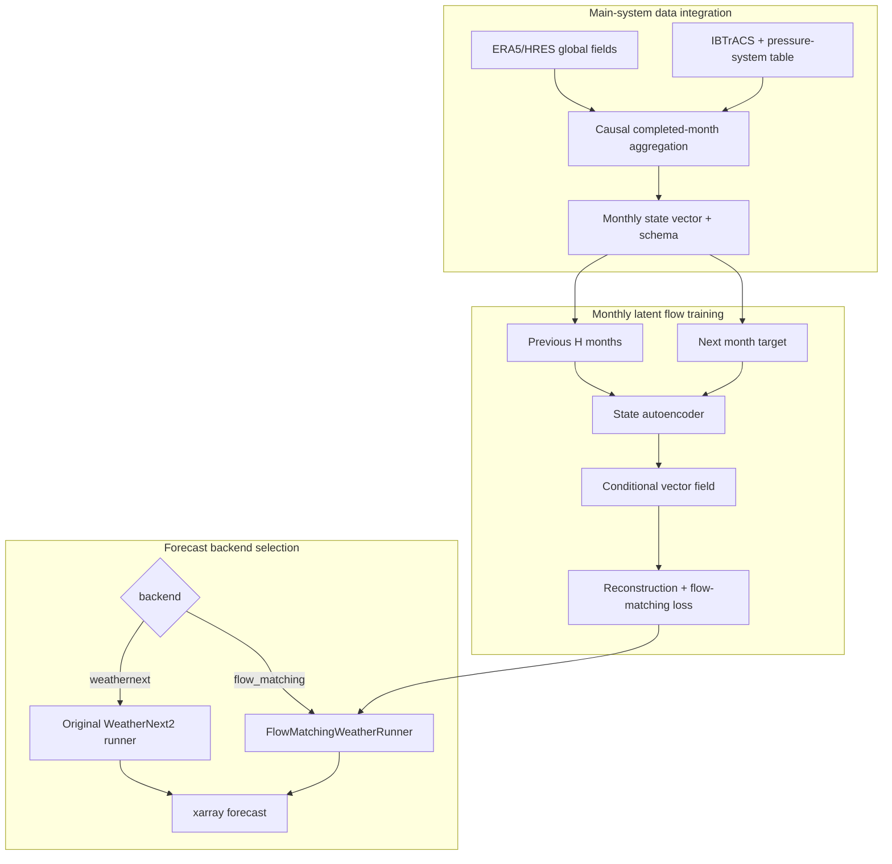

## 1. 설치

```bash
git clone https://github.com/nayehyeon61-glitch/climate_diffusion.git
cd climate_diffusion
pip install -e '.[io]'
```

## 2. Main-system 데이터 통합

`--fields`에는 시간축을 가진 ERA5/HRES NetCDF 또는 Zarr를 전달합니다.
`--integrated`에는 `typnonn_preesure_data_loader`가 생성한 통합 Parquet/CSV를
전달합니다.

```bash
prepare-climate-monthly-data \
  --fields data/era5_hres_history.zarr \
  --integrated data/integrated.parquet \
  --variables msl t2m u10 v10 \
  --target-lat-points 18 \
  --target-lon-points 36 \
  --output data/monthly_climate_states.npz
```

출력:

```text
data/
├── monthly_climate_states.npz
└── monthly_climate_states.schema.json
```

- `.npz`: `[month, state_dimension]` monthly state와 관측 mask
- `.schema.json`: 변수별 slice, 차원, 좌표, 통합 표 feature 목록
- 전 지구 field는 지정한 저해상도 grid로 평균 pooling하여 초기 연구 비용을 줄임
- 통합 표의 수치 feature는 동일 달 기준으로 평균하여 field state 뒤에 결합
- 6시간/일 단위 원자료의 월평균은 해당 월이 끝난 다음 시각을 availability time으로
  기록하며, 완료되지 않은 달은 추론 입력에서 제외

IBTrACS 통합 표만으로는 전 지구 대기장을 복원할 수 없습니다. WeatherNext 대체
runner를 만들려면 반드시 ERA5/HRES 같은 gridded field도 함께 학습해야 합니다.

## 3. 다음 1개월 Flow Matching 학습

```bash
train-climate-flow \
  --archive data/monthly_climate_states.npz \
  --history-months 6 \
  --lead-months 1 \
  --latent-dim 64 \
  --hidden-dim 256 \
  --epochs 100 \
  --batch-size 32 \
  --test-fraction 0.1 \
  --purge-windows 1 \
  --output download/flow-matching/monthly-v1/climate-flow-monthly-v1.pt
```

학습 경로는 다음과 같습니다.

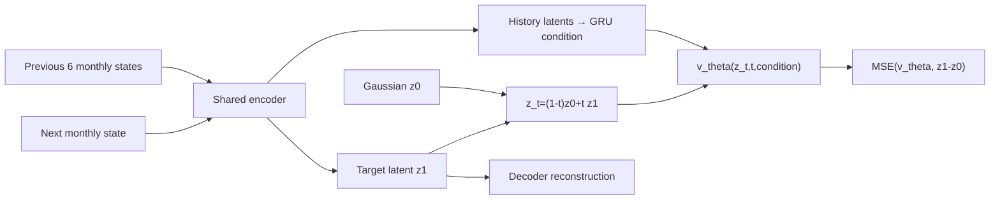

목적함수:

\[
\mathcal L =
\lambda_{rec}\|D(E(x_{m+1}))-x_{m+1}\|_2^2
+\lambda_{flow}\|v_\theta(z_t,t,c)-(z_1-z_0)\|_2^2
+\lambda_z\|z_1\|_2^2.
\]

시간 순서대로 train/validation/test를 분리하며 경계 사이의 겹치는 window를
`--purge-windows`만큼 제거합니다. 정규화 통계는 train 구간에서만 계산합니다.
최적 validation checkpoint와 함께 다음 artifact를 저장합니다.

```text
climate-flow-monthly-v1.pt
climate-flow-monthly-v1.metrics.json
climate-flow-monthly-v1.metadata.json
climate-flow-monthly-v1.manifest.json
```

manifest에는 SHA-256, 변수 schema, seed와 고정 test window가 기록됩니다.

### 3-1. 최근 ERA5 가중치와 autoencoder 용량

긴 기록은 비정상(non-stationary)이라 1959년 state와 2015년 state를 같은 비중으로
학습하면 예측 시점 분포에서 멀어집니다. 두 개의 knob이 있습니다.

```bash
train-climate-flow \
  --archive data/era5_monthly_states_full.npz \
  --recency-halflife 200 \
  --normalization-states 240 \
  --autoencoder-hidden-dim 512 \
  --autoencoder-blocks 3 \
  --autoencoder-dropout 0.1 \
  --latent-dim 128 \
  --output download/flow-matching/expanded-ae/run/run.pt
```

- `--recency-halflife`: window 나이에 대한 지수 sampling 가중치입니다. 200이면
  200 window(약 16.7년) 이전 표본이 절반 확률로 뽑힙니다. train 구간 안에서만
  적용하므로 causal 경계를 깨지 않습니다.
- `--normalization-states`: 정규화 통계를 train 끝의 최근 N개 state로 제한합니다.
  시작점만 앞으로 당기므로 미래 정보가 새지 않습니다.
- `--autoencoder-hidden-dim` / `--autoencoder-blocks` / `--autoencoder-dropout`:
  state autoencoder를 pre-norm residual block으로 확장합니다. `--autoencoder-blocks 0`
  (기본값)은 기존 3-layer MLP를 그대로 만들어 이전 checkpoint가 계속 로드됩니다.
  vector field는 `--hidden-dim`이 따로 제어하므로 autoencoder만 독립적으로 키울 수
  있습니다.

ERA5 1959-2021 월별 archive(756개월, held-out 75개월, ensemble 32) 결과입니다.

| run | AE params | held-out RMSE | CRPS | spread | AE recon RMSE | latent std |
|---|---|---|---|---|---|---|
| 균등 sampling, 기존 AE | 1.2M | 0.823 | 0.478 | 0.309 | 0.690 | 0.104 |
| half-life 200, 기존 AE | 1.2M | **0.737** | **0.436** | 0.267 | 0.668 | 0.099 |
| half-life 200, AE 512x3 | 8.5M | 0.878 | 0.517 | 0.592 | **0.498** | 0.054 |
| half-life 200, AE 768x4 | 22M | 0.936 | 0.561 | 0.618 | 0.507 | 0.053 |
| half-life 200, AE 1024x6 | 55M | 0.978 | 0.585 | 0.658 | 0.591 | 0.036 |

persistence 0.984, climatology 1.027이 기준선입니다.

**recency 가중치는 예측 성능을 개선하지만, autoencoder 확장은 현 구성에서 오히려
악화시킵니다.** 확장 AE는 reconstruction RMSE를 0.668에서 0.498로 낮춰 압축 자체는
분명히 개선하는데, held-out 예측은 나빠집니다. 원인은 latent scale입니다.
flow는 N(0, I)에서 출발해 latent로 수송하는데, 확장 AE의 latent std는 0.036-0.054로
prior보다 20-30배 작습니다. 표현력이 큰 decoder일수록 latent를 더 작게 눌러도 되기
때문입니다. 이 상태에서는 벡터장의 작은 오차도 latent 자체 scale 대비 거대해지고,
ensemble spread가 0.27에서 0.66으로 부풀며 2 m 기온 계절 진폭이 붕괴합니다
(`docs/figures/expanded_ae_timeseries.png`).

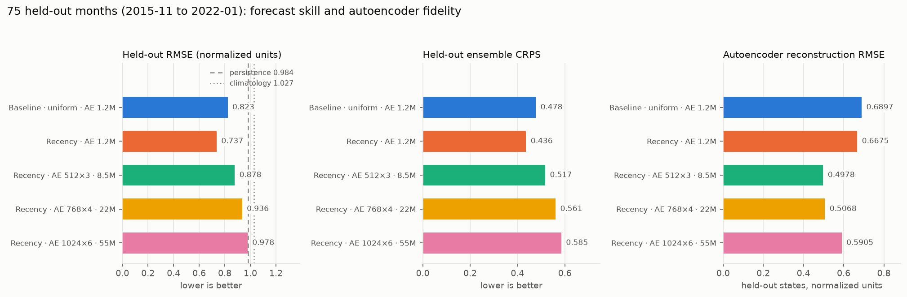

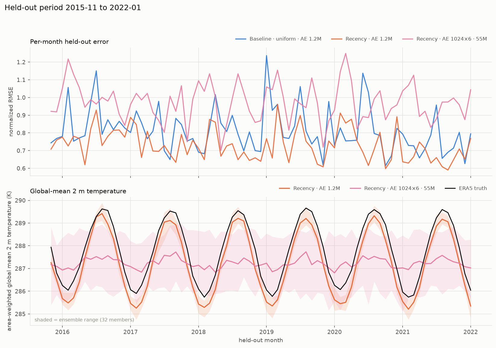

아래 패널에서 확장 AE(노란색)가 2 m 기온 계절 주기를 거의 평평하게 눌러버린 것이 보입니다.

또한 총 loss는 reconstruction 항이 지배하므로(확장 AE에서 84%) best-validation
checkpoint 선택이 예측 성능이 아니라 압축 성능을 따라갑니다.

### 3-2. Latent scale, checkpoint 선택, 앙상블 학습

위 두 문제를 세 개의 knob으로 해결합니다.

```bash
train-climate-flow \
  --archive data/era5_monthly_states_full.npz \
  --recency-halflife 200 \
  --latent-dim 128 --autoencoder-hidden-dim 512 --autoencoder-blocks 3 \
  --autoencoder-dropout 0.1 \
  --latent-normalization \
  --select-by forecast_rmse --forecast-eval-steps 16 \
  --ensemble-size 4 --ensemble-weight 1.0 --ensemble-steps 4 \
  --output download/flow-matching/latent-fix/run/run.pt
```

- **L** `--latent-normalization`: `latent_scale` buffer가 encoder 출력 std를 EMA로
  추적하고 flow는 `z/latent_scale`을 다룹니다. decode에서 되돌리므로 reconstruction은
  그대로입니다. 첫 배치에서 시드합니다 — 1.0에서 EMA를 시작하면 두 자릿수 작은
  scale까지 내려가는 데 수천 스텝이 걸립니다. 버퍼는 플래그가 켜졌을 때만 등록되어
  이전 checkpoint 호환이 유지됩니다.
  참고: `latent_regularization_weight`를 올리는 것은 해법이 아닙니다. 그 항은
  `latent.square().mean()`이라 latent를 더 **작게** 밀어 불일치를 키웁니다.
- **S** `--select-by forecast_rmse` (기본값): 매 epoch validation window를 고정 seed로
  샘플링해 RMSE를 재고 그것으로 checkpoint를 고릅니다. `loss`로 이전 동작 복원.
- **E** `--ensemble-size/--ensemble-weight/--ensemble-steps`: window당 K개 멤버를 실제로
  생성해 **fair CRPS**(K(K-1) 분모)를 loss에 더합니다. 샘플러(`MonthlyLatentFlow.integrate`)가
  미분 가능해 rollout을 통과해 backprop합니다. 기본은 꺼짐.

동일 archive/split, held-out 75개월, 평가 ensemble 32 기준입니다.

| run | AE | L | S | E | RMSE | CRPS | spread | latent std |
|---|---|---|---|---|---|---|---|---|
| 3-1의 최고 (recency, 기존 AE) | 1.2M | | | | 0.737 | **0.436** | 0.267 | 0.099 |
| 3-1의 확장 AE (수정 전) | 8.5M | | | | 0.878 | 0.517 | 0.592 | 0.054 |
| ablation: S만 | 8.5M | | O | | 0.750 | 0.451 | 0.272 | 0.026 |
| ablation: L만 | 8.5M | O | | | 0.813 | 0.485 | 0.308 | 1.077 |
| **L+S** | 8.5M | O | O | | **0.734** | 0.448 | 0.242 | 1.104 |
| L+S+E | 8.5M | O | O | O | 0.756 | 0.450 | 0.304 | 1.012 |
| L+S+E | 22M | O | O | O | 0.746 | 0.440 | 0.305 | 0.963 |
| L+S | 1.2M | O | O | | 0.763 | 0.553 | 0.033 | 0.949 |
| L+S+E | 1.2M | O | O | O | 0.777 | 0.563 | 0.049 | 0.957 |

- **L+S가 확장 AE를 복구합니다**: 0.878 -> 0.734로, 3-1의 최고(0.737)를 근소하게 앞섭니다.
  두 수정 모두 단독으로 기여하고 조합에서 더 좋아집니다. latent std가 0.054에서 1.10으로
  올라가 prior와 맞고, spread 과대(0.592)도 0.242로 정상화됩니다.
- **선택 기준이 단독으로는 더 큰 요인이었습니다**(S만으로 0.878 -> 0.750). 즉 확장 AE의
  실패는 상당 부분 "압축이 가장 좋은 epoch을 고른" 탓입니다.
- **앙상블 CRPS 항(E)은 이 설정에서 이득이 없습니다**: 8.5M에서 RMSE 0.734 -> 0.756,
  CRPS 0.448 -> 0.450. K=4, rollout 4 step이 너무 거칠 가능성이 큽니다.
- **작은 AE는 L+S에서 앙상블이 붕괴합니다**(spread 0.033). RMSE는 멀쩡하지만 CRPS가
  0.553으로 나빠집니다. 1.2M latent가 unit scale로 늘어나면 flow가 거의 결정론적으로
  학습됩니다.
- AE reconstruction RMSE는 오히려 나빠집니다(0.498 -> 0.724). S가 압축이 아니라 예측을
  기준으로 epoch을 고르기 때문이며, 의도한 trade-off입니다.

알려진 이슈: 정규화가 raw latent 크기를 상쇄하므로 AdamW weight decay가 encoder를 계속
줄여 raw std가 `LATENT_SCALE_FLOOR`(1e-3)에 근접합니다. 현재는 EMA가 따라가 정규화
결과가 정상이지만, 더 길게 학습하면 floor에 닿아 scale 매칭이 깨질 수 있습니다.
encoder 출력에 weight decay를 빼거나 unit-variance 제약을 두는 편이 안전합니다.

재현:

```bash
python scripts/visualize_expanded_ae.py --set expanded-ae --ensemble-size 32
python scripts/visualize_expanded_ae.py --set latent-fix  --ensemble-size 32
```

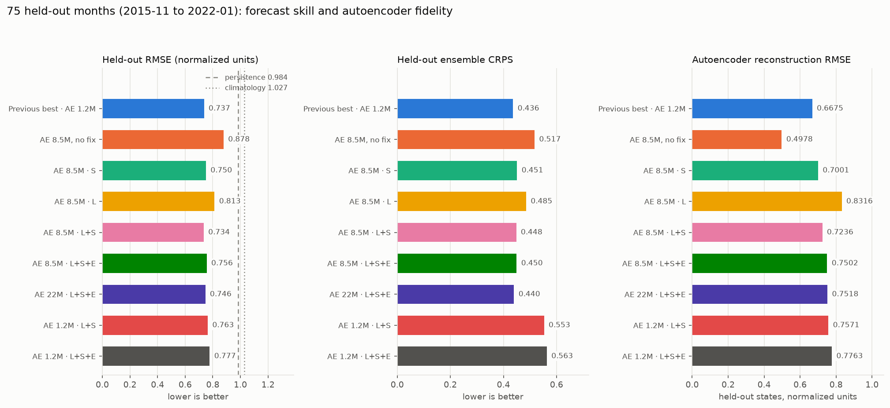

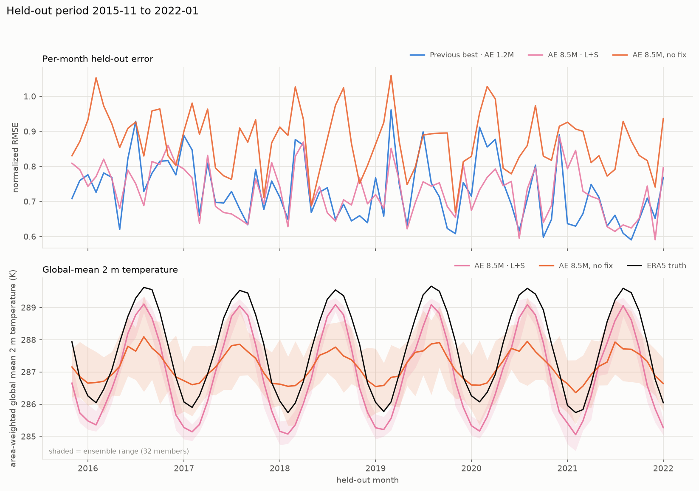

`outputs/`에 세트별로 `<set>_training.png`, `<set>_skill.png`, `<set>_variables.png`,
`<set>_maps.png`, `<set>_timeseries.png`와 `<set>-summary.json`이 생성됩니다.

### 3-3. 기준선을 제대로 잡으면 (중요)

`evaluation.py`의 `climatology_rmse`는 계절 기후값이 아니라 **무조건부 학습 평균**입니다.
월평균장은 분산의 대부분이 계절 주기이므로 이 기준선은 지나치게 약합니다. 같은 held-out
75개월에서 month-of-year 기후값을 인과적 train 구간으로 추정해 다시 재면:

| 방법 | nRMSE | 계절 기후값 대비 |
|---|---|---|
| Monthly flow (AE 8.5M, L+S) | 0.734 | +2.8% |
| Monthly flow (recency, AE 1.2M) | 0.737 | +2.5% |
| **계절 기후값 (month-of-year)** | **0.755** | 0.0% |
| Anomaly persistence | 0.899 | -19.1% |
| Persistence | 0.984 | -30.2% |
| 무조건부 평균 (기존 "climatology") | 1.027 | -35.9% |

변수별로는 (계절 기후값 = 1.0):

| | msl | t2m | u10 | v10 |
|---|---|---|---|---|
| AE 8.5M (L+S) | 0.95 | 1.20 | 0.99 | 1.01 |
| AE 1.2M (recency) | 1.03 | 0.92 | 1.01 | 1.01 |

**현재 monthly 모델은 실질적으로 계절 기후값 수준입니다.** 바람은 기후값과 동률이고,
t2m은 두 모델이 정반대 방향입니다. 총합 nRMSE에서 8.5M이 앞선 것은 msl 덕분이지 온도
예측이 나아져서가 아닙니다. 개선폭 2-3%는 단일 seed, 75개월 표본에서 유의하다고 보기
어렵습니다.

배경으로, 시계열 분할이 train 목표월 1959-08~2003-02 / validation 2003-04~2015-09 /
test 2015-11~2022-01이라 **모델은 2003년까지만 보고 2015-2022를 예측합니다**(12.7년 공백).
validation이 20%를 가져가면서 생긴 구조이며, 온난화 추세 때문에 t2m이 특히 불리합니다.

```bash
python scripts/baseline_skill.py --ensemble-size 32
```

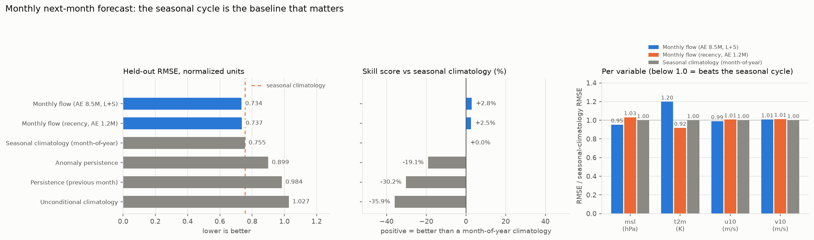

## 4. 물리 시간축 latent ODE (dynamics)

월별 모델은 한 archive 간격을 한 번에 건너뛰므로 ODE가 flow time tau in [0,1] 하나뿐입니다.
`dynamics.py`는 예보가 실제로 가진 두 번째 축을 추가합니다.

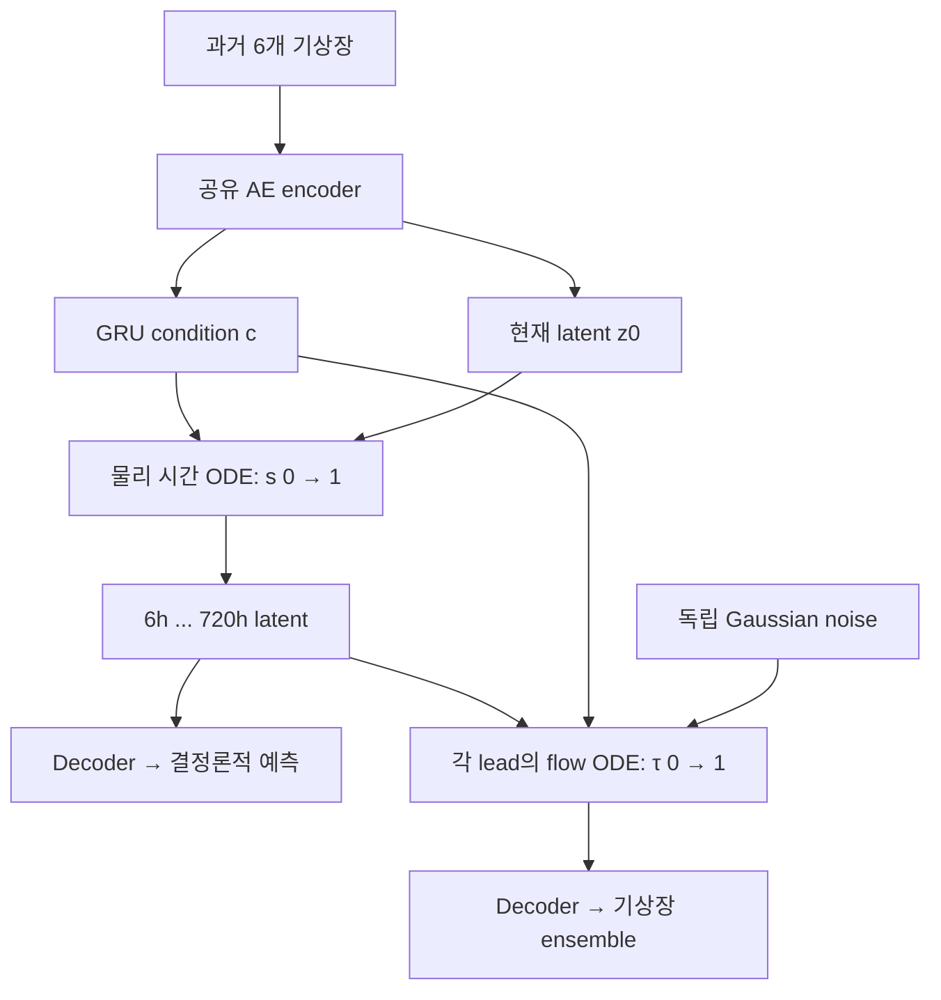

결정론적 ODE가 latent 궤적을 만들고, flow matching은 그 latent를 조건으로 각 lead의 분포를 학습합니다.
두 출력의 평균이 일치하도록 강제하지는 않습니다.
`TrajectoryFlowField`는 lead time으로도 조건화되어 head 하나가 모든 lead를 담당합니다.

```bash
prepare-climate-fixed-step-data \
  --fields data/era5_wb2_6h_full.nc --variables msl t2m u10 v10 \
  --step-hours 6 --output data/era5_6h_states.npz

train-climate-dynamics \
  --archive data/era5_6h_states.npz \
  --history-steps 6 --history-stride 120 --horizon-steps 120 \
  --latent-dim 512 --autoencoder-hidden-dim 768 --autoencoder-blocks 3 \
  --dynamics-solver rk4 --epochs 150
```

`--history-stride`는 history 샘플 간격입니다. 6개 시점 사이 간격은 5개이므로
`(6 - 1) × 120 × 6h = 3,600h = 150일`의 문맥입니다. 연속 archive 601개 중
`t0-150d, -120d, -90d, -60d, -30d, t0`의 6개를 encoder에 넣습니다.

### 첫 실험 결과: autoencoder가 병목

| run | horizon | latent | recon RMSE | latent 궤적 MSE | state RMSE |
|---|---|---|---|---|---|
| `dyn-h24` | 144h | 128 | 0.862 | 0.158 | 0.862 |
| `dyn-h120` | 720h | 128 | 0.865 | 0.497 | 0.867 |
| `dyn-h120-ens` | 720h | 128 | 0.870 | 0.491 | 0.871 |
| `fix-h24-l512` | 144h | 512 | 0.836 | **0.004** | 0.849 |

Latent 512에서 궤적 MSE는 0.004이지만 target 분산과 latent collapse를 함께 확인해야
예측력을 판단할 수 있습니다. State RMSE와 reconstruction RMSE가 비슷하다는 관찰은
AE 병목을 시사하지만 오차 전부의 원인을 분리해 증명하지는 않습니다.

선형 PCA 기준과 비교하면 격차가 분명합니다 (6h 스냅샷, 정규화 단위):

| latent | PCA 기준 | 신경망 AE |
|---|---|---|
| 128 | 0.401 | 0.862 |
| 512 | 0.166 | 0.836 |

**해당 latent 512 실험에서 AE 재구성 RMSE가 PCA 기준보다 약 5배 큽니다.**
PCA는 선형 재구성 비교 기준이며 비선형 AE에 대한 이론적 하한은 아닙니다.
진단해 보면 두 가지가 겹칩니다.

1. `fix-h24-l512`의 `latent_scale`이 `LATENT_SCALE_FLOOR`(1e-3)에 닿았습니다. raw latent
   std가 0.00039로 floor 아래라 정규화 latent std가 1.0이 아니라 0.39입니다. 3-2에서
   "알려진 이슈"로 적어둔 위험이 실제로 발생했습니다. 정규화가 raw scale을 상쇄하니
   AdamW weight decay가 encoder를 계속 줄인 결과입니다.
2. latent 유효 차원이 붕괴했습니다. participation ratio가 latent 512에서 128, latent 128에서
   51입니다. trajectory loss가 "예측하기 쉬운" 저정보 latent를 선호하고, 재구성 항이
   여기에 밀린 것으로 보입니다.

다음 순서는 이렇게 봅니다.

1. AE 파라미터를 weight decay에서 제외하거나, EMA scale buffer 대신 차원별 단위분산 제약을
   직접 걸어 floor 문제를 없앨 것
2. AE만 단독 학습시켜 PCA 기준에 도달하는지 먼저 확인할 것. 도달하지 못하면 다중 과제
   충돌이 아니라 AE 자체 문제입니다
3. 격자 구조를 쓰는 encoder(순환 경계 `nn.Conv2d`)로 교체할 것. 현재는 4변수 x 16위도 x
   32경도를 평평한 2048 벡터로 다룹니다

```bash
python scripts/visualize_dynamics.py --cases 64 --ensemble-size 16
```

`outputs/`에 `dynamics_skill.png`(리드 시간별 RMSE 대 persistence/climatology),
`dynamics_training.png`(loss 항별 곡선), `dynamics_autoencoder.png`(AE 대 PCA 기준),
`dynamics-summary.json`이 생성됩니다.

### 검증: 리드 시간별 skill 곡선

```bash
python scripts/visualize_dynamics.py --cases 48 --ensemble-size 8
```

`docs/figures/dynamics_skill.png`가 결론을 한눈에 보여줍니다.

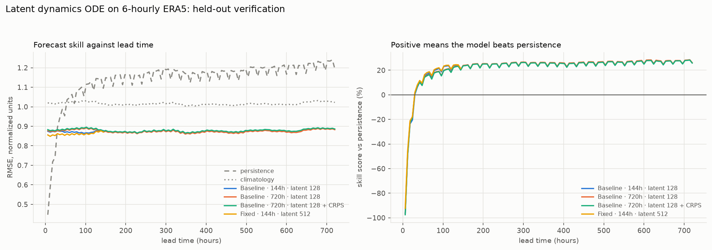

- 모델 RMSE가 6h부터 720h까지 **0.87 근처에서 평평합니다.** 리드 시간에 따른 변화가 없습니다.
- persistence는 6h에서 0.44, 720h에서 1.22입니다. 무조건부 기후값은 1.02로 평평합니다.
- 모델은 약 30h 이후부터 persistence를 이기고 기후값보다 항상 15% 낫습니다.

**평평한 곡선은 lead 변화에 대한 예측 민감도를 추가로 점검할 신호입니다.** 리드 시간과 무관하게 같은 품질을
낸다는 것은 출력이 대략 "기후값보다 조금 나은 지도"에 고정돼 있다는 의미이고, 30h 이후
persistence를 이기는 것은 그 자체로는 성과가 아닙니다. 30h 이전에는 persistence보다 크게
나쁩니다. Autoencoder 재구성 오차(0.84~0.87)가 중요한 병목으로 보이지만 ODE 오차와의 원인 분리는 추가 검증이 필요합니다.

### AE 단독 probe: 병목의 진짜 원인

결합 목적함수 안에서 재구성이 나쁜 데는 두 가지 가능성이 있습니다. AE가 그 일을 못 하거나,
다른 항에 밀리거나. AE만 따로 학습시켜 선형 PCA 기준과 대면 분리됩니다.

```bash
python scripts/autoencoder_probe.py --latents 128 512 --kinds mlp conv --epochs 30
```

6h 스냅샷, holdout 재구성 RMSE (정규화 단위):

| kind | latent | params | 단독 학습 | PCA 기준 | 배수 | 유효 차원 |
|---|---|---|---|---|---|---|
| mlp | 128 | 2.70M | 0.436 | 0.401 | 1.09x | 118/128 |
| mlp | 512 | 2.90M | 0.392 | 0.166 | 2.36x | 488/512 |
| conv | 128 | 6.40M | 0.441 | 0.401 | 1.10x | 126/128 |
| **conv** | **512** | 12.69M | **0.301** | 0.166 | **1.81x** | 445/512 |

같은 AE가 전체 dynamics 모델 안에서는 **0.836**이었습니다. 단독으로는 0.30~0.44입니다.
유효 차원도 단독일 때 445/512로 건강한데 결합 시 128/512로 붕괴합니다.

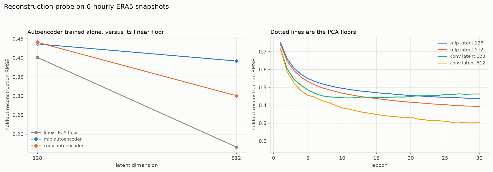

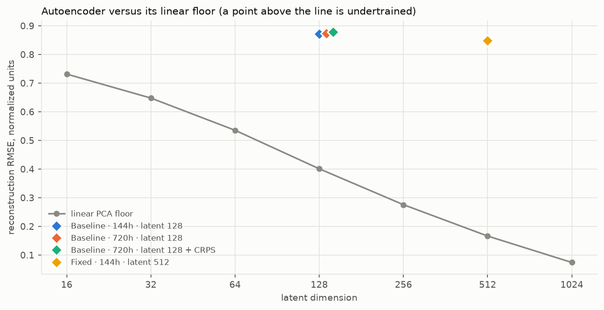

두 번째 그림의 마름모가 모두 PCA 곡선 위에 한참 떨어져 있는 것이 결합 학습에서의 붕괴입니다.

**이 결과는 다중 과제 충돌 가설을 지지하지만 원인을 하나로 확정하지는 않습니다.**
trajectory loss와 flow matching loss가 "예측하기 쉬운" 저정보 latent를 선호하고, 재구성 항이
거기에 밀립니다. 작은 latent 궤적 MSE는 latent 축소로도 얻을 수 있으므로 raw-state 예측과 함께 검증해야 합니다.

Conv encoder(3번)는 latent 512에서 MLP보다 확실히 낫고(0.301 대 0.392) 30 epoch에서도 아직
개선 중이었으므로, 다중 과제 충돌을 해결한 뒤에 다시 볼 가치가 있습니다.

### 새로 추가된 knob

```bash
train-climate-dynamics \
  --autoencoder-kind conv \          # 순환 경계 nn.Conv2d encoder (경도 wrap, 극 replicate)
  --autoencoder-weight-decay 0.0 \   # AE만 weight decay 제외 (기본값)
  ...
```

- `--autoencoder-kind conv`: `GeoConv2d`는 경도 방향으로 순환 padding, 위도 방향으로 replicate
  padding을 씁니다. 전 지구장은 동서로 주기적이라 zero padding은 날짜변경선에 인위적 이음매를
  만듭니다. grid는 schema에서 자동 유도합니다.
- `--autoencoder-weight-decay`: latent가 정규화되면 decoder가 scale을 되돌리므로 encoder에 걸린
  decay는 상쇄할 재구성 비용이 없습니다. 그래서 latent가 scale floor에 닿을 때까지 줄어듭니다
  (`fix-h24-l512`에서 실제로 발생). 기본값 0으로 이 축퇴 방향을 제거합니다.
- `FlowModelConfig.autoencoder_kind`의 기본값은 `"mlp"`라 기존 checkpoint는 그대로 로드됩니다.

### 다음 순서

probe 결과가 방향을 명확히 합니다: **단계적 학습**입니다. AE를 먼저 재구성만으로 학습해
freeze한 뒤, 고정된 latent 공간에서 dynamics와 flow를 학습하는 것이 latent 생성 모델의 표준
구성이며(Rombach et al.), 여기서 진단된 충돌을 구조적으로 없앱니다. 현재 코드에는 freeze
경로가 없어 다음 작업 항목입니다.

## 5. 독립적인 월별 예측

```bash
forecast-climate-flow \
  --checkpoint checkpoints/climate-flow-matching.pt \
  --archive data/monthly_climate_states.npz \
  --months 1 \
  --ensemble-size 8 \
  --integration-steps 32 \
  --output outputs/next-month-ensemble.npz
```

각 ensemble member는 서로 다른 Gaussian latent에서 시작합니다. 여러 달을 요청하면
생성한 다음 달 state를 history에 넣는 autoregressive 방식으로 진행합니다.

학습에 사용하지 않은 test window만 평가하려면:

```bash
evaluate-climate-flow \
  --checkpoint download/flow-matching/monthly-v1/climate-flow-monthly-v1.pt \
  --archive data/monthly_climate_states.npz \
  --ensemble-size 8 \
  --output outputs/monthly-flow-evaluation.json
```

평가 파일에는 normalized RMSE/MAE/bias, ensemble CRPS/spread,
persistence·climatology baseline과 변수별 raw-unit metric이 저장됩니다.

## 6. WeatherNext2를 유지하면서 선택적으로 대체

기존 WeatherNext2 runner를 그대로 사용할 때:

```python
from climate_diffusion import ForecastSelectionConfig, build_forecast_runner

runner = build_forecast_runner(
    ForecastSelectionConfig(backend="weathernext"),
    weathernext_runner=official_weathernext_runner,
)
```

월 단위 Flow Matching 모델로 교체할 때:

```python
runner = build_forecast_runner(
    ForecastSelectionConfig(
        backend="flow_matching",
        flow_checkpoint="checkpoints/climate-flow-matching.pt",
        integration_steps=32,
        seed=7,
    ),
    weathernext_runner=official_weathernext_runner,
)

forecast = runner.rollout(
    monthly_history_dataset,
    horizon_hours=720,
)
```

`FlowMatchingWeatherRunner`의 계약:

- 입력: 학습 schema에 맞는 최소 `history_months`개월의 `xarray.Dataset`
- 출력: 학습한 gridded 변수로 복원한 월별 `xarray.Dataset`
- 시간 단위: 720시간을 1 model month로 정의
- hard frozen inference: `eval()`, `requires_grad_(False)`, `inference_mode()` 적용
- 로드 시 manifest SHA-256 검증
- provenance: backend, checkpoint 경로·hash·format 기록

통합 표 feature를 추론 history에도 사용하려면 schema에 기록된 원래 column 이름을
월별 scalar data variable로 초기 `xarray.Dataset`에 포함합니다. 예를 들어
`typhoon_pressure_hpa(time)`와 `high_pressure_hpa(time)`를 field와 같은 월 시간축에
추가할 수 있습니다. 누락된 통합 feature는 train 평균값으로 채워져 중립 조건으로
처리됩니다.

기존 WeatherNext2 객체는 수정하거나 덮어쓰지 않습니다. 선택 함수가 동일한
rollout 경계에서 어느 runner를 반환할지만 결정합니다.

## 7. 기존 GPT·double-loss 시스템과 연결

Flow Matching 출력은 xarray이므로 main system의 tokenization 단계로 전달할 수
있습니다. `typnonn_preesure_data_loader`의 `prepare-weathernext-tokens`에서
`--backend flow_matching`을 선택하면 frozen checkpoint를 불러오고 720시간 token
cache를 만듭니다.

```bash
prepare-weathernext-tokens \
  --backend flow_matching \
  --checkpoint download/flow-matching/monthly-v1/climate-flow-monthly-v1.pt \
  --initial-state data/era5_hres_history.zarr \
  --storm-id TEST --init-time 2025-01-01T00:00:00Z \
  --storm-lat 20 --storm-lon 130 \
  --horizon-hours 720 --max-lead-hours 720 \
  --output-dir data/flow_matching_tokens

train-weathernext-transformer \
  --integrated data/integrated.parquet \
  --distribution data/distribution/spatial_distribution.csv \
  --weathernext-token-dir data/flow_matching_tokens \
  --require-checkpoint-kind flow_matching
```

이 경로에서는 Flow parameter를 optimizer에 넣지 않습니다. 후단의 GPT state,
GRU/Transformer와 distribution CE + track MSE double loss만 학습됩니다.

권장 실험군:

| 실험 | Frozen forecast source | 후단 학습 |
|---|---|---|
| A | 공식 WeatherNext2 | GPT-FiLM + GRU + Transformer + double loss |
| B | fine-tuned WeatherNext2 | 동일 |
| C | monthly latent flow matching | 동일 |

이렇게 구성하면 novelty는 단순히 강한 모델을 제거하는 데 있지 않고,
`월 단위 생성적 operator + GPT-conditioned 태풍 history + distribution/track dual
objective`의 결합과 세 실험군의 정량 비교에서 형성됩니다.

## 결과 그림과 수치

커밋된 그림은 `docs/figures/`, 근거가 되는 요약 수치는 `docs/results/`에 있습니다.
`outputs/`는 스크립트가 쓰는 작업 디렉터리이며 버전 관리하지 않습니다.

| 그림 | 내용 |
|---|---|
| `baseline_skill.png` | 월별 모델 대 persistence / 계절 기후값 / anomaly persistence |
| `expanded_ae_*.png` | AE 확장 sweep 5종: 학습 곡선, held-out 성능, 변수별, 예보 지도, 시계열 |
| `latent_fix_*.png` | latent 정규화 / 선택 기준 / 앙상블 CRPS ablation 5종 |
| `dynamics_skill.png` | 리드 시간별 RMSE 곡선 (6h~720h) |
| `dynamics_training.png` | dynamics loss 항별 곡선 |
| `dynamics_autoencoder.png` | 결합 학습 AE 대 선형 PCA 기준 |
| `autoencoder-probe.png` | AE 단독 학습 대 PCA 기준 (mlp / conv) |

## 현재 범위와 주의점

- 본 모델은 초기 연구용 저해상도 latent baseline입니다.
- WeatherNext2의 물리적 성능을 자동으로 대체한다고 보장하지 않습니다.
- 0.25° 전 지구 원해상도 학습에는 convolutional/operator autoencoder가 추가로
  필요합니다.
- 월별 평균은 태풍의 6시간 단위 극값을 약화시킬 수 있으므로, 월 단위 climate
  distribution과 단기 cyclone track 평가는 분리해야 합니다.
- 실제 논문 실험에서는 persistence, climatology, WeatherNext2와 동일 split에서
  CRPS·RMSE·distribution calibration·track error를 함께 비교해야 합니다.
