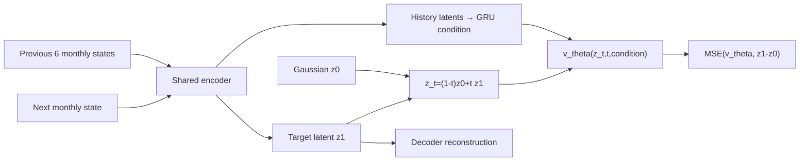

# Climate Diffusion: Monthly Latent Flow Matching

이 저장소는 기존 `typnonn_preesure_data_loader`가 만든 전 지구 기상장과 통합
태풍·고기압 표를 월별 state로 결합하고, 다음 1개월 state를 생성하는
conditional flow matching 모델을 제공합니다. Google WeatherNext2 원본 runner는
변경하지 않으며, 동일한 `rollout(initial_state, horizon_hours)` 경계에서
`weathernext`와 `flow_matching`을 선택할 수 있습니다.

엄밀히 말하면 이 모델은 일반적인 noise-schedule diffusion이 아니라
**latent conditional flow matching**입니다. Autoencoder latent에서 Gaussian noise와
다음 달 state 사이의 확률 흐름 ODE를 학습한다는 점에서 latent generative forecast
역할을 수행합니다.

## 전체 구조


## 1. 설치

```bash
git clone https://github.com/nayehyeon61-glitch/climate_diffusion.git
cd climate_diffusion
pip install -e '.[io]'
```

## 2. Main-system 데이터 통합

`--fields`에는 시간축을 가진 ERA5/HRES NetCDF 또는 Zarr를 전달합니다.
`--integrated`에는 `typnonn_preesure_data_loader`가 생성한 통합 Parquet/CSV를
전달합니다.

```bash
prepare-climate-monthly-data \
  --fields data/era5_hres_history.zarr \
  --integrated data/integrated.parquet \
  --variables msl t2m u10 v10 \
  --target-lat-points 18 \
  --target-lon-points 36 \
  --output data/monthly_climate_states.npz
```

출력:

```text
data/
├── monthly_climate_states.npz
└── monthly_climate_states.schema.json
```

- `.npz`: `[month, state_dimension]` monthly state와 관측 mask
- `.schema.json`: 변수별 slice, 차원, 좌표, 통합 표 feature 목록
- 전 지구 field는 지정한 저해상도 grid로 평균 pooling하여 초기 연구 비용을 줄임
- 통합 표의 수치 feature는 동일 달 기준으로 평균하여 field state 뒤에 결합
- 6시간/일 단위 원자료의 월평균은 해당 월이 끝난 다음 시각을 availability time으로
  기록하며, 완료되지 않은 달은 추론 입력에서 제외

IBTrACS 통합 표만으로는 전 지구 대기장을 복원할 수 없습니다. WeatherNext 대체
runner를 만들려면 반드시 ERA5/HRES 같은 gridded field도 함께 학습해야 합니다.

### 분할된 실제 ERA5 입력

변수·pressure level 파일이 나뉜 ERA5 디렉터리는 전용 adapter로 기존 spatial
archive에 연결합니다. adapter는 `valid_time/latitude/longitude/pressure_level`을
기존 `time/lat/lon/level` 계약으로 정규화하고, 경도를 `[0, 360)`으로 정렬합니다.
이후의 월 집계, 결측치 정책, train-only 정규화 및 grid fingerprint는 기존 구현을
그대로 사용합니다.

```bash
prepare-era5-climate-flow \
  --source data/era5/ \
  --variables msl t2m u10 v10 z t q u v \
  --target-lat-points 721 --target-lon-points 1440 \
  --output data/monthly_climate_spatial_025
```

`--source`는 하나 이상의 NetCDF/Zarr 경로, glob 또는 디렉터리를 받습니다. HRES는
forecast init/step을 먼저 하나의 valid-time 계열로 바꾼 뒤 같은 archive 경계를
사용합니다. 분석장에는 기본 `--lead-hours 0`, 특정 forecast lead에는 값을 명시합니다.

```bash
prepare-hres-climate-flow \
  --source data/hres/ --lead-hours 0 \
  --variables msl t2m u10 v10 z t q u v \
  --target-lat-points 721 --target-lon-points 1440 \
  --output data/monthly_hres_spatial_025
```

HRES가 0.1°이면 선형 보간으로 정확한 `721×1440` 전지구 grid를 만들며, 선택한
lead와 regridding provenance가 schema fingerprint에 포함됩니다.

## 3. 다음 1개월 Flow Matching 학습

```bash
train-climate-flow \
  --archive data/monthly_climate_states.npz \
  --history-months 6 \
  --lead-months 1 \
  --latent-dim 64 \
  --hidden-dim 256 \
  --epochs 100 \
  --batch-size 32 \
  --test-fraction 0.1 \
  --purge-windows 1 \
  --output download/flow-matching/monthly-v1/climate-flow-monthly-v1.pt
```

학습 경로는 다음과 같습니다.



목적함수:

\[
\mathcal L =
\lambda_{rec}\|D(E(x_{m+1}))-x_{m+1}\|_2^2
+\lambda_{flow}\|v_\theta(z_t,t,c)-(z_1-z_0)\|_2^2
+\lambda_z\|z_1\|_2^2.
\]

시간 순서대로 **raw calendar month를 먼저** train/validation/test로 분리하고 각
구간 안에서만 window를 만듭니다. 따라서 기본 `history=6`, `lead=1`,
`purge=1`에서도 서로 다른 split이 원시 월을 공유하지 않습니다. 정규화와 결측치
보간 통계는 train raw-month 구간의 관측값만으로 계산합니다.
최적 validation checkpoint와 함께 다음 artifact를 저장합니다.

```text
climate-flow-monthly-v1.pt
climate-flow-monthly-v1.metrics.json
climate-flow-monthly-v1.metadata.json
climate-flow-monthly-v1.manifest.json
```

manifest에는 SHA-256, 변수 schema, seed와 고정 test window가 기록됩니다.
또한 raw-month index/time 범위와 archive schema·grid·channel·time fingerprint를
기록하여 다른 archive를 실수로 평가하는 것을 차단합니다.

### 결측치와 시간축 안전 계약

| 입력 상태 | 정책 |
|---|---|
| `+Inf` / `-Inf` | archive 생성·로딩 즉시 변수/월/위치/개수와 함께 실패 |
| `NaN` | 관측 mask에 보존하고 split 이후 train-only 평균으로 보간 |
| spatial `NaN` | channel train mean으로 보간되어 정규화 후 정확히 0 |
| train 구간 전체 결측 feature/channel | 학습 시작 전 실패 |
| 결측 calendar month | 해당 행을 다음 달로 간주하지 않고 archive 검증 실패 |
| 중복 timestamp | archive 생성 전에 실패 |
| 입력 순서 뒤섞임 | 중복 검사 후 timestamp 정렬, 이후 월 연속성 검사 |

입력, 보간·정규화 tensor, auxiliary, latent, 각 loss, gradient, checkpoint 통계,
rollout, evaluation metric에는 단계별 finite guard가 적용됩니다. AMP 학습에서는
`GradScaler`로 unscale한 뒤 gradient finite 여부를 검사합니다. 평가 JSON은
`allow_nan=False`로 기록됩니다.

### 0.25° 전지구 공간 backend

원해상도에서는 `721×1440` grid를 하나의 dense vector로 만들지 않습니다. 공간
archive는 `[month, channel, latitude, longitude]` 배열을 `.npy` memory map으로
보존하고, pressure level 같은 비공간 차원만 channel로 펼칩니다. 따라서 한 달과
patch만 읽어 학습할 수 있습니다.

```bash
prepare-climate-monthly-data \
  --fields data/era5_025_history.zarr \
  --integrated data/integrated.parquet \
  --variables msl t2m u10 v10 z t q u v \
  --layout spatial \
  --target-lat-points 721 \
  --target-lon-points 1440 \
  --output data/monthly_climate_spatial_025

train-climate-flow \
  --archive data/monthly_climate_spatial_025 \
  --model-backend spatial_operator \
  --history-months 6 \
  --spatial-base-channels 32 \
  --spatial-latent-channels 16 \
  --spatial-downsample-levels 3 \
  --operator-modes-lat 12 \
  --operator-modes-lon 24 \
  --patch-height 256 \
  --patch-width 256 \
  --tile-overlap 64 \
  --batch-size 1 \
  --mixed-precision \
  --gradient-accumulation-steps 8 \
  --gradient-checkpointing \
  --min-observed-fraction 0.95 \
  --epochs 100 \
  --output download/flow-matching/monthly-spatial-025/climate-flow-spatial-025.pt
```

두 공간 backend를 선택할 수 있습니다.

| backend | 구성 | 용도 |
|---|---|---|
| `spatial_conv` | periodic convolutional autoencoder + ConvGRU vector field | 빠른 공간 baseline |
| `spatial_operator` | 위 구조 + latent Fourier operator | 장거리 공간 mode 학습 |

실제 0.25° 장기 job 전에는 안전 회귀 테스트를 먼저 실행하십시오.

```bash
python -m pytest -q

prepare-climate-monthly-data \
  --fields data/era5_025_history.zarr \
  --layout spatial \
  --target-lat-points 721 --target-lon-points 1440 \
  --output data/monthly_climate_spatial_025
```

두 번째 명령은 archive를 쓰는 동안에도 `Inf`, 완전 결측 월/channel, 중복·결측 월을
검사하므로 실패하면 학습으로 진행하면 안 됩니다. 저장소에는 실제 ERA5 0.25°
학습 weight 또는 실데이터 evaluation artifact가 포함되어 있지 않습니다.

공통으로 경도에는 circular padding을, 위도에는 pole-safe replicate padding을
적용합니다. 721처럼 downsampling 배수로 나누어지지 않는 위도 크기는 decoder가
명시적인 output shape로 복원합니다. 학습 시 random patch를 사용하고, rollout은
경도를 dateline 너머로 wrap한 overlap tile을 Hann weight로 합칩니다. 기존
`vector_mlp` archive와 v1/v2 checkpoint loader는 그대로 유지됩니다.

공간 archive의 통합 태풍·기압 scalar는 `auxiliary.npy`에 따로 보존되어 ConvGRU
condition에 들어갑니다. target 전지구장은 공간 tensor로 예측되며 scalar를 field에
복제하지 않습니다.

## 4. 독립적인 월별 예측

```bash
forecast-climate-flow \
  --checkpoint checkpoints/climate-flow-matching.pt \
  --archive data/monthly_climate_states.npz \
  --months 1 \
  --ensemble-size 8 \
  --integration-steps 32 \
  --output outputs/next-month-ensemble.npz
```

각 ensemble member는 서로 다른 Gaussian latent에서 시작합니다. 여러 달을 요청하면
생성한 다음 달 state를 history에 넣는 autoregressive 방식으로 진행합니다.

학습에 사용하지 않은 test window만 평가하려면:

```bash
evaluate-climate-flow \
  --checkpoint download/flow-matching/monthly-v1/climate-flow-monthly-v1.pt \
  --archive data/monthly_climate_states.npz \
  --ensemble-size 8 \
  --output outputs/monthly-flow-evaluation.json
```

평가 파일에는 normalized RMSE/MAE/bias, ensemble CRPS/spread,
persistence·climatology baseline과 변수별 raw-unit metric이 저장됩니다.

## 5. WeatherNext2를 유지하면서 선택적으로 대체

기존 WeatherNext2 runner를 그대로 사용할 때:

```python
from climate_diffusion import ForecastSelectionConfig, build_forecast_runner

runner = build_forecast_runner(
    ForecastSelectionConfig(backend="weathernext"),
    weathernext_runner=official_weathernext_runner,
)
```

월 단위 Flow Matching 모델로 교체할 때:

```python
runner = build_forecast_runner(
    ForecastSelectionConfig(
        backend="flow_matching",
        flow_checkpoint="checkpoints/climate-flow-matching.pt",
        integration_steps=32,
        seed=7,
    ),
    weathernext_runner=official_weathernext_runner,
)

forecast = runner.rollout(
    monthly_history_dataset,
    horizon_hours=720,
)
```

`FlowMatchingWeatherRunner`의 계약:

- 입력: 학습 schema에 맞는 최소 `history_months`개월의 `xarray.Dataset`
- 출력: 학습한 gridded 변수로 복원한 월별 `xarray.Dataset`
- 시간 단위: 720시간을 1 model month로 정의
- hard frozen inference: `eval()`, `requires_grad_(False)`, `inference_mode()` 적용
- 로드 시 manifest SHA-256 검증
- provenance: backend, checkpoint 경로·hash·format 기록

통합 표 feature를 추론 history에도 사용하려면 schema에 기록된 원래 column 이름을
월별 scalar data variable로 초기 `xarray.Dataset`에 포함합니다. 예를 들어
`typhoon_pressure_hpa(time)`와 `high_pressure_hpa(time)`를 field와 같은 월 시간축에
추가할 수 있습니다. 누락된 통합 feature는 train 평균값으로 채워져 중립 조건으로
처리됩니다.

기존 WeatherNext2 객체는 수정하거나 덮어쓰지 않습니다. 선택 함수가 동일한
rollout 경계에서 어느 runner를 반환할지만 결정합니다.

## 6. 기존 GPT·double-loss 시스템과 연결

Flow Matching 출력은 xarray이므로 main system의 tokenization 단계로 전달할 수
있습니다. `typnonn_preesure_data_loader`의 `prepare-weathernext-tokens`에서
`--backend flow_matching`을 선택하면 frozen checkpoint를 불러오고 720시간 token
cache를 만듭니다.

```bash
prepare-weathernext-tokens \
  --backend flow_matching \
  --checkpoint download/flow-matching/monthly-v1/climate-flow-monthly-v1.pt \
  --initial-state data/era5_hres_history.zarr \
  --storm-id TEST --init-time 2025-01-01T00:00:00Z \
  --storm-lat 20 --storm-lon 130 \
  --horizon-hours 720 --max-lead-hours 720 \
  --output-dir data/flow_matching_tokens

train-weathernext-transformer \
  --integrated data/integrated.parquet \
  --distribution data/distribution/spatial_distribution.csv \
  --weathernext-token-dir data/flow_matching_tokens \
  --require-checkpoint-kind flow_matching
```

이 경로에서는 Flow parameter를 optimizer에 넣지 않습니다. 후단의 GPT state,
GRU/Transformer와 distribution CE + track MSE double loss만 학습됩니다.

권장 실험군:

| 실험 | Frozen forecast source | 후단 학습 |
|---|---|---|
| A | 공식 WeatherNext2 | GPT-FiLM + GRU + Transformer + double loss |
| B | fine-tuned WeatherNext2 | 동일 |
| C | monthly latent flow matching | 동일 |

이렇게 구성하면 novelty는 단순히 강한 모델을 제거하는 데 있지 않고,
`월 단위 생성적 operator + GPT-conditioned 태풍 history + distribution/track dual
objective`의 결합과 세 실험군의 정량 비교에서 형성됩니다.

## 현재 범위와 주의점

- `vector_mlp`는 초기 연구용 저해상도 latent baseline입니다.
- `spatial_conv`와 `spatial_operator`는 0.25° 입력을 처리할 수 있는 구현 경로이며,
  실제 0.25° weight 학습 완료를 의미하지 않습니다.
- WeatherNext2의 물리적 성능을 자동으로 대체한다고 보장하지 않습니다.
- 원해상도 학습 전에는 ERA5 변수·level 선정에 따라 archive 크기를 계산하고 GPU
  memory profiling을 먼저 수행해야 합니다. 권장 시작값은 256×256 patch,
  batch 1, AMP, gradient accumulation 8입니다.
- 월별 평균은 태풍의 6시간 단위 극값을 약화시킬 수 있으므로, 월 단위 climate
  distribution과 단기 cyclone track 평가는 분리해야 합니다.
- 실제 논문 실험에서는 persistence, climatology, WeatherNext2와 동일 split에서
  CRPS·RMSE·distribution calibration·track error를 함께 비교해야 합니다.

## 7. RunPod에서 전체 시스템 실행

이 절차는 `climate_diffusion`과 `typnonn_preesure_data_loader`를 하나의 RunPod
`/workspace`에서 실행하는 production-candidate 경로입니다. **monthly spatial Flow와
P15용 fixed-step Flow는 서로 다른 checkpoint입니다.** monthly checkpoint의 기본
720h step을 P15 360h endpoint로 사용하면 안 됩니다.

### 7.1 현재 branch 선택

두 production PR이 `main`에 merge되기 전에는 검증된 integration branch를 사용합니다.
merge 후에는 두 저장소 모두 `main`으로 바꿉니다.

```bash
mkdir -p /workspace/{repos,data,cache,checkpoints,outputs,logs}
mkdir -p /workspace/data/{era5,hres,ibtracs,distribution}
mkdir -p /workspace/cache/{flow_360h,gpt_states}
mkdir -p /workspace/checkpoints/flow_matching/{monthly_spatial_025,fixed_step}
mkdir -p /workspace/checkpoints/gpt_double_loss

df -h /workspace
nvidia-smi

cd /workspace/repos
git clone https://github.com/nayehyeon61-glitch/climate_diffusion.git
cd climate_diffusion
git checkout integration/production-consolidation
python -m pip install -U pip
pip install -e '.[io,test]'
pytest -q
git rev-parse HEAD | tee /workspace/logs/climate_diffusion.sha

cd /workspace/repos
git clone https://github.com/nayehyeon61-glitch/typnonn_preesure_data_loader.git
cd typnonn_preesure_data_loader
git checkout integration/p15-360h-survival-contract
# 중요: 현재 typnonn의 [flow] extra는 오래된 climate_diffusion SHA를 pin한다.
# 위에서 설치한 local climate_diffusion을 유지하기 위해 [flow]는 설치하지 않는다.
pip install -e '.[io,test,small,gpt]'
pytest -q
git rev-parse HEAD | tee /workspace/logs/typnonn.sha
```

### 7.2 원자료 배치

```text
/workspace/data/
├── era5/       # ERA5 NetCDF/Zarr, 6-hourly 권장
├── hres/       # 선택적 HRES
├── ibtracs/    # IBTrACS.ALL.v04r01.csv
└── distribution/
```

먼저 태풍·주변 고기압 통합 표를 만듭니다.

```bash
cd /workspace/repos/typnonn_preesure_data_loader

build-typhoon-pressure-data \
  --ibtracs /workspace/data/ibtracs/IBTrACS.ALL.v04r01.csv \
  --era5 '/workspace/data/era5/*.nc' \
  --basin WP --agency TOKYO \
  --radius-km 2500 --max-highs 3 \
  --output /workspace/data/integrated_typhoon_pressure.parquet
```

### 7.3 monthly spatial Flow: smoke → full training

monthly spatial Flow는 장기 전지구 dynamics 용도이며 P15 endpoint 모델이 아닙니다.

```bash
cd /workspace/repos/climate_diffusion

prepare-era5-climate-flow \
  --source /workspace/data/era5/ \
  --variables msl t2m u10 v10 z t q u v \
  --target-lat-points 721 --target-lon-points 1440 \
  --output /workspace/data/monthly_climate_spatial_025

# smoke
train-runpod-climate-flow \
  --archive /workspace/data/monthly_climate_spatial_025 \
  --checkpoint-dir /workspace/checkpoints/flow_matching/monthly_spatial_025/smoke \
  --model-backend spatial_conv \
  --history-months 6 --lead-months 1 \
  --epochs 2 --batch-size 1 \
  --patch-height 128 --patch-width 128 --tile-overlap 32 \
  --gradient-accumulation-steps 8 \
  --min-observed-fraction 0.95 \
  --min-free-disk-gb 50

# full
train-runpod-climate-flow \
  --archive /workspace/data/monthly_climate_spatial_025 \
  --checkpoint-dir /workspace/checkpoints/flow_matching/monthly_spatial_025/operator \
  --model-backend spatial_operator \
  --history-months 6 --lead-months 1 \
  --epochs 100 --batch-size 1 \
  --spatial-base-channels 32 \
  --spatial-latent-channels 16 \
  --spatial-downsample-levels 3 \
  --operator-modes-lat 12 --operator-modes-lon 24 \
  --patch-height 256 --patch-width 256 --tile-overlap 64 \
  --gradient-accumulation-steps 8 \
  --min-observed-fraction 0.95 \
  --save-every-epochs 5 --keep-epoch-snapshots 3 \
  --num-workers 2 --min-free-disk-gb 50
```

같은 명령을 다시 실행하면 `latest.pt`에서 resume합니다. 새 학습으로 강제 시작할
때만 `--no-resume`을 사용합니다.

### 7.4 P15용 fixed-step Flow: 권장 24h/6h step, endpoint=360h

P15의 계약은 **forecast horizon이 정확히 360h**라는 뜻입니다. 전체 0→360h 경로를
사용하려면 24h 또는 WeatherNext cadence와 같은 6h step을 권장합니다. `--step-hours
360`은 Day-15 endpoint 하나만 직접 생성하는 ablation입니다.

```bash
cd /workspace/repos/climate_diffusion

prepare-fixed-step-climate-flow \
  --fields /workspace/data/era5/era5_history.zarr \
  --integrated /workspace/data/integrated_typhoon_pressure.parquet \
  --variables msl t2m u10 v10 z t q u v \
  --step-hours 24 \
  --target-lat-points 18 --target-lon-points 36 \
  --output /workspace/data/fixed_step_24h.npz

# smoke
train-runpod-fixed-step-climate-flow \
  --archive /workspace/data/fixed_step_24h.npz \
  --checkpoint-dir /workspace/checkpoints/flow_matching/fixed_step/smoke \
  --history-steps 2 --lead-steps 1 \
  --latent-dim 32 --hidden-dim 128 \
  --epochs 2 --batch-size 16

# full / resume-safe
train-runpod-fixed-step-climate-flow \
  --archive /workspace/data/fixed_step_24h.npz \
  --checkpoint-dir /workspace/checkpoints/flow_matching/fixed_step/production \
  --history-steps 4 --lead-steps 1 \
  --latent-dim 64 --hidden-dim 256 \
  --epochs 100 --batch-size 32 \
  --learning-rate 1e-4 \
  --validation-fraction 0.15 --test-fraction 0.15 \
  --purge-windows 1 --seed 7
```

fixed-step trainer도 `latest.pt`와 `best.pt`를 분리합니다. resume checkpoint의
`forecast_step_hours`와 현재 archive step이 다르면 즉시 실패합니다.

### 7.5 frozen 360h rollout/token smoke

아래 예제는 24h checkpoint를 15번 rollout하여 정확히 360h endpoint를 만듭니다.
monthly 720h checkpoint를 넣으면 360h 요청이 거부되어야 정상입니다.

```bash
cd /workspace/repos/typnonn_preesure_data_loader

prepare-weathernext-tokens \
  --backend flow_matching \
  --checkpoint /workspace/checkpoints/flow_matching/fixed_step/production/best.pt \
  --initial-state /workspace/data/era5/era5_history.zarr \
  --storm-id WP_TEST_001 \
  --init-time 2025-08-01T00:00:00 \
  --storm-lat 22.5 --storm-lon 132.0 \
  --horizon-hours 360 --max-lead-hours 360 \
  --output-dir /workspace/cache/flow_360h
```

이 단계에서 cache provenance의 `forecast_backend=flow_matching`,
`forecast_horizon_hours=360`, checkpoint SHA, `forecast_step_hours`를 기록합니다. Flow는
`eval() + requires_grad_(False) + inference-only` 경계 안에서만 사용됩니다.

### 7.6 storm split → distribution → GPT state cache

```bash
cd /workspace/repos/typnonn_preesure_data_loader

build-storm-split \
  --integrated /workspace/data/integrated_typhoon_pressure.parquet \
  --output /workspace/data/storm_split.csv

build-typhoon-distribution-targets \
  --ibtracs /workspace/data/ibtracs/IBTrACS.ALL.v04r01.csv \
  --basins WP \
  --output-dir /workspace/data/distribution

export OPENAI_API_KEY='...'
build-gpt-state-cache \
  --integrated /workspace/data/integrated_typhoon_pressure.parquet \
  --output-dir /workspace/cache/gpt_states \
  --on-error mask
```

같은 `storm_id`는 train/validation/test 중 하나에만 속해야 합니다. GPT API는 학습
loop에서 호출하지 않고 cache를 먼저 생성합니다.

### 7.7 GPT Router + Transformer + Q_t/survival smoke

```bash
train-weathernext-transformer \
  --integrated /workspace/data/integrated_typhoon_pressure.parquet \
  --distribution /workspace/data/distribution/spatial_distribution.csv \
  --weathernext-token-dir /workspace/cache/flow_360h \
  --gpt-state-dir /workspace/cache/gpt_states \
  --split-manifest /workspace/data/storm_split.csv \
  --require-forecast-backend flow_matching \
  --epochs 1 --batch-size 2 \
  --distribution-samples 8 \
  --distribution-weight 1.0 \
  --track-weight 1.0 \
  --survival-weight 1.0 \
  --output /workspace/checkpoints/gpt_double_loss/smoke.pt
```

실험에서 API 실패 cache까지 금지하려면 `--require-valid-gpt-states`를 추가합니다.
trainer는 token provenance의 forecast horizon이 Day 15, 즉 정확히 360h가 아니면
실패하며, split 사이에 같은 storm이 겹쳐도 실패합니다.

### 7.8 full downstream training

```bash
train-weathernext-transformer \
  --integrated /workspace/data/integrated_typhoon_pressure.parquet \
  --distribution /workspace/data/distribution/spatial_distribution.csv \
  --weathernext-token-dir /workspace/cache/flow_360h \
  --gpt-state-dir /workspace/cache/gpt_states \
  --split-manifest /workspace/data/storm_split.csv \
  --require-forecast-backend flow_matching \
  --require-valid-gpt-states \
  --epochs 50 --batch-size 8 \
  --history 8 --track-steps 20 \
  --model-dim 128 --num-heads 8 --num-layers 4 --decoder-layers 2 \
  --distribution-samples 32 \
  --distribution-weight 1.0 \
  --track-weight 1.0 \
  --survival-weight 1.0 \
  --output /workspace/checkpoints/gpt_double_loss/gpt_double_loss.pt
```

### 7.9 RunPod 실행 전 최종 체크

```bash
cd /workspace/repos/climate_diffusion && pytest -q
cd /workspace/repos/typnonn_preesure_data_loader && pytest -q

df -h /workspace
nvidia-smi

cat /workspace/logs/climate_diffusion.sha
cat /workspace/logs/typnonn.sha
```

실제 full run은 다음 순서만 지킵니다.

```text
ERA5/HRES + IBTrACS
  → integrated table
  → monthly spatial archive → spatial smoke → spatial full training
  → fixed-step archive → fixed-step smoke → fixed-step full/resume
  → frozen exact-360h token cache
  → storm-level split + distribution target + GPT state cache
  → GPT-DoubleLoss smoke
  → full GPT Router/Transformer + Q_t/survival training
  → held-out storm evaluation
```

Rollback은 각 저장소의 `git rev-parse HEAD` 기록, Flow `best.pt`, downstream best
checkpoint를 기준으로 합니다. branch가 `main`에 merge된 이후에는 README의 integration
branch checkout을 `git checkout main`으로 교체하고, 실행 전에 SHA를 다시 기록합니다.
