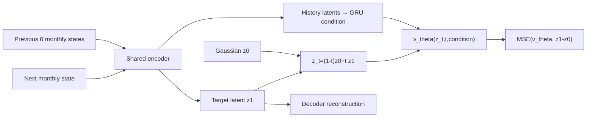

# Climate Diffusion: Monthly Latent Flow Matching

이 저장소는 기존 `typnonn_preesure_data_loader`가 만든 전 지구 기상장과 통합
태풍·고기압 표를 월별 state로 결합하고, 다음 1개월 state를 생성하는
conditional flow matching 모델을 제공합니다. Google WeatherNext2 원본 runner는
변경하지 않으며, 동일한 `rollout(initial_state, horizon_hours)` 경계에서
`weathernext`와 `flow_matching`을 선택할 수 있습니다.

엄밀히 말하면 이 모델은 일반적인 noise-schedule diffusion이 아니라
**latent conditional flow matching**입니다. Autoencoder latent에서 Gaussian noise와
다음 달 state 사이의 확률 흐름 ODE를 학습한다는 점에서 latent generative forecast
역할을 수행합니다.

## 전체 구조


## 1. 설치

```bash
git clone https://github.com/nayehyeon61-glitch/climate_diffusion.git
cd climate_diffusion
pip install -e '.[io]'
```

## 2. Main-system 데이터 통합

`--fields`에는 시간축을 가진 ERA5/HRES NetCDF 또는 Zarr를 전달합니다.
`--integrated`에는 `typnonn_preesure_data_loader`가 생성한 통합 Parquet/CSV를
전달합니다.

```bash
prepare-climate-monthly-data \
  --fields data/era5_hres_history.zarr \
  --integrated data/integrated.parquet \
  --variables msl t2m u10 v10 \
  --target-lat-points 18 \
  --target-lon-points 36 \
  --output data/monthly_climate_states.npz
```

출력:

```text
data/
├── monthly_climate_states.npz
└── monthly_climate_states.schema.json
```

- `.npz`: `[month, state_dimension]` monthly state와 관측 mask
- `.schema.json`: 변수별 slice, 차원, 좌표, 통합 표 feature 목록
- 전 지구 field는 지정한 저해상도 grid로 평균 pooling하여 초기 연구 비용을 줄임
- 통합 표의 수치 feature는 동일 달 기준으로 평균하여 field state 뒤에 결합

IBTrACS 통합 표만으로는 전 지구 대기장을 복원할 수 없습니다. WeatherNext 대체
runner를 만들려면 반드시 ERA5/HRES 같은 gridded field도 함께 학습해야 합니다.

## 3. 다음 1개월 Flow Matching 학습

```bash
train-climate-flow \
  --archive data/monthly_climate_states.npz \
  --history-months 6 \
  --lead-months 1 \
  --latent-dim 64 \
  --hidden-dim 256 \
  --epochs 100 \
  --batch-size 32 \
  --output checkpoints/climate-flow-matching.pt
```

학습 경로는 다음과 같습니다.



목적함수:

\[
\mathcal L =
\lambda_{rec}\|D(E(x_{m+1}))-x_{m+1}\|_2^2
+\lambda_{flow}\|v_\theta(z_t,t,c)-(z_1-z_0)\|_2^2
+\lambda_z\|z_1\|_2^2.
\]

시간 순서대로 train/validation을 분리하고, train 구간에서만 정규화 통계를
계산합니다. 최적 validation checkpoint와 metrics/metadata를 저장합니다.

## 4. 독립적인 월별 예측

```bash
forecast-climate-flow \
  --checkpoint checkpoints/climate-flow-matching.pt \
  --archive data/monthly_climate_states.npz \
  --months 1 \
  --ensemble-size 8 \
  --integration-steps 32 \
  --output outputs/next-month-ensemble.npz
```

각 ensemble member는 서로 다른 Gaussian latent에서 시작합니다. 여러 달을 요청하면
생성한 다음 달 state를 history에 넣는 autoregressive 방식으로 진행합니다.

## 5. WeatherNext2를 유지하면서 선택적으로 대체

기존 WeatherNext2 runner를 그대로 사용할 때:

```python
from climate_diffusion import ForecastSelectionConfig, build_forecast_runner

runner = build_forecast_runner(
    ForecastSelectionConfig(backend="weathernext"),
    weathernext_runner=official_weathernext_runner,
)
```

월 단위 Flow Matching 모델로 교체할 때:

```python
runner = build_forecast_runner(
    ForecastSelectionConfig(
        backend="flow_matching",
        flow_checkpoint="checkpoints/climate-flow-matching.pt",
        integration_steps=32,
        seed=7,
    ),
    weathernext_runner=official_weathernext_runner,
)

forecast = runner.rollout(
    monthly_history_dataset,
    horizon_hours=720,
)
```

`FlowMatchingWeatherRunner`의 계약:

- 입력: 학습 schema에 맞는 최소 `history_months`개월의 `xarray.Dataset`
- 출력: 학습한 gridded 변수로 복원한 월별 `xarray.Dataset`
- 시간 단위: 720시간을 1 model month로 정의
- inference-only: `fit()`, optimizer, backward 경로 없음
- provenance: `forecast_backend=flow_matching`, checkpoint 경로 기록

통합 표 feature를 추론 history에도 사용하려면 schema에 기록된 원래 column 이름을
월별 scalar data variable로 초기 `xarray.Dataset`에 포함합니다. 예를 들어
`typhoon_pressure_hpa(time)`와 `high_pressure_hpa(time)`를 field와 같은 월 시간축에
추가할 수 있습니다. 누락된 통합 feature는 train 평균값으로 채워져 중립 조건으로
처리됩니다.

기존 WeatherNext2 객체는 수정하거나 덮어쓰지 않습니다. 선택 함수가 동일한
rollout 경계에서 어느 runner를 반환할지만 결정합니다.

## 6. 기존 GPT·double-loss 시스템과 연결

Flow Matching 출력은 xarray이므로 main system의 tokenization 단계로 전달할 수
있습니다. 단, 기존 WeatherNext tokenizer의 기본 최대 lead time은 15일이므로 월별
출력에는 `max_lead_hours=720`인 별도 token 설정이 필요합니다.

권장 실험군:

| 실험 | Frozen forecast source | 후단 학습 |
|---|---|---|
| A | 공식 WeatherNext2 | GPT-FiLM + GRU + Transformer + double loss |
| B | fine-tuned WeatherNext2 | 동일 |
| C | monthly latent flow matching | 동일 |

이렇게 구성하면 novelty는 단순히 강한 모델을 제거하는 데 있지 않고,
`월 단위 생성적 operator + GPT-conditioned 태풍 history + distribution/track dual
objective`의 결합과 세 실험군의 정량 비교에서 형성됩니다.

## 현재 범위와 주의점

- 본 모델은 초기 연구용 저해상도 latent baseline입니다.
- WeatherNext2의 물리적 성능을 자동으로 대체한다고 보장하지 않습니다.
- 0.25° 전 지구 원해상도 학습에는 convolutional/operator autoencoder가 추가로
  필요합니다.
- 월별 평균은 태풍의 6시간 단위 극값을 약화시킬 수 있으므로, 월 단위 climate
  distribution과 단기 cyclone track 평가는 분리해야 합니다.
- 실제 논문 실험에서는 persistence, climatology, WeatherNext2와 동일 split에서
  CRPS·RMSE·distribution calibration·track error를 함께 비교해야 합니다.
