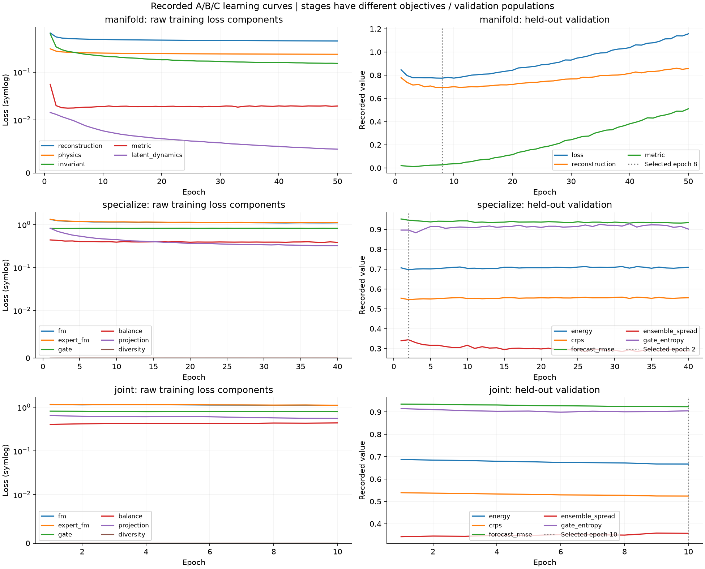
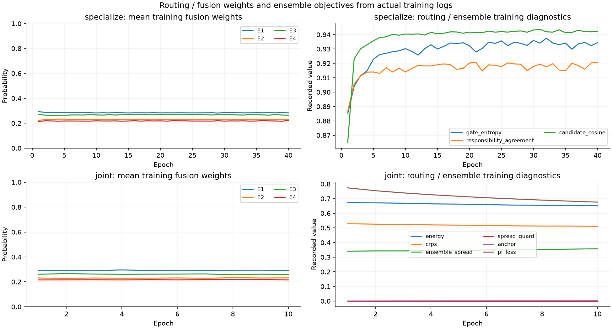
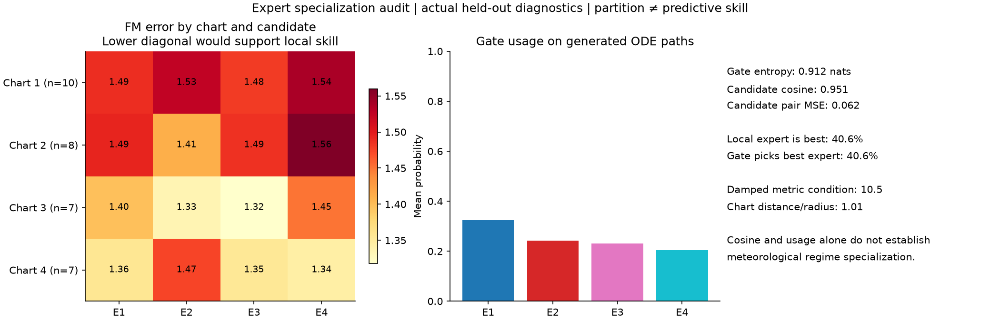
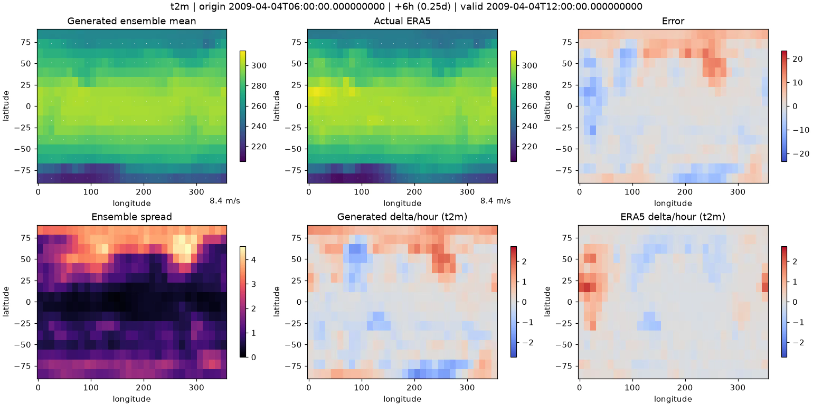
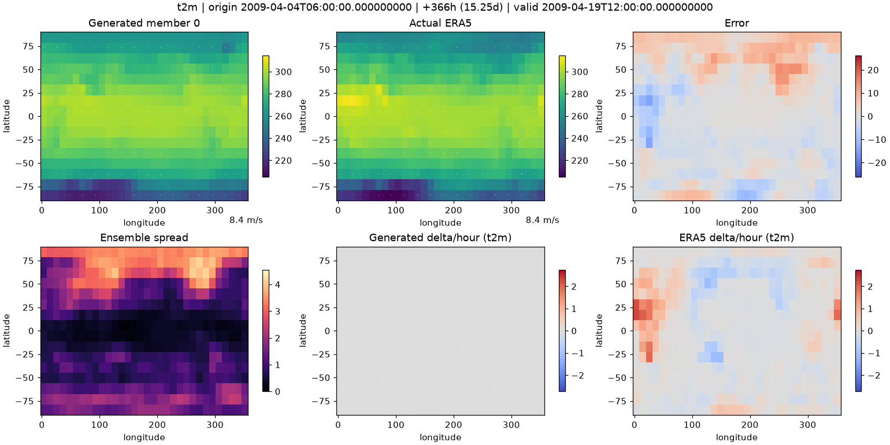

# 사용자 ERA5 run 그림 검토 — 2026-09-09

원본 첨부 그림을 다시 읽은 결과이며, 이 폴더는 새 학습 결과가 아닙니다.
검토 코드 `a3003d1fb53f5c1fecae21ff7a8cdfcf87069096`와 사용자 실제 실행 버전이 같은지는
checkpoint/명령이 없어 확인하지 못했습니다. [학습 개선 설계](../../training-mechanism/README.md).

## 근거와 범위

- `manifold-run-001-results(1).zip`: 5,255,158 bytes,
  SHA256 `b0ffd553f1529e026862421dd04759a5b4002f4ada9cdf4315710ee80c515804`.
- `validation-mean.mp4`: 1,805,385 bytes,
  SHA256 `767f1cd05485577d5531541c3c34cb83386af31d1189a1794086726eb914f865`.
- `validation-member-0.mp4`: 1,795,512 bytes,
  SHA256 `b80ae571b83bed240e0e62d53a0ca5e4592a69d090c1671dddb4654bc0ce55f7`.
- 사용자 원문 [user-training-proposal.txt](user-training-proposal.txt): 9,784 bytes,
  SHA256 `7a49784063e14fb967af4d548ce8d0f777ef7dbc36eebdfcd16d41c3e9ba799e`.
  원래 파일명에 포함된 시각은 참고자료 제목이며 새 실행 명령으로 해석하지 않습니다.

두 MP4는 ffprobe에서 모두 1540×770, 120 frames, 2.5fps, 48초였습니다.
ZIP에는 두 MP4와 training-abc/routing-learning/manifold-geometry/expert-specialization/
rank-histogram/validation-mean-frame0/validation-mean-frame60 PNG가 있습니다.
**NPZ 예측, metrics JSON, checkpoint, ERA5 archive는 없습니다.** 영상 색상에서 원시 물리량이나
전 기간 변화율을 복원했다고 주장하지 않습니다. 전체 영상을 Git에 중복 저장하지 않고 원본
PNG와 member 0의 24초 frame을 보존했습니다.

## 곡선 관찰

A/B/C 선택 epoch는 각각 8/2/10입니다. A train drift loss는 감소하지만 validation total/
reconstruction/metric은 최저점 이후 증가합니다. A 후기 일반화 저하에 부합하나, 현재 trainer는
best를 재로드하므로 마지막 weight가 실제 예측에 쓰였다고 단정하지 않습니다. B의 확률 지표는
대체로 정체되고 spread는 감소합니다. C는 Energy/CRPS가 소폭 개선됩니다. 눈으로 읽은
곡선 해석이며 checkpoint별 정량 재계산 결과가 아닙니다.

사용률이 분산되어 있다는 것과 expert가 기상 dynamics에 전문화되었다는 것은 다릅니다.

표기값: entropy 0.912 nats, cosine 0.951, pair MSE 0.062, local expert best 40.6%,
gate picks best 40.6%, damped condition 10.5, chart distance/radius 1.01. 영역별 n=10/8/7/7.
후보 중복을 의심할 근거이나 표본이 작고 최종 lead teacher-forced audit이므로 모든 lead의
전문화 실패/성공을 인증하지 않습니다. 현재 이 audit은 test 기반이므로 후속 튜닝에는
별도의 validation audit가 필요합니다.

## 화면과 해석의 한계

Frame 60의 표기는 origin 2009-04-04 06:00 → +366h → 2009-04-19 12:00로 산술상 맞습니다.
Mean뿐 아니라 member 0의 t2m 변화율 패널도 거의 중립색입니다. 평균화만으로 설명할 수 있는지
확인하려면 다른 member, raw arrays, 변수별 tendency가 필요합니다. 현재 render는 시간 전체에
공통 tendency 색 범위를 사용해 첫 origin jump가 크면 이후 작은 차분이 잘 안 보일 수도 있습니다.
색 범위를 바꾼 진단과 수치 측정을 병행하되 확대된 그림을 성능 개선으로 보고하지 않습니다.

후속 필수 자료: 예측 NPZ, archive/schema 또는 동일 valid-time 정답 slice, A/B/C checkpoint와
sidecar, 실행 인자, raw metrics. 이 자료가 확보되면 per-variable amplitude/lag, A reconstruction
차분 한계, mean/member 차이, 선택된 best 성능을 구별해 재계산합니다.
