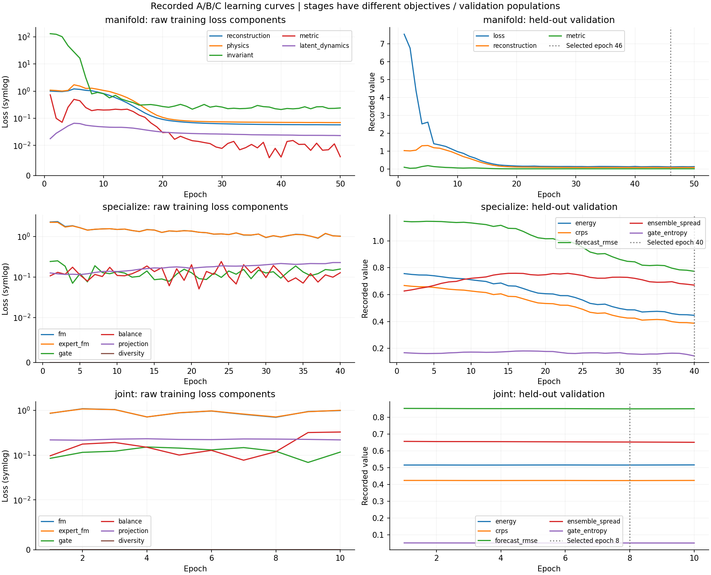
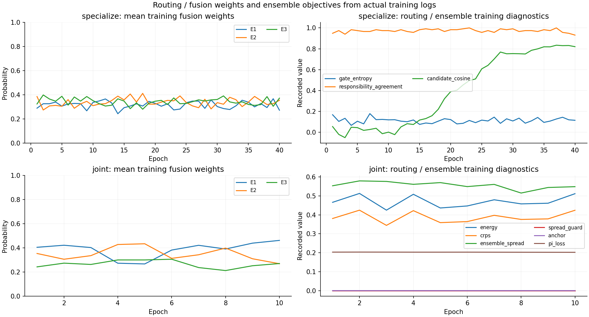
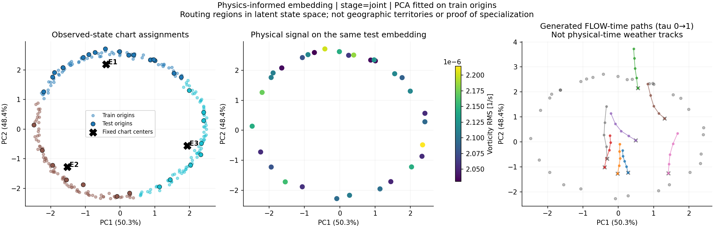
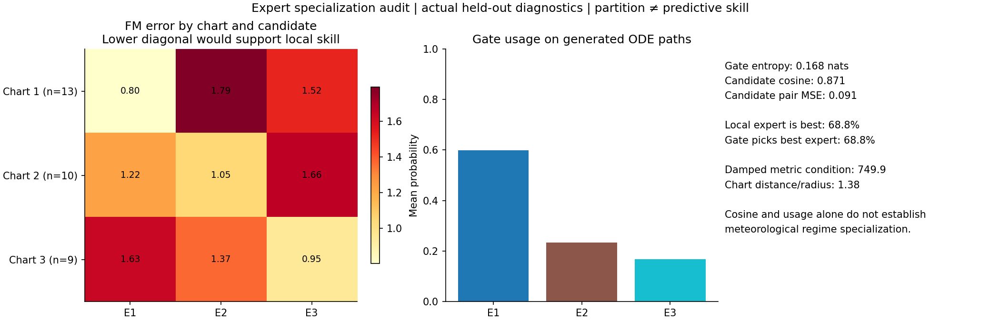
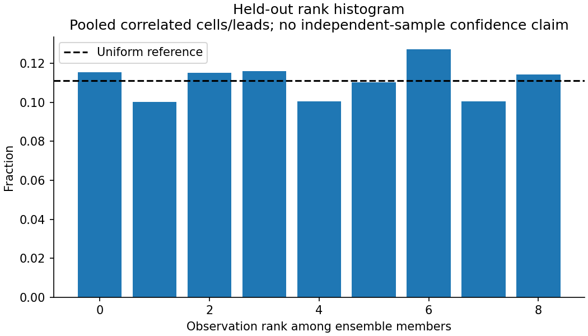

# Manifold MoE: 실제 synthetic A/B/C 검증

2026-09-08 CPU에서 `scripts/smoke_manifold_moe.py`를 실행한 기록입니다.
480개 6h 합성 state, 4변수(msl/t2m/u10/v10), 4×8 grid, D128, history6/stride1,
48h horizon, K3/M4, manifold dimension6, expert bottleneck64, gate hidden64입니다.
PI-AE pretrain50 + specialization40 + joint10 epoch, seed7이며 실제 ERA5/RunPod 학습이 아닙니다.

Python3.12.13, PyTorch2.14.0+cpu, NumPy2.3.5, CPU1thread, 143,221 parameters,
학습·평가·진단 포함 약36.25초, process peak RSS426.84MiB였습니다. 재실행 시간/체크섬은
환경에 따라 달라질 수 있습니다. GPU 비용/메모리나 실데이터 소요시간을 이 수치로 추정하지 마세요.

## 선택 모델과 freeze

| Stage | 실행 epoch | Validation 선택 epoch | 확인 |
|---|---:|---:|---|
| A: PI manifold | 50 | 46 | Train-only latent 통계와 chart fit |
| B: experts/gate | 40 | 40 | A manifold/physics/reference/geometry가 bitwise 동일 |
| C: joint | 10 | 8 | 작은 PI 학습률, 고정 A coordinate anchor |

Stage별 목적함수와 validation population이 달라 raw loss 높이를 stage간 성능으로 비교하면
안 됩니다. 아래 learning curve는 저장된 모든 epoch JSON으로 생성했습니다.

## 상태 영역과 실제 분업은 구분해서 확인

왼쪽 PCA 색은 gate의 선택일 뿐 전문화의 증거가 아닙니다. 가운데는 같은 좌표의 vorticity
신호이며 실제 대기 regime label이 아닙니다. 오른쪽은 독립 noise에서 생성하는 **flow time**
경로로 실제 48시간 기상 궤적이 아닙니다. 관측 좌표가 주로 원형 구조인데 생성 경로가 그 내부에
남는 모습도 보입니다. 영역을 나눴다는 것과 관측 분포를 잘 복원한다는 것은 별도 문제입니다.

아래는 test origin32개에 각각 독립 noise를 사용한 FM pair(최종 lead, tau=.5)의 측정입니다.
Origin은 시간적으로 상관돼 있으므로 독립 기상 사례32개로 해석하지 않습니다.
행의 영역은 **geometric prior**로 정하며 가장 잘 맞힌 expert 기준으로 행을 정하지 않습니다.

| 담당 chart | 표본 수 | E1 FM error | E2 FM error | E3 FM error |
|---|---:|---:|---:|---:|
| Chart1 | 13 | **0.8005** | 1.7941 | 1.5211 |
| Chart2 | 10 | 1.2226 | **1.0488** | 1.6638 |
| Chart3 | 9 | 1.6321 | 1.3681 | **0.9462** |

세 영역 모두 담당 expert의 평균 오차가 가장 낮았고, 개별 pair에서 담당 expert가 최저오차인
비율은 **68.75%**였습니다. 이는 이번 toy 표본의 국소 분업 증거입니다. 다른 seed/lead/ERA5
regime까지 검증된 결과는 아닙니다. 다른 전문가가 모든 표본에서 틀려야 한다는 목표도 아닙니다.

생성 ODE midpoint128개에서 gate 사용률은 59.96% / 23.29% / 16.75%, entropy .1685 nats,
candidate cosine .8710, pairwise MSE .0911입니다. **후보 유사도는 여전히 높습니다.** 공통
dynamics와 중복이 모두 영향을 줄 수 있어 cosine만으로 성공/실패를 판정하지 않습니다.
Gate balance는 완전 균등이 아니며 geographic regime 전문화는 입증하지 않았습니다.

## 동일 test 조건의 예측 성능

8 test origins, ensemble8, midpoint8, seed83, 전체8lead 비교입니다. 모든 방식에 같은
표준화·origin·초기 noise 조건을 사용했습니다. 최종 평가의 Energy/CRPS는 기존 평가 계약에
따라 diagonal pair를 포함하는 empirical estimator입니다. 학습/validation 선택의
off-diagonal fair estimator와 구분하세요.

| 모델/결합 | RMSE ↓ | Energy ↓ | CRPS ↓ | Mean spread | RMS spread / RMSE |
|---|---:|---:|---:|---:|---:|
| Stage B local | .79284 | .59635 | .49581 | .69051 | .92458 |
| Stage C uniform | .79729 | .59581 | .49305 | .62071 | .82980 |
| Stage C local | **.78193** | **.58730** | **.48727** | .68540 | .93038 |

최종 local은 같은 checkpoint의 uniform보다 RMSE가 약1.9% 낮았습니다. Persistence RMSE는
.83413입니다. 이것은 한 seed의 작은 합성 실험에서의 소폭 개선이며 불확실성 보정이나
15～30일 예측 skill의 증거는 아닙니다. 이전 MoE smoke RMSE .7422보다 좋지 않습니다.
이전 모델과 차원·학습 전략이 달라 통제된 architecture 비교는 아니지만 **신규 구조가 이전
모델의 예측 정확도를 개선했다고 주장할 수 없습니다**.

최종 ensemble의 경험적 80% quantile coverage는64.51%입니다. M8의 유한표본 quantile
영향과 cell/lead 상관을 고려한 calibration 비교가 필요합니다. Spread가 0이 아닌 것만으로
정확한 불확실성이라고 판단하지 않습니다. Rank histogram은 pooled correlated coordinates입니다.

## 남은 한계와 다음 보정 대상

- Test 관측 PI-AE reconstruction RMSE가 **.4377**로, 압축 오차가 작지 않습니다.
- Damped pullback metric condition number 평균은 **749.9**입니다. Ridge와 latent dimension,
  reconstruction/metric 가중치 보정 및 정밀도 확인이 필요합니다. 현재 solve는 유한했습니다.
- Projection이 제거한 raw-field 제곱 비율은 약.5295입니다. 이는 damped 차이량이며 정확한
  orthogonal normal-energy 비율은 아닙니다. Projection이 있다고 물리법칙 준수가 보장되지 않습니다.
- 생성 noise와 중간 state가 관측 chart 중심에서 벗어날 수 있습니다. 진단 JSON의
  `chart_distance_over_radius_mean`은 최근접 차트까지 RMS 거리 / train RMS radius입니다.
- 물리항은 surface diagnostic matching이며 primitive PDE, 정확한 보존법칙은 아닙니다.
- Leadwise 조건부 ensemble이며 학습된 joint physical-time trajectory는 아닙니다.

구조 추가 대신 데이터·AE 압축·loss weight·locality temperature·ridge·LR·적분 step의
보정과 다중 seed/held-out 비교를 진행하는 기준 실험입니다.

## 재현과 검증

[실행 README](../../../flow-matching_moe/MANIFOLD_README.md)의 **A → 시각화 → B → 시각화 → C → 평가**
명령을 따르세요. `summary.json`, `training-metrics.json`, `diagnostics-*.json`,
`evaluation-*.json`은 실제 로그입니다. `.pt`/archive는 Git에 올리지 않고 smoke로 재생성합니다.
기존 MoE와 dynamics 실험 결과는 보존했습니다.

기존32개 + 신규7개 = **39개 테스트 통과**: projection 수학/gradient, decoder Jacobian,
simplex/locality, member coupling, A→B frozen geometry, C gradient, standalone phase 재로드,
checkpoint checksum, forecast CLI/adapter/evaluation, 기존 DCT roundtrip/split/mask 계약을 포함합니다.
실제 ERA5 장기 학습, RunPod, CUDA 성능/메모리, 기상학적 regime label 검증은 실행하지 않았습니다.
