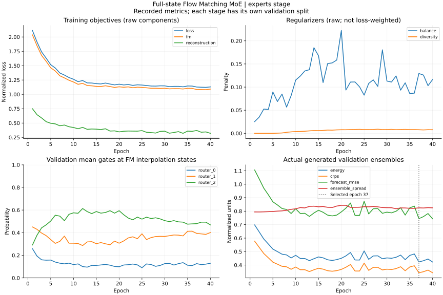
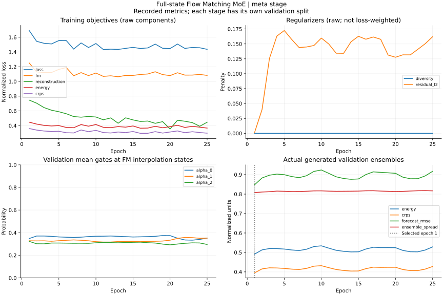
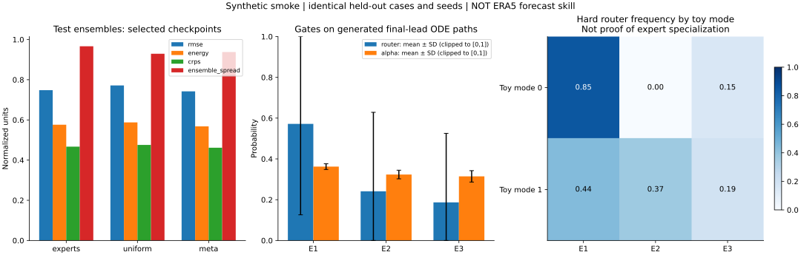

# 실행 결과: Full-state FM-MoE synthetic smoke

실행일: 2026-09-08 (KST). 기준 코드: `552191a`의 기존 dynamics 수정 위에 추가한 MoE 경로.
실제 ERA5/RunPod/GPU 장기 학습이 아니라 **CPU synthetic end-to-end 검증**입니다.

## 실행 조건

- 480개의 6h state, 4개 변수 × 4 lat × 8 lon = D128.
- 두 toy 전파 방향이 전체 변수에 영향을 주는 합성 파동장. Toy label은 학습에 사용하지 않음.
- History 6개 연속 시점, horizon 8 steps = **48시간**. 15~30일 검증이 아님.
- Experts 3개, expert AE64/meta AE160, hidden64/context32, 324,070 parameters.
- Expert 40 epoch, meta 25 epoch, AdamW LR 0.001, batch16, window stride2.
- Train ensemble4/midpoint steps4. Test ensemble8/steps8, 동일 seed와 8개 test windows.
- Data seed19, train seed7, test seed83. Python 3.12.13 / PyTorch 2.14.0 CPU / NumPy 2.3.5.
- Split before subsampling: train231 / expert_validation46 / calibration70 / validation46 / test46.
- 경계 purge 7개씩. Normalization은 raw state `[0,244)`만 사용.
- Selected expert epoch37, meta epoch1. Stage 2의 frozen weights가 **bitwise 동일**함을 검사.
- 학습+평가+audit 약 10.2초, 해당 CPU process peak RSS 약 407 MiB. 설치·테스트·plot 제외.

## Held-out 비교

아래 모두 같은 최종 checkpoint에 포함된 expert 파라미터를 사용하며 결합 방식만 다릅니다.
동일 test windows, member noise seed, integration step 수를 사용했습니다. Error와 score는 낮을수록
좋으며 **spread는 높거나 낮을수록 무조건 좋은 점수가 아닙니다**.

| 결합 | RMSE | Energy | CRPS | Ensemble spread |
|---|---:|---:|---:|---:|
| Warm-up router | 0.74797 | 0.57622 | 0.46690 | 0.96650 |
| Uniform vector-field fusion | 0.77155 | 0.58767 | 0.47555 | 0.92917 |
| Meta learner + residual | 0.74217 | 0.56805 | 0.46168 | 0.93792 |

Persistence RMSE 0.83413, train-climatology RMSE 1.05364. 모든 값은 train 통계의 표준화 좌표.
Energy/CRPS는 평가용 empirical estimator이고 학습 그래프의 fair score와 직접 일치하지 않습니다.
Test window들의 horizon이 서로 겹칠 수 있어 독립 표본 8개라는 뜻도 아닙니다.

## 해석

1. **학습 경로는 동작합니다.** Expert train total loss는 첫 epoch 2.11232에서 마지막
   1.12964로 줄었습니다. Validation Energy+CRPS 기준으로 마지막이 아닌 epoch37을 선택했습니다.
2. **Meta 개선은 작습니다.** Router 대비 RMSE 약 0.8%, CRPS 약 1.1% 개선입니다.
   하나의 seed와 작은 test 구간이므로 유의한 일반화 이득이라고 주장할 수 없습니다.
3. **Meta를 오래 학습한다고 좋아지지 않았습니다.** Meta epoch1이 validation 최적이었고
   이후 validation score는 개선되지 않았습니다. 마지막 epoch를 저장하는 구현이었다면
   이 실행에서 더 나쁜 모델을 배포했을 가능성이 있습니다.
4. **Ensemble collapse는 이 smoke에서 관측되지 않았지만 calibration은 미검증입니다.**
   Meta spread 0.938이 유지되지만 ensemble-mean RMSE 0.742보다 큽니다. 이는 해당 요약상
   overdispersion 가능성을 점검할 이유이지 reliability 검증을 대신하지는 않습니다.
5. **강한 regime 전문화를 입증하지 못했습니다.** 생성 경로의 평균 router 사용률은
   `[0.572,0.241,0.187]`, mean alpha는 `[0.362,0.323,0.314]`입니다. 모든 expert가 쓰이지만
   meta는 균등 결합에 가깝습니다. Router entropy 0.197 nats (최대 1.099), 후보 velocity의
   평균 cosine 0.745. Toy-mode/hard-route MI 0.143 nats는 상관된 ODE sample에서 측정한
   단순 진단이며 기상 regime 학습 증거가 아닙니다.

다음 검증은 여러 seed 및 더 긴 calibration/validation 구간, single-expert baseline,
meta residual 제거, 실제 regime별 conditional error, rank histogram/coverage,
solver-step 수 민감도입니다. **이 test 결과를 보고 hyperparameter를 반복 조정하지 마세요.**

## 그래프와 원본 로그

- [training-metrics.json](training-metrics.json): 모든 epoch의 train/validation loss, usage, spread.
- [summary.json](summary.json): 환경, SHA, freeze 검사, routing 감사, test 요약.
- [evaluation-experts.json](evaluation-experts.json), [evaluation-uniform.json](evaluation-uniform.json),
  [evaluation-meta.json](evaluation-meta.json): case별·lead별·변수별 실제 평가.

재현 명령과 메커니즘 수정 위치: [MoE README](../../../flow-matching_moe/README.md).
Synthetic archive 및 checkpoint는 `outputs/moe-smoke/`에서 재생성하며 Git에는 넣지 않습니다.

## 검증 범위

전체 pytest **32개 통과**(기존 테스트의 scalar-conversion warning 1개). 자동 테스트는
DCT/IDCT roundtrip·SciPy 일치·gradient, routing/fusion simplex,
동일 member의 expert 입력 일치, **fusion-before-integration**의 해석적 midpoint 비교,
member 독립성/재현성, meta gradient의 finite-difference 일치, frozen expert 유지,
누수 없는 split, mask/시간 계약 fail-fast, 두 단계 checkpoint 재로드, CLI forecast,
weather adapter, 학습 archive와 adapter의 pooling 일치, 다른 grid의 fail-fast,
held-out evaluation을 검사합니다. 기존 monthly/dynamics 회귀 테스트도 함께 실행합니다.
수정된 구조 문서의 Mermaid 6개(보존된 기존 그림 1개 포함)는 Mermaid parser로 검증했습니다.
Editable install 및 실제 `forecast-climate-flow` CLI 출력도 확인했습니다.

실제 ERA5 archive 및 기존 LFS 실험 checkpoint의 재학습/성능 재평가, RunPod/GPU 실행,
전지구 고해상도 메모리, 15~30일 예측 skill, 물리 보존·joint-time 분포는 미실행/미검증입니다.
