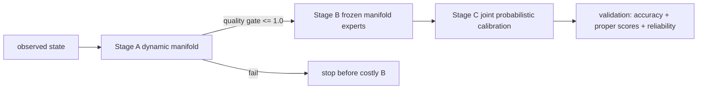

# Physical-Time Recurrent Flow 최적화 감사·구현 보고

기준 결과는 `results/physical-recurrent-run-001@6caf8a63a6698d0298280916698b19ee87f3755a`,
원래 모델 코드는 `f897046b94db108eff4e36a8fb6d129a847347a4`이다. 이 브랜치는 결과 브랜치의
Stage-C 전용 `temporal_c`와 `_run_full_pipeline.sh`를 포함한 최신 결과 HEAD에서 분기했다.
`main`과 결과 브랜치는 수정하지 않았다.

## 결론

이번 영상은 바람 방향/크기 변화가 생겼다는 **동작 증거**다. 정확도나 calibration 개선 증거는 아니다.
실제 validation은 RMSE 1.0480으로 persistence 0.9810과 climatology 1.0150보다 나쁘고,
coverage@80은 0.4947, spread/skill은 0.7168이다. pooled rank histogram의 양 끝 bin은 중앙의
2.35배다. 단, M=8이고 격자·시간이 강하게 상관되어 있으므로 이것으로 full support coverage를
주장할 수 없다.

단 하나의 예측 최적화 우선순위는 **Stage A의 변화량 보존**이다. 실제 ERA5 A best epoch 7에서
state reconstruction MSE는 msl/t2m/u10/v10 = 0.452/0.217/0.734/0.697인데 decoded 6h
tendency MSE는 1.064/1.077/1.059/1.043이다. B는 이 geometry를 동결하므로 C에서 확률 loss만
강화하기 전에 A가 실제 변화 방향을 보존해야 한다.

## 구현

1. Stage A에 두 가지 opt-in이 아닌 최적화 브랜치 기본 loss를 연결했다.
   - `loss_ae_delta`: 양 endpoint를 decode한 차분을 train-only tendency scale, grid area,
     variable metric으로 정규화해 실제 차분과 비교한다.
   - `loss_finite_step_drift`: 실제 추론과 같은 `z + (dt/24)b(z)`를 decode한 finite Euler delta를
     실제 차분과 비교한다. 6h 차분을 순간 tangent라고 부르지 않는다.
   - 기본 가중치는 실행 스크립트에서 각각 0.05다. 새 network는 없다.
   - best A의 변수 평균 decoded-tendency MSE가 1.0을 넘으면 Stage B 전에 실패시킨다. 기존 A의
     값은 약 1.061이므로 최소 5.7% 개선을 요구하는 비용 방지 gate다.
2. B/C 계산에서는 한 physical step 동안 고정인 `physical_q`의 decode, decoder Jacobian,
   `JᵀWJ`, Cholesky factor를 한 번만 만든다. 다음 physical step에는 반드시 새로 계산한다.
   autograd graph를 유지하며 detach/cache-across-step은 없다.
3. 평가기는 biased/fair CRPS와 Energy를 모두 내고 lead별 bias/RMSE/score, 50/80/90% central
   coverage, member pair distance를 기록한다. finite-M·상관된 rank/coverage라는 계약도 기록한다.



## ensemble collapse 진단

- aggregate mean bias는 -0.0128로 작지만 변수별 raw bias는 msl +21.15 Pa, t2m +0.205 K,
  u10 -0.255 m/s, v10 -0.0148 m/s다. 작은 global bias가 지역·위상 bias 부재를 뜻하지 않는다.
- source-noise 이후 residual member variance는 첫/마지막 step 9.43e-4/7.89e-4 q²/hour²로
  완전히 사라지지 않는다. 따라서 단순한 seed 복제는 아니다.
- tangent projection norm ratio는 평균 0.575(첫 0.572, 마지막 0.539)다. projection 수축은 있지만
  이것만으로 차원 부족이나 collapse 원인이라고 단정할 수 없다.
- drift q-RMS/hour는 0.0276→0.0299, residual은 0.0367→0.0356인데 결합값은 0.0394→0.0159로
  감소한다. late lead에서 drift와 residual의 상쇄가 보이지만 causal 원인은 drift-only,
  residual-only, full 동일 cohort 대조가 필요하다.
- raw-state member pair RMSE는 +6h 57.7에서 +120h 596.4로 커진다. member가 완전히 동일해진 것은
  아니며, **truth error에 비해 조건부 spread가 부족한 under-dispersion**이 더 정확한 표현이다.
- expert candidate cosine 0.531과 gate entropy 0.827만으로 member collapse를 설명할 수 없다.
  expert 후보 유사성과 noise-member collapse는 별개다.

현재 `delta_member`는 `mean-delta MSE + member variance penalty`의 항등식을 가지므로 양의 가중은
분산을 줄이는 쪽이다. 실제 C는 이미 0, B는 0.001이다. 한 번의 confounded B/C 비교만으로 0의
효과를 판정하지 않는다. 또한 B/C checkpoint selection은 둘 다
`fair Energy + fair CRPS + 0.1*trajectory Energy`, 동일 validation indices, M=4, tau=4,
동일 seed/RNG로 계산된다. 따라서 기존 README의 “C loss가 섞여 selection score를 직접 비교하기
어렵다”는 설명과 달리 **selection score 자체는 직접 비교 가능**하다. B best 1.34845보다 C best
1.35516이 0.50% 나쁘다. training total loss와 selection score는 비교하지 않는다.

## L2와 ‘정보적 loss’의 정확한 구분

| 대상 | 실제 학습 objective | stochastic conditioning | 판단 |
|---|---|---|---|
| 현재 A | state/physics/invariant/metric/latent-drift L2 + 새 decoded delta/finite drift L2 | 없음 | state geometry에는 유지, 변화량 직접 감독 보완 |
| 현재 B | noise/tau/lead/physical-q conditioned FM velocity L2 + expert/gate/projection | 있음 | L2라는 이유로 collapse라 단정 불가; 유지 |
| 현재 C | B objective + fair marginal CRPS/Energy + fair joint state+increment trajectory Energy | 있음 | probabilistic score 이미 존재; estimator/scale/weight ablation 우선 |
| GenCast / WeatherNext Gen | noise-level conditioned denoising MSE(score matching 계열), area·variable·noise-level 가중 | 매 step 새 diffusion noise | CRPS는 주로 평가; deterministic endpoint MSE와 다른 문제 |
| WeatherNext 2 FGN | 2 samples의 fair marginal CRPS, area·variable-level 가중, 최대 8-step AR fine-tune | 32D global functional noise; 4 independent model seeds | marginal loss만으로 joint law가 수학적으로 식별된다는 뜻은 아님 |
| WeatherNext 3 | 2 trajectories의 fair marginal CRPS를 modality/field/time별 합산, 일부 global-pooled CRPS | FGN + 2 seeds + epistemic dropout | 공식적으로 2026-09-03 공개됨; WN2 objective를 확장 |

제곱오차라는 표면만 같아도 deterministic `f(x)→y`의 최적값은 조건부 평균인 반면,
FM/denoising은 `(noise,tau 또는 sigma,condition)`별 vector/denoiser를 회귀한다. FM optimal vector가
conditional expectation이어도 그 ODE가 운반하는 분포가 점질량이어야 하는 것은 아니다.
KL/likelihood/entropy, proper scores(CRPS/Energy), score matching은 서로 다른 개념이다. CRPS는
극단 tail을 자동 보장하지 않고, pointwise marginal CRPS만으로 joint dependence가 식별되지 않는다.

공식 근거:

- GenCast Nature paper: https://www.nature.com/articles/s41586-024-08252-9
- WeatherNext 2 / FGN paper: https://arxiv.org/abs/2506.10772
- official WeatherNext repository: https://github.com/google-deepmind/weathernext
- WeatherNext 3 paper (submitted 2026-09-03): https://arxiv.org/abs/2609.03582
- WeatherNext 3 official announcement: https://blog.google/innovation-and-ai/models-and-research/google-deepmind/introducing-weathernext-3/

GenCast를 “WeatherNext1”이라 부르기보다 공식 제품 계보의 `WeatherNext Gen`으로 구분하는 편이
정확하다. WN2 논문의 56-member 평가는 4 seeds×14 members다. “single pass 64 members”는 한 member가
diffusion의 39 denoiser 평가 대신 한 network pass로 생성되고 병렬화할 수 있다는 뜻이지, 한 호출이
항상 64개를 반환한다는 구현 계약으로 해석하면 안 된다.

## 측정 결과와 검증 범위

- 실제 C checkpoint weight로 CPU batch=2, tau=4 forward+backward median:
  0.14485s → 0.05667s, **2.56×**. Jacobian 호출은 physical step당 8→1.
- forward max abs diff 2.98e-7, physical-q gradient max abs diff 8.94e-8,
  parameter-gradient relative L2 diff 4.28e-7.
- 이는 CPU 한 physical-step 측정이다. GPU speedup이나 peak-memory 개선률로 보고하지 않는다.
- 전체 test suite 66개가 통과했다.
- raw ERA5 `/workspace/data/era5-temporal-6h.npz`는 접근 불가했다. 따라서 새 loss의 실제 ERA5
  RMSE/CRPS/Energy 개선은 **미입증**이다. LFS checkpoint/forecast/trajectory 실제 바이트와 SHA는
  manifest에 일치했다.

## 새 학습·비교 순서

```bash
git clone --branch feature/physical-recurrent-optimization --single-branch \
  https://github.com/nayehyeon61-glitch/climate_diffusion.git climate_diffusion_opt
cd climate_diffusion_opt
python -m venv .venv
source .venv/bin/activate
pip install -e '.[test,plots,io]'

export TEMPORAL_ARCHIVE=/workspace/data/era5-temporal-6h.npz
export TEMPORAL_RUN=/workspace/experiments/physical-recurrent-opt-a1
export TEMPORAL_DEVICE=cuda
export TEMPORAL_A_DELTA_WEIGHT=0.05
export TEMPORAL_A_DRIFT_WEIGHT=0.05
export TEMPORAL_A_TENDENCY_MAX=1.0
bash scripts/run_recurrent_120h.sh prepare
bash scripts/run_recurrent_120h.sh A
# A gate가 통과한 경우에만
bash scripts/run_recurrent_120h.sh B
bash scripts/run_recurrent_120h.sh C
bash scripts/run_recurrent_120h.sh validation
bash scripts/run_recurrent_120h.sh render
```

재개는 기존 checkpoint를 덮어쓰지 않는다. phase 실패 시 기존 run을 보존하고 새 `TEMPORAL_RUN`을
만든다. A 좌표가 바뀌므로 기존 B/C weights를 재사용하지 말고 A→B→C를 다시 학습한다. model key와
checkpoint format은 그대로라 old checkpoint inference는 호환된다.

최소 ablation은 같은 split/seed에서 A0(두 새 가중치 0), AΔ(0.05/0), Adr(0/0.05),
AΔ+dr(0.05/0.05)까지만 한다. gate 통과 후보 중 validation decoded tendency와 state reconstruction을
동시에 개선한 하나만 B/C로 보낸다. 이후 같은 B에서 C-member=0/0.001 한 쌍과 M/tau
4/4 대 8/16 민감도만 비교한다. test split은 고정된 최종 모델 한 번에만 사용한다.

수용 기준은 validation block bootstrap CI와 함께 (1) RMSE가 persistence보다 낮음,
(2) fair CRPS·fair Energy·joint trajectory Energy가 baseline C보다 개선,
(3) 50/80/90 coverage와 spread-skill이 개선하되 RMSE/score 악화 없음,
(4) member prefix/identity와 물리적으로 연속된 120h 경로 유지다. calibration split의 bias correction와
제한된 spread scaling은 그 다음 대조이며 test truth 기반 reweighting은 금지한다. step innovation,
entropy reward, 새 meta learner는 noise 계약을 바꾸므로 후순위다.

## 재현 명령

```bash
PYTHONPATH=src python scripts/audit_recurrent_result.py \
  --result docs/results/physical-recurrent-run-001 \
  --output docs/results/physical-recurrent-optimization/audit-existing-run.json \
  --figure docs/results/physical-recurrent-optimization/audit-existing-run.png

PYTHONPATH=src python scripts/benchmark_recurrent_geometry.py \
  --checkpoint docs/results/physical-recurrent-run-001/c.pt \
  --output docs/results/physical-recurrent-optimization/geometry-benchmark-cpu.json \
  --batch-size 2 --integration-steps 4 --repeats 3

PYTHONPATH=src python -m pytest -q
```
