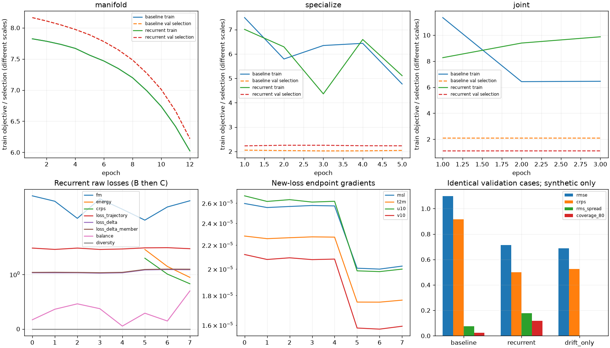
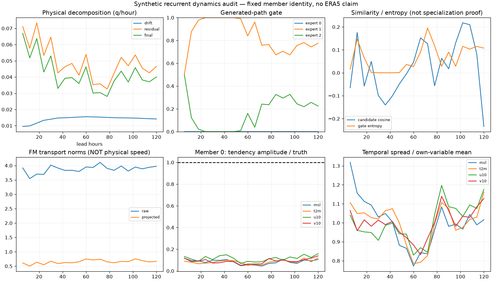

# Physical-time recurrent Flow: 구현 검증과 남은 dynamics 한계

2026-09-11 실행. **실제 물리시간 재귀·잔차 Flow Matching·20-step 전체 역전파를 구현했습니다. 이번 짧은 합성 학습으로 dynamics 약화가 해결되지는 않았습니다.** 실제 ERA5 재학습은 수행하지 않았습니다.

## 1. 기존 ERA5 결과에서 확인한 범위

읽기 전용 기준은 [`results/temporal-120h-era5-run-001`의 3e79970](https://github.com/nayehyeon61-glitch/climate_diffusion/tree/3e79970a1a5b777c5dee10cf3004bcad7a287056/docs/results/temporal-120h-era5-run-001)입니다. 원본 JSON의 8개 member를 확인했습니다. 아래 범위는 그중 **origin 2009-05-19T06:00:00Z, member 0, 첫 구간을 제외한 +6→+12 … +114→+120h**이며 전체 origin의 성능을 뜻하지 않습니다.

| 변수 | 기존 ERA5 예측/정답 tendency 진폭 비 |
|---|---:|
| t2m | 0.00954–0.03609 |
| u10 | 0.04031–0.07779 |
| v10 | 0.03223–0.06762 |
| msl | 0.03910–0.07749 |

저장된 validation coverage80은 0.33494, spread/skill은 0.42329, candidate cosine은 0.93254입니다. 이는 후속 변화와 ensemble 분산 부족을 검토할 근거이며 원인 하나를 입증하지 않습니다. 마지막 epoch와 best A/B/C(6/1/10)를 구분했습니다. metadata의 실제 grid는 **4×16×32=2048**입니다. README의 18×36은 pooling 요청 크기와 혼동되어 있었습니다.

현재 환경에는 이 실험의 실제 ERA5 archive·forecast 원본·checkpoint 또는 연결된 RunPod가 없습니다. 아래 수치는 별도의 합성 실험이며 위 결과와 직접 전후 비교하지 않습니다.

## 2. 코드에서 변경한 메커니즘

기존 A의 `latent_drift`는 **encoder z/day**로 학습됩니다. 이를 표준화 좌표 q/day로 변환하여 physical backbone에 연결했습니다. FM은 teacher-forced 인접 관측에서 추출한 `(q_next-q)/(dt_hours/24)-drift(q)`의 조건부 residual 분포를 학습합니다.

각 physical step에서 모든 expert가 동일 member의 현재 q를 공유합니다. 후보 transport를 현재 physical chart의 공통 좌표로 투영·결합한 후, 안쪽 생성 τ ODE를 적분하여 residual 샘플을 얻습니다. 바깥 physical Euler step은 `q_next=q+(dt_hours/24)*(drift+residual_sample)`입니다. 다음 step에 이 q_next가 그대로 들어갑니다. τ vector를 physical drift에 직접 더하지 않습니다.

member 간 noise는 독립이며, 같은 member는 20개 physical step 동안 같은 초기 noise identity를 재사용합니다. 중간 teacher forcing·detach·member 재정렬은 없습니다. 미래 target은 FM 감독과 loss에서만 사용합니다. 출력은 고정 origin-offset을 사용하는 `origin + decode(q_j) - decode(q_origin)`입니다. 따라서 초기 AE reconstruction jump 제거도 state RMSE 개선에 영향을 줄 수 있습니다.

기존 FM/PI/specialization/ensemble·joint endpoint+increment Energy를 유지하고, 작은 `loss_delta_member`를 추가했습니다. **member tendency MSE = mean tendency MSE + ensemble variance 벌점**이므로 weight 0 ablation과 spread/coverage 확인이 필요합니다. 정확한 수식·CLI·checkpoint 호환 정책은 [전체 매뉴얼](../../../flow-matching_moe/RECURRENT_TRAINING_MANUAL.md)에 있습니다.

## 3. 실제 실행 조건

- 합성 480개 시각, 6h 간격, 4변수×4위도×8경도, intrinsic dimension 4, experts 3. 내부 expert/gate 폭은 64/160, 총 parameters 73,119개입니다.
- baseline와 recurrent 모두 새 초기화부터 A12/B5/C3 epoch를 실행했습니다. A weights가 정확히 동일함을 비교했고 B의 frozen parameter 동일성도 확인했습니다.
- train seed 7, evaluation seed 83, members 3, 생성 τ midpoint 2step. 모든 B/C batch에서 **20개 edge 전체, 6h×20=120h** loss와 backward를 실행했습니다.
- 두 방식 모두 기존 temporal/wind loss와 새 member 보조항을 활성화했습니다. baseline은 lead-conditioned 상태 생성, recurrent는 물리시간 재귀 residual 생성입니다. drift-only는 recurrent C의 같은 weights를 사용한 ablation입니다.
- 동일한 2개 held-out validation window로 비교했습니다. test를 선택·튜닝에 사용하지 않았습니다. best baseline A/B/C=12/3/3, recurrent=12/1/1입니다.
- CPU/Python 3.12.14/PyTorch 2.14.0+cpu, 136.64초, 전체 process peak RSS 663.18MiB. GPU peak VRAM 측정값이 아닙니다.

모든 숫자와 archive/checkpoint SHA256은 [summary.json](summary.json)에 있습니다. checkpoint 자체는 실험 output 폴더에 보존하고 Git에는 보고서·로그·forecast를 저장했습니다. 아래 명령으로 같은 초기화와 학습을 재현할 수 있습니다.

## 4. 수치와 해석

state 오차는 train 통계로 정규화한 값입니다. 변수 원시 Pa/K/m/s를 같은 physical norm으로 섞은 수치가 아닙니다.

| 동일 validation 조건 | RMSE ↓ | CRPS ↓ | Energy ↓ | RMS spread | Coverage80 |
|---|---:|---:|---:|---:|---:|
| Lead-conditioned baseline | 1.09794 | 0.91715 | 1.06402 | 0.07621 | 2.42% |
| Recurrent drift + residual FM | 0.71378 | 0.49865 | 0.58970 | 0.17873 | 11.80% |
| Recurrent C drift-only | 0.68894 | 0.52470 | 0.62111 | ≈0 | 0% |

Persistence RMSE는 **0.69034**로 recurrent보다 작습니다. recurrent의 CRPS/Energy는 이 비교에서 낫지만, physical dynamics 개선이나 불확실성 보정 완료를 뜻하지 않습니다. 약한 lead-conditioned baseline 대비 state 개선에는 origin-offset 효과도 포함되어 있습니다. 이를 분리하는 추가 ablation 없이 전부 recurrence의 학습 효과라고 해석할 수 없습니다.

[합성 member 0 JSON](members-6h/member-000.json)의 첫 구간 이후 tendency 진폭 비는 msl 0.0448–0.1088, t2m 0.0508–0.1200, u10 0.0676–0.1597, v10 0.0516–0.1389입니다. **실제 변화량의 상당 부분을 여전히 따라가지 못합니다.** 80% interval coverage도 11.8%에 그쳐 underdispersion이 남습니다.

생성 경로 gate 사용률은 약 `[0.000008, 0.839, 0.161]`, entropy 0.0643 nats, candidate cosine 0.0232입니다. 후보 cosine은 낮지만 한 expert는 거의 사용되지 않습니다. 기상 regime 전문화 성공으로 해석하지 않습니다. 매우 작은 A/학습 예산과 1seed/2window 결과만으로 과적합의 단일 원인이나 최적 계수를 결정하지 않습니다.

## 5. 실제 로그와 member 시각화





| 동일 저장 forecast의 member | Fixed 6h MP4: 20frame | Fixed 12h GIF: 10frame | 변수별 물리시간 진단 |
|---|---|---|---|
| 0 | [MP4](members-6h/member-000.mp4) | [GIF](members-12h/member-000.gif) | [JSON](members-6h/member-000.json) |
| 1 | [MP4](members-6h/member-001.mp4) | [GIF](members-12h/member-001.gif) | [JSON](members-6h/member-001.json) |
| 2 | [MP4](members-6h/member-002.mp4) | [GIF](members-12h/member-002.gif) | [JSON](members-6h/member-002.json) |

추가 [adaptive quiver](members-6h/member-000-adaptive.gif)와 [풍속·온도 tendency map](members-6h/member-000-dynamics.gif)은 진단용입니다. 전자는 시간별 화살표 scale이 바뀌므로 dynamics 개선 근거로 사용하지 않습니다. 기본 fixed 영상의 scale/FPS를 키워 성능을 개선하지 않았습니다. 화살표는 Eulerian wind이며 입자 위치가 아닙니다. 세 member 모두 같은 [forecast-6h.npz](forecast-6h.npz)에서 추출했습니다.

## 6. 검증 범위와 다음 실행

전체 **63개 테스트 통과**, 새 Mermaid 2개 parse 성공, 매뉴얼 shell/embedded Python 구문 검사 성공. 기존 회귀 테스트를 포함합니다. 실제 nonlinear model의 full20-step gradient, B 동결, C 미분, step2 입력=step1 출력, independent member/persistent source, 6h/12h 단위, residual/drift ablation, member-loss 분산 항등식, checkpoint roundtrip/구버전 reject, future-target 누수 방지, exact valid time/prefix를 확인했습니다. 일정 속도 20-step 시험은 분석적 stub이며 학습된 예보 성능과 구분합니다.

최종 MP4는 1100×460/20frame, 12h GIF는 1100×459/10frame입니다. 모든 member를 렌더링하고 실제 저장 그림도 확인했습니다. 과거 ERA5 지표 재계산, 실제 ERA5 A/B/C 재학습, GPU/4090 peak VRAM·장기 안정성·보정 개선은 실행하지 않았습니다.

```bash
python -m pip install -e '.[test,plots,io]'
OMP_NUM_THREADS=1 MKL_NUM_THREADS=1 python -m pytest -q
OMP_NUM_THREADS=1 MKL_NUM_THREADS=1 python scripts/smoke_recurrent_flow.py \
  --work-dir outputs/recurrent-reproduction-001 \
  --report-dir outputs/recurrent-reproduction-report-001
```

실제 ERA5는 [전체 매뉴얼](../../../flow-matching_moe/RECURRENT_TRAINING_MANUAL.md)의 새 폴더 설정 후 `prepare → A → B → C → validation → render → 설정 고정 후 test` 순서로 진행합니다. 우선 1epoch pilot에서 단위·loss·메모리를 검사한 뒤 새로운 full run 폴더에서 처음부터 학습하세요. 모델 구조 확대 없이 다음 보정에서는 A reconstruction/drift 일반화, origin-offset ablation, member weight 0 비교, residual spread와 gate 사용률을 함께 점검해야 합니다.
