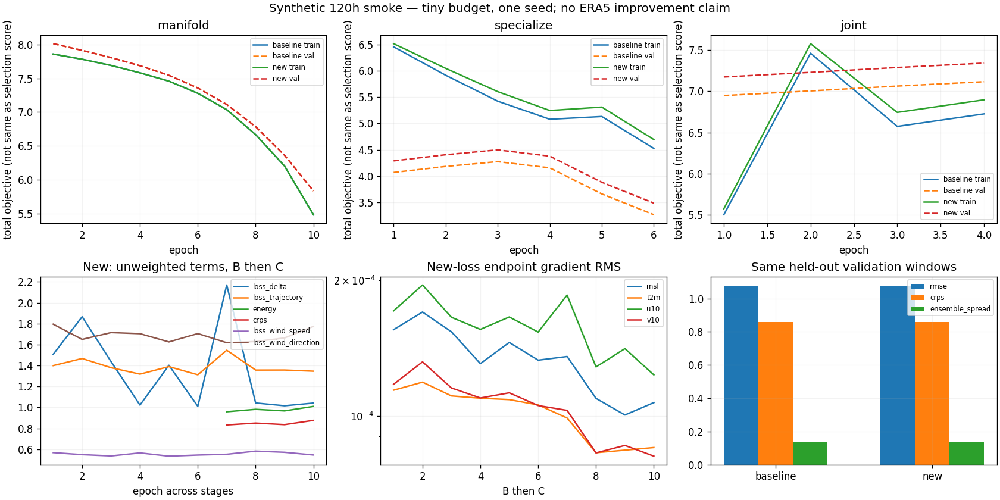
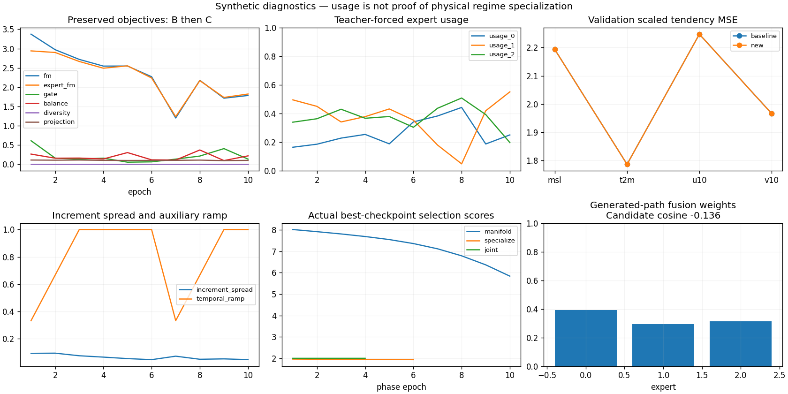
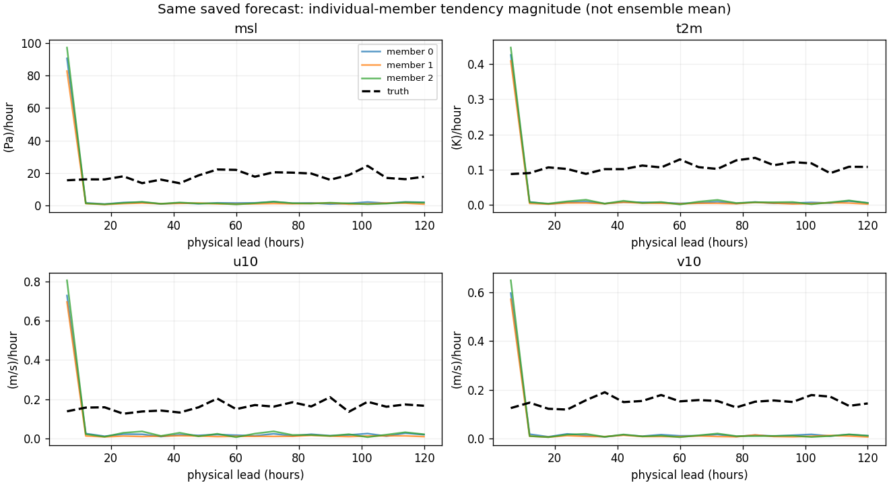
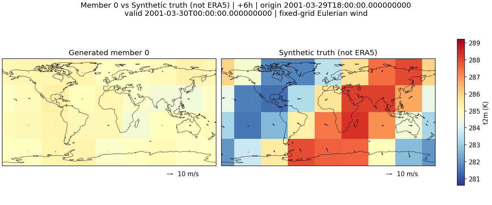

# 120시간 dynamics loss: 실제 CPU 합성 실행 보고

2026-09-10, `scripts/smoke_temporal_moe.py`를 실행한 결과입니다.
**실제 ERA5나 RunPod 재학습 결과가 아닙니다.** 사용자 기존 ERA5 실험 자료는
`../manifold-run-001-review/`에 별도로 보존했습니다.

구현·역전파·checkpoint·영상 파이프라인은 작동하지만 **느린 dynamics/과적합 개선은 입증되지 않았습니다**.
두 실험 모두 작은 예산에서 under-dispersed하며, 아래 소수점 차이를 연구 성과로 해석하지 않습니다.

## 실행 설정과 기록

- 시간에 따라 이동하는 toy wave, 480시각×4변수×4×8 grid; 데이터 seed19, 학습7, 평가83.
- horizon=20, step=6h,120h. history6/stride1. manifold6, experts3, expert bottleneck64, gate160.
- A10epoch, B6epoch, C4epoch. A는 새 초기화, B/C는 순차 best checkpoint를 재로드했습니다.
- baseline/new가 같은 A 및 데이터/split/seed를 사용합니다. baseline도 수정된 shared-noise 계약을 쓰므로
  이전 `9f9b406` 실행을 통째로 재현한 실험이 아닙니다.
- new: trajectory weight0.1, delta0.02, speed0.01, direction0.005; warmup3epoch;
  B/C2-edge sub-block, validation20-edge 전체 window. trainingM3/ODE2, evaluationM4/ODE4.
- **별도 full-window B1epoch**에서20구간의 새 loss backward를 실행했습니다.
- best A=10/B=6/C=1(epoch), baseline과new 동일. 마지막 C epoch를 평가한 값이 아닙니다.
- B에서 frozen A/geometry tensor가 정확히 동일함을 확인했습니다.
- CPU1thread, PyTorch2.8.0+cpu/Python3.12.14, 약31.8초/peak process RSS464.7MiB.
  작은4×8 toy 실행 값이며4090 실데이터 자원 추정으로 사용하지 않습니다.
- test split은 사용하지 않았습니다. validation4windows에서 아래 지표를 계산했습니다.

| Validation 지표 | 새 loss=0 baseline | 새 loss 활성화 |
|---|---:|---:|
| normalized state RMSE ↓ | 1.079215 | 1.079205 |
| marginal empirical Energy ↓ | 0.997709 | 0.997600 |
| marginal empirical CRPS ↓ | 0.859137 | 0.859051 |
| joint endpoint/increment fair Energy ↓ | 1.598642 | 1.598317 |
| scaled ensemble-mean tendency MSE ↓ | 2.048316 | 2.048248 |
| mean ensemble spread | 0.139493 | 0.139677 |
| empirical central80% coverage | 7.686% | 7.695% |

수치 차이는 미미합니다. central80% coverage가 약7.7%이며 spread/skill ratio도 약0.159여서
불확실성 보정이 충분하지 않습니다. climatology RMSE1.06374보다도 양쪽state RMSE가 높습니다.
실제 ERA5 dynamics 둔화의 원인이나 개선을 이 작은 합성 실행으로 단정할 수 없습니다.

`routing-validation.json`은 별도 validation8origin의 audit입니다. generated gate 평균은
약[0.391,0.294,0.315]이지만 개별 gate entropy는0.100nats입니다.
candidate cosine−0.136, 지역별best75%(표본1/2/5개)라는 값도 기상 regime 전문화의 증거는 아닙니다.
projection removed fraction0.966, condition64.5, chart distance/radius2.04는 함께 관찰할
geometry 진단이며 해당 수치만으로 실패 원인을 지정하지 않습니다.

## 로그에서 만든 그림







`temporal_output_grad_rms_*`는 weighted 새 loss가 normalized predicted endpoint에 보내는 gradient입니다.
모든 변수에서0보다 컸으며, 모델parameter별 causality/backward는 단위 테스트로 별도 확인했습니다.
state 물리 단위의gradient 또는 모든 networkparameter의 분해 norm이라는 뜻은 아닙니다.

## 같은 forecast를 사용한 member 영상

각각 왼쪽generated member/오른쪽 **Synthetic truth (not ERA5)** 입니다.
새 추론을 하지 않고 `forecast-native-6h.npz` 한 개에서6h와12h를 선택했습니다.

| Member | 6h 간격120h MP4,20frames | 12h 간격120h GIF,10frames | 6h 진단 |
|---|---|---|---|
| 0 | [MP4](members-6h/member-000.mp4) | [GIF](members-12h/member-000.gif) | [JSON](members-6h/member-000.json) |
| 1 | [MP4](members-6h/member-001.mp4) | [GIF](members-12h/member-001.gif) | [JSON](members-6h/member-001.json) |
| 2 | [MP4](members-6h/member-002.mp4) | [GIF](members-12h/member-002.gif) | [JSON](members-6h/member-002.json) |



온도/화살표scale는 member간 공통입니다. 움직임이 작아도 FPS/scale를 바꿔 결과를 개선하지 않았습니다.
영역별 경로가 아닌 Eulerian wind field입니다. MP4의20프레임과GIF의10프레임은 origin 이후 시각이며
origin_state는NPZ에 별도 저장됐습니다. ratio는 near-zero 구간에서null/valid count를 사용합니다.

## 재현과 검증 범위

```bash
python -m pip install -e '.[test,plots]'
OMP_NUM_THREADS=1 MKL_NUM_THREADS=1 python -m pytest -q
OMP_NUM_THREADS=1 MKL_NUM_THREADS=1 python scripts/smoke_temporal_moe.py \
  --work-dir outputs/temporal-reproduction --report-dir outputs/temporal-reproduction-report
python scripts/visualize_temporal_moe.py --report-dir outputs/temporal-reproduction-report \
  --checkpoint outputs/temporal-reproduction/new-c.pt \
  --archive outputs/temporal-reproduction/synthetic-states.npz
```

checkpoint/archive hash와best epoch는 `summary.json`, loss 전체는 `training-{baseline,new}.json`,
전체20구간실행은 `training-full-window.json`, 평가 원본은 `validation-*.json`에 있습니다.
생성 checkpoint와toy archive는 `outputs/`에 두며 예측/로그/그림을 저장소에 보존합니다.

검증: 전체54테스트 통과(기존44+새10), 새 loss만의 B/C backward, frozen B hash,
동일 member source와 독립 member, FM/추론 prefix bit 일치, 기존H120의120h조건 보존,
delta/dt/단위/정규화/train-only통계/mask/causality, wind wrap/calm,
singleton fail-fast, 단계별 checkpoint 재로드, validation/test 구분,
6h/12h선택과all-member 렌더링을 포함합니다.
새 Mermaid3개를11.12.0 parser로 검사했습니다. preflight 통계·split이 실제 A와 동일한 것도 검증했습니다.

실제 ERA5 전면 재학습·장기 수렴·계절별 일반화·다중seed유의성·4090memory benchmark는 미실행입니다.
다음 실행은 [RETRAIN_120H.md](../../../flow-matching_moe/RETRAIN_120H.md)의 데이터검사→새A→B→C→
validation→설정고정→test→forecast/member출력 순서입니다.
