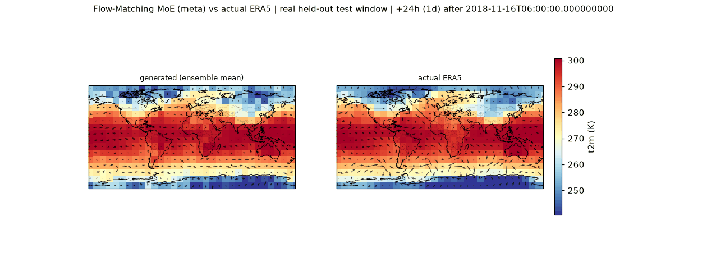

# 시간 정합성 보정의 사용자 참고 출력

2026-09-08 사용자가 제공한 `test-case-compare(1).gif`의 수신본을 바이트 변경 없이 보존합니다.
파일명은 gif였으나 실제 수신 파일은 **PNG, 1260×483, 1 frame**입니다. 따라서 이 파일만으로
시간 변화 속도나 GIF 재생 간격을 측정할 수 없습니다. 원본 이름과 혼동하지 않도록 확장자를
실제 형식에 맞췄습니다. SHA-256:
`22224936907adda20f93fbc7648e626fd2fe86852b814ed5ba791f49b63cbcf7`.

그림 표제: `Flow-Matching MoE (meta) vs actual ERA5 | real held-out test window |
+24h (1d) after 2018-11-16T06:00:00`. 왼쪽 generated ensemble mean, 오른쪽 actual ERA5,
색상 t2m(K), 화살표는 바람 벡터로 보이나 정확한 변수·배율·단위는 원본 plotting 코드로 검증해야
합니다. 표제는 **이전 MoE meta 경로**를 가리키며 신규 manifold smoke 결과가 아닙니다.
그림 표제의 real-data 표기는 사용자 산출물의 표제이며 이 환경에서 실제 원본 배열을 검증한
것은 아닙니다.

사용자 후속 요청은 현재 구조를 유지하며 **시간에 따른 출력 변화와 vector의 시간 비율**을
맞추는 보정입니다. 다음 작업에서는 다음을 분리해서 확인합니다.

1. Origin, history stride, target index, physical lead, valid time, forecast_step_hours 계약.
2. 생성 시간 tau의 FM velocity, 물리 시간의 기상장 변화율, u10/v10 풍속은 서로 다른 양이라는 점.
3. 양쪽 패널과 모든 시점의 같은 valid time, color limits, quiver scale 및 frame duration.
4. 실제 배열의 lead별 RMSE/CRPS, 바람 벡터 오차, 인접 시점 state 변화량, anomaly·phase/lag.
5. Leadwise marginal 학습이 시간 정합성에 주는 한계와 현재 모듈 안에서 가능한 학습/추론 보정.

GIF 한 프레임이나 ensemble mean의 평활화만으로 모델의 시간 scaling 오류를 단정하지 않습니다.
원본 다중-frame GIF, checkpoint, 예측/ERA5 배열이 없으면 부족한 증거를 명시하고 synthetic
시간 계약 검증을 수행합니다. 향후 수정에서도 기존 실험·checkpoint를 보존하고 feature branch를
사용하며 main에 병합하지 않습니다.
