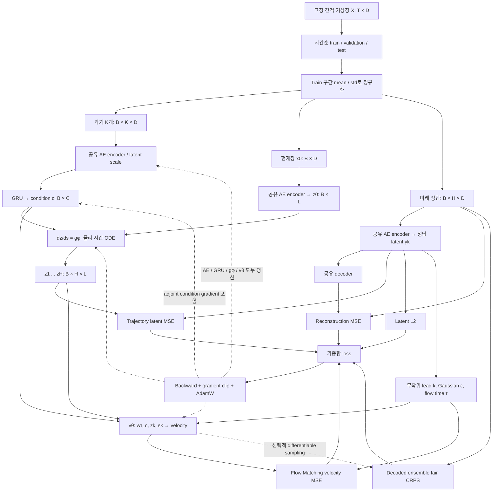

# 현재 학습 구조

`B`: batch, `D`: state dimension, `K`: history samples, `L`: latent dimension,
`C`: GRU hidden dimension, `H`: forecast steps.
실제 저장된 실험은 `D=2048 = 4 variables × 16 latitude × 32 longitude`이며,
MLP와 Conv AE 변형, L=128 또는 512, H=24 또는 120이 있습니다.
이는 원본 전지구 0.25도 격자 해상도로 학습했다는 의미가 아닙니다.



미래 정답은 loss를 만드는 학습 경로에만 사용됩니다. 예측 condition은 과거와 현재장에서
만듭니다. Encoder/decoder는 가지마다 별도 모델이 아니라 공유된 하나의 AE입니다.
현재 trainer는 scratch joint training이며 AE 단독 pretraining checkpoint를 읽어 freeze하는
2단계 학습 옵션은 없습니다. `autoencoder_probe.py`는 별도의 진단 실험입니다.

두 시간축은 다음과 같습니다.

| 축 | 역할 | 구간 |
|---|---|---|
| `s = lead_hours / horizon_hours` | 기상장 latent의 물리 시간 진행 | origin 0 → horizon 1 |
| `τ` | 각 lead에서 Gaussian을 예측 분포로 옮기는 생성 시간 | noise 0 → sample 1 |

수식에서 `yk = E(xk)/a`, `a`는 train에서 갱신하는 EMA scalar latent scale입니다.
origin으로 한 번 scale을 갱신한 뒤 history와 target에도 같은 값을 적용합니다.

```math
w_\tau=(1-\tau)\epsilon+\tau y_k,\quad \epsilon\sim\mathcal N(0,I)
```

```math
\mathcal L=\lambda_r\|D(a y_k)-x_k\|^2
+\lambda_t\|z_k-y_k\|^2
+\lambda_f\|v_\theta(w_\tau,\tau,c,z_k,s_k)-(y_k-\epsilon)\|^2
+\lambda_z\|y_k\|^2+\lambda_e\mathrm{CRPS}_{fair}
```

기본 가중치는 `(λr, λt, λf, λz, λe) = (1, 1, 1, 1e-4, 0)`입니다.
FM은 batch마다 무작위 lead 최대 8개를 복원추출합니다. Ensemble CRPS는
`--ensemble-size ≥ 2`와 `--ensemble-weight > 0`일 때만 계산하며 case당 한 lead를 사용합니다.
Reconstruction/CRPS의 기상장은 state 정규화 단위이고 trajectory/FM은 latent 단위입니다.
위경도 면적 가중치나 변수별 물리 단위 가중치는 현재 없습니다.

Optimizer는 AE weight decay 기본 0, 나머지 1e-4, gradient clipping 1.0입니다.
Validation에서는 deterministic ODE trajectory를 decode한 RMSE가 최소인 epoch를 저장합니다.
따라서 저장 epoch는 ensemble CRPS 최적 epoch와 다를 수 있습니다.

물리 시간 adjoint ODE는 trainable dynamics 파라미터뿐 아니라 계산된 GRU condition도
`adjoint_params`로 받습니다. 이를 통해 trajectory loss가 GRU와 history encoder로 전달됩니다.
AE target latent에도 gradient가 흐르므로 latent collapse / loss 간 충돌 가능성은 남아 있습니다.
