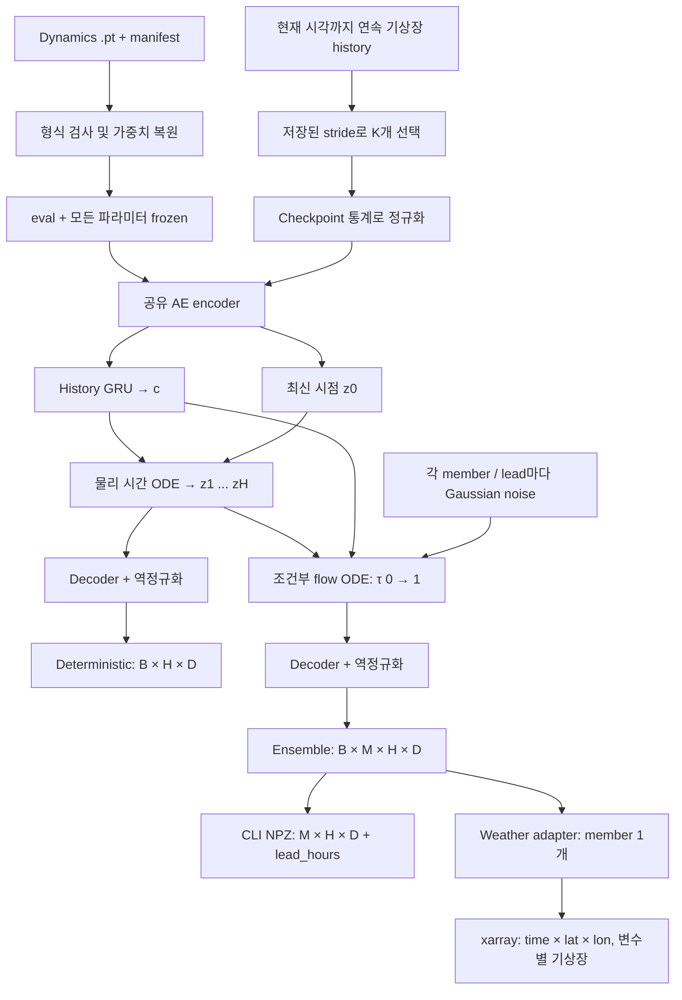

# 저장 모델과 예측 출력

Checkpoint format은 `climate_diffusion.latent_dynamics_flow.v1`입니다.

| 저장 항목 | 내용 |
|---|---|
| `model` | AE encoder/decoder, GRU, dynamics field, FM velocity field, latent-scale buffers |
| `model_config` | 차원, MLP/Conv, history stride, horizon, step hours, solver 설정 |
| `loss_config` | joint loss와 optional ensemble 설정 |
| `state_mean`, `state_scale`, `schema` | state 역정규화, 변수 순서와 격자 재구성 |
| `training` | split, normalization 구간, seed, best epoch/validation metric |
| 옆 파일 | `.metrics.json`, `.metadata.json`, SHA256 `.manifest.json` |

Optimizer/RNG 상태는 저장하지 않습니다. 예측용 모델 artifact이며 학습을 동일 상태로
재개하는 resume checkpoint는 아닙니다. Noise sample이나 예측 기상장은 가중치에 저장되지 않습니다.

`LatentFlowForecaster`가 월별/고정-step legacy 모델과 dynamics 모델을 format별로 선택합니다.
CLI는 dynamics에서 기본적으로 학습된 전체 horizon을 출력하고 `--forecast-steps`로 줄일 수
있습니다. 범위를 넘으면 오류를 내며 무검증 장기 extrapolation을 하지 않습니다.
Python `forecast(..., months=N)`의 기존 인자명 `months`는 실제로 archive step 개수입니다.
Dynamics는 origin에서 한 번 ODE rollout한 결과에 조건화하며 월별 모델처럼 매 step history를
교체하는 autoregressive loop를 쓰지 않습니다.

**Ensemble의 시간별 noise는 독립입니다.** 같은 member 인덱스로 묶여 있어도 시간 상관을
학습한 joint stochastic trajectory는 아닙니다. Flow의 평균이 deterministic trajectory와
같도록 강제하는 residual 제약도 없습니다. 직접 보장하는 것은 각 lead의 조건부 샘플입니다.

평가는 기록된 test windows의 모든 future lead를 사용합니다. 정규화 MAE/RMSE/bias,
empirical ensemble CRPS, spread, persistence/climatology RMSE, 변수별 raw-unit 오차와
lead별 RMSE를 저장합니다. CRPS 평가값은 empirical CRPS이며 학습의 fair CRPS와 estimator가
다릅니다. 겹치는 target을 가진 과거 split checkpoint의 평가는 오류로 막고 재학습을 요구합니다.
서로 다른 split 사이 미래 정답은 분리하지만 같은 split 내부의 sliding windows는 겹칠 수 있습니다.

태풍 위치, 경로, IBTrACS 확률지도는 이 checkpoint의 직접 출력이 아닙니다. 별도 downstream
검출/학습 시스템에 기상장을 전달해야 합니다. WeatherNext 호환 adapter라는 이름이
WeatherNext 2 공식 pretrained 가중치를 이 모델에 적재한다는 뜻은 아닙니다.
