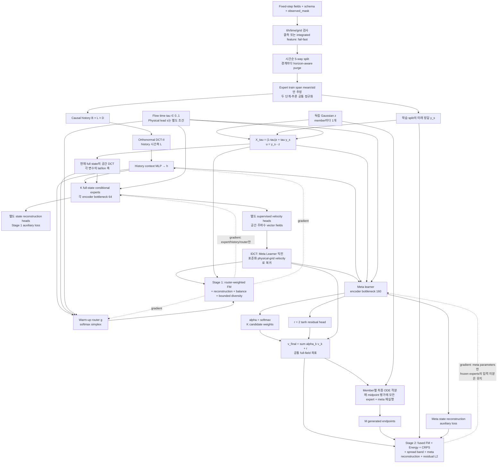
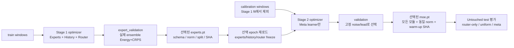

# Full-state MoE: 학습 구조

구현: `moe.py`, `train_moe.py`, `moe_data.py`. 기존 physical latent-dynamics trainer와
**별도 학습 경로**입니다. [실행 README](../flow-matching_moe/README.md).

## 데이터·좌표·네트워크 전체

`D=C×Y×X`는 전체 archive field 크기입니다. `64/160`은 내부 AE bottleneck이며
ODE state dimension이 아닙니다. Expert의 state reconstruction decoder와 velocity head는
서로 다릅니다. IDCT는 선형 velocity 변환입니다. 최종 state의 물리 단위 변환은 별도
`x = mean + scale * X` 역정규화이며 IDCT라고 부르지 않습니다.

그림의 FM interpolation 입력 경로는 학습용입니다. Ensemble ODE loss 경로는
정답 endpoint를 state로 넣지 않고 독립 noise에서 생성합니다. 정답은 비교 loss에만 갑니다.

## 두 단계 optimizer·checkpoint 생명주기

체크포인트 선택이 끝나기 전에는 test 점수로 epoch를 고르지 않습니다. Stage 1과 Stage 2의
validation 데이터가 다르므로 곡선 연결만으로 성능 개선을 주장하지 않습니다.

## 실제 학습 그래프

이 그래프는 합성 데이터 실행 로그입니다. **실제 ERA5/30일 예측 학습 결과가 아닙니다.**
