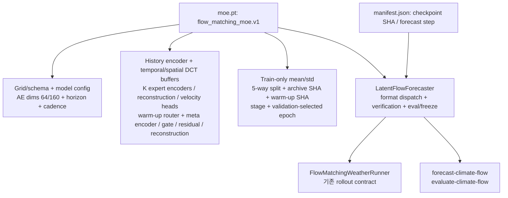
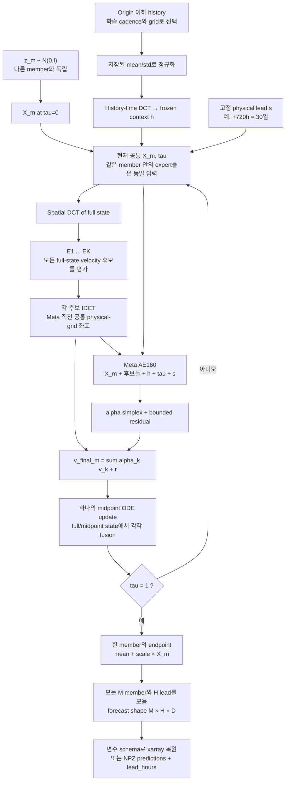

# Full-state MoE: 저장 모델·member별 추론

## 저장되는 checkpoint

Warm-up checkpoint는 `stage=experts`, 최종 checkpoint는 `stage=meta`입니다. 최종 파일에는
모든 expert가 포함되므로 추론 시 warm-up 파일을 별도로 요구하지 않습니다. 원본
monthly/dynamics checkpoint도 기존 dispatch로 계속 동작합니다.

## 한 member·한 physical lead의 최종 ODE

그림의 update 블록 안에서 중간점의 vector field도 다시 모든 expert/meta를 통과합니다.
가중치를 시작점에서 한 번만 구해 끝까지 고정하지 않습니다. Expert별 trajectory를 따로
적분한 뒤 endpoint를 평균하는 경로는 없습니다.

## 두 종류의 gate와 두 시간축

| 항목 | Warm-up | 최종 meta |
|---|---|---|
| `g_psi` | expert별 FM 책임과 router-only velocity | 동결; baseline 및 진단용 |
| `alpha_phi` | 초기 균등값; 학습 안 함 | 각 현재 state/후보/조건에 따른 fusion |
| `r_phi` | 0 초기화; 학습 안 함 | bounded residual correction |
| `tau` | interpolation/생성 flow time | 매 ODE evaluation에서 갱신 |
| Physical lead | 조건 `s=(j+1)/H` | 해당 lead solve 동안 고정 |

Meta 추론에서 `g`와 `alpha`를 곱하지 않습니다. `--moe-mode experts`와 `uniform`은
동일 ODE 구현에서 결합 정책만 바꾸는 ablation입니다. `uniform`도 expert endpoint 평균이 아닙니다.

여러 lead에는 같은 member noise를 재사용합니다. 그러나 lead별 ODE를 각각 풀고 학습 loss는
lead별 분포에 계산하므로, 현재 출력은 **common-random-number coupling을 가진 조건부
marginals**입니다. Joint stochastic trajectory 학습 또는 물리 시간 latent ODE라고 해석하면
안 됩니다. 미래 정답·GPT state·WeatherNext API는 이 추론 경로의 입력이 아닙니다.

## 실제 held-out 진단

합성 smoke의 routing 값과 meta alpha는 **실제 생성 ODE의 midpoint state**에서 측정했습니다.
Teacher-forced FM interpolation에서의 gate 사용률과 혼동하지 마세요. Hand-made toy mode와
router의 관련성은 기상 regime 분업이 입증됐다는 뜻이 아닙니다.
