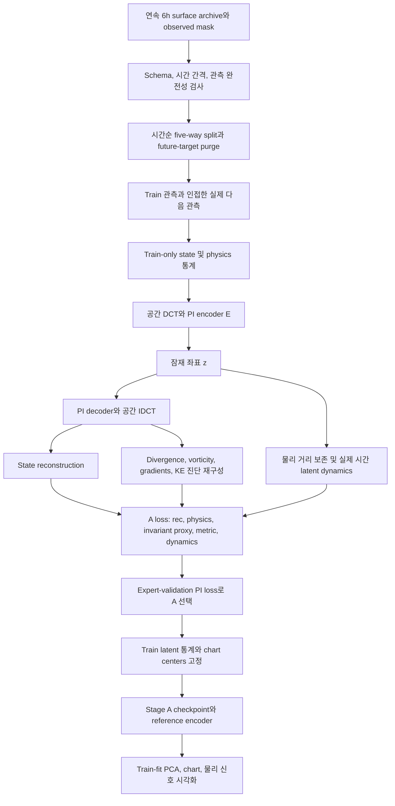
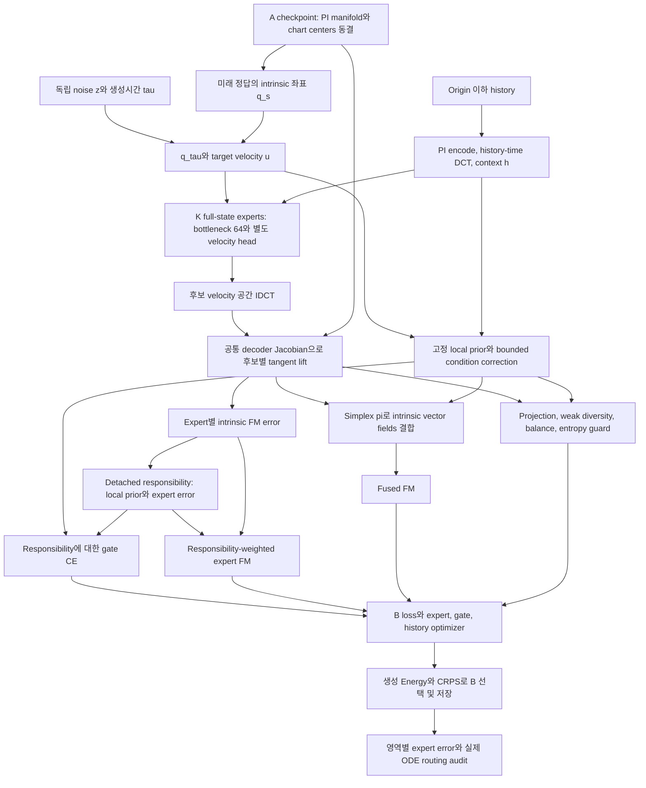
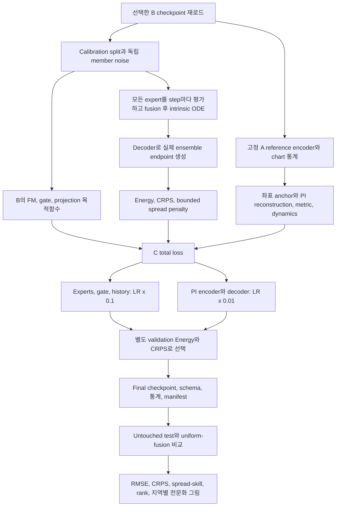

# 최종 Manifold MoE: 설계와 A/B/C 학습

[실행 순서·수식·단위·한계](../flow-matching_moe/MANIFOLD_README.md),
[member별 추론](07-manifold-inference.md), [실제 결과](../docs/results/manifold-smoke/README.md).
이 그림은 `train-climate-manifold-moe`용입니다. 이전 Meta160 경로는 04/05 문서에 보존합니다.

## A: Physics-informed 좌표 학습

물리항은 관측과 재구성의 진단 비교입니다. 대기를 divergence=0으로 만들거나 primitive
equation을 정확히 풀지 않습니다. PCA 색 분리는 학습한 기상 regime의 존재를 증명하지 않습니다.

## B: 고정 geometry에서 국소 expert 분업

Projection 자체는 담당 영역을 만들지 않습니다. 영역 prior와 responsibility가 분업을 유도합니다.
Expert 출력의 공통 dynamics를 무조건 직교시키지 않습니다. 교차 영역에서도 overlap을 허용합니다.

## C: geometry anchor를 유지하는 공동 보정

C는 encoder도 보정하므로 FM target 좌표를 detach하고 A reference anchor를 유지합니다.
Jacobian과 ODE를 통한 decoder/input gradient는 유지합니다. 고정 기준 좌표/physics 통계는
다시 fit하지 않습니다. B/C의 validation 구간이 달라 stage별 selection score의 높이를
서로 직접 비교하지 말고 동일 test 조건의 forecast skill을 비교하세요.
