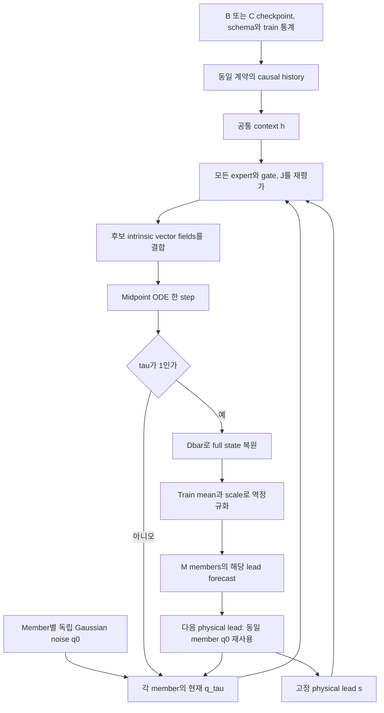

# 최종 Manifold MoE: 접공간과 member별 ODE

## 한 member의 한 vector-field 평가

```mermaid
flowchart TB
    H["Causal history"] --> CTX["PI encode와 history-time DCT: h"]
    Q["공통 현재 intrinsic state q_tau"] --> DEC["표준화 state x = Dbar(q_tau)"]
    Q --> J["현재 decoder Jacobian J와 metric J transpose W J"]
    DEC --> EXP["공간 DCT: K full-state local experts"]
    CTX --> EXP
    T["Physical lead s와 생성 flow time tau"] --> EXP
    EXP --> RAW["각 velocity head와 IDCT: v_raw,k"]
    RAW --> LIFT["Damped least-squares tangent lift: a_k"]
    J --> LIFT
    Q --> G["Local prior와 bounded gate: simplex pi"]
    CTX --> G
    T --> G
    LIFT --> F["a_final = sum pi_k a_k"]
    G --> F
    F --> DER["dq / d tau = a_final"]
    J --> PHYS["물리 격자 tangent field: J a_final"]
    F --> PHYS
```

`a_k=(JᵀWJ+epsilon I)^-1 JᵀWv_raw,k`입니다. 모든 expert가 같은 현재 기상장을 보고,
같은 현재 tangent span으로 투영되며 국소 responsibility로 다른 부분을 학습합니다.
State decoder를 velocity decoder로 사용하지 않습니다. 이전의 자유로운 meta residual은
없으며 pi가 바로 fusion weights입니다. Physics 항은 이 접공간의 물리적 품질을 학습으로
유도하며 기상 PDE의 정확한 constraint subspace임을 보장하지 않습니다.

## M개 ensemble과 physical lead

Midpoint는 한 step에 두 번 전체 field를 평가합니다. Expert마다 별도 noise나 별도 endpoint를
생성하지 않습니다. 위도·경도 field ensemble은 schema에 따라 복원하며 기존 weather adapter로
전달합니다. **tau 경로는 기상장의 실제 시간 경로가 아닙니다.** 여러 physical lead의 초기 noise를
공유하더라도 joint-time trajectory law를 학습했다는 뜻은 아닙니다.

Local geometry는 decoder가 표현하는 state 영역입니다. Full-state Gaussian을 tangent field만으로
옮길 때 생기는 normal-direction 잔류를 피하기 위해 ODE는 처음부터 r차원 intrinsic 좌표에서
적분합니다. 그 대가로 decoder reconstruction floor와 off-training-support 일반화 한계가 있습니다.

## 저장과 검증 계약

Checkpoint에는 PI-AE, experts, local gate, history MLP, fixed reference encoder, latent mean/scale,
chart centers/radius, surface diagnostic scales, state normalization, schema, stage와 archive SHA가
포함됩니다. Sidecar manifest는 checkpoint checksum을 검사합니다. Stage A는 forecast를 거부합니다.
`--moe-mode local`이 기본이며 `uniform`, `expert:0` 등은 동일 checkpoint의 통제 비교용입니다.

실제 실행/순서는 [MANIFOLD_README](../flow-matching_moe/MANIFOLD_README.md),
그림의 실제 수치 검증은 [smoke report](../docs/results/manifold-smoke/README.md)를 보세요.
