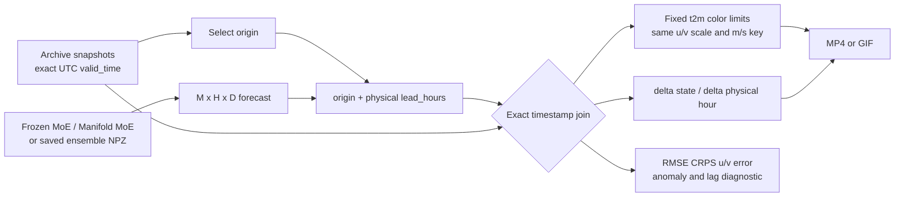

# Exact valid-time comparison and temporal diagnostics

`tau` is not on this timeline: `dq/dtau` is the velocity inside each generative
solve at a fixed physical lead. The comparison uses `dX/dt` from adjacent valid
times. Wind arrows show `u10/v10` in their source units and use one fixed scale
and key for generated and ERA5 panels. Lag is reported only; truth is never
shifted or fed to the prediction.
