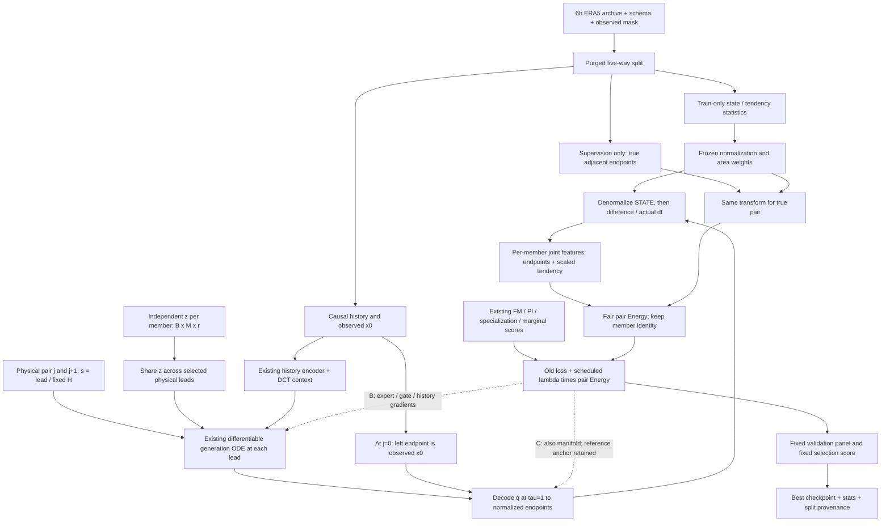
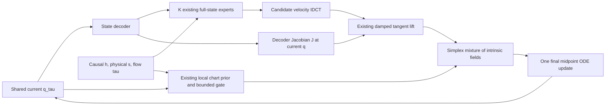

# 제안: 같은 모델, paired physical-dynamics supervision

당시 상태: **설계 / 새 loss 미구현**, 기준 `a3003d1`, 2026-09-09.
후속 실제 구현은 [11-temporal-training-implemented.md](11-temporal-training-implemented.md)를 참조하세요.
[수식·판단 근거](../docs/training-mechanism/README.md), [구현·검증 순서](../docs/training-mechanism/RUNBOOK.md).
실선은 forward, 점선은 감독/gradient입니다. Future 정답은 history/router 입력이 아닙니다.

## 한 member·한 physical lead에서 유지되는 내부 ODE

다른 physical lead의 q는 서로 달라질 수 있지만 같은 member의 초기 z는 유지합니다.
Member 간 z는 독립입니다. 생성 flow time tau 적분과 physical lead의 변화는 다른 축입니다.
Expert별 최종 state를 평균하지 않으며, 비선형 state decoder를 velocity decoder로 쓰지 않습니다.

## 단계별 gradient 경계

| 단계 | 기존 손실 / 추가안 | 업데이트 | 고정 |
|---|---|---|---|
| A manifold | reconstruction + PI + metric + observed latent-drift | PI manifold와 보조 drift | 아직 B expert 예측 학습 아님 |
| B specialize | 기존 local FM/specialization + **새 pair Energy** | experts, gate, history | manifold parameters, reference, scales/centers |
| C joint | 기존 FM/ensemble/PI/anchor + **새 pair Energy** | 기존 작은 LR로 experts/gate/history/PI | reference, 고정 normalization/geometry 통계 |

B에서도 decoder 입력 q에 대한 미분은 필요합니다. Frozen parameters와 `no_grad()`는 같지 않습니다.
단순 같은-noise 생성만으로 시간적 결합 분포가 학습됐다고 주장하지 않습니다.
