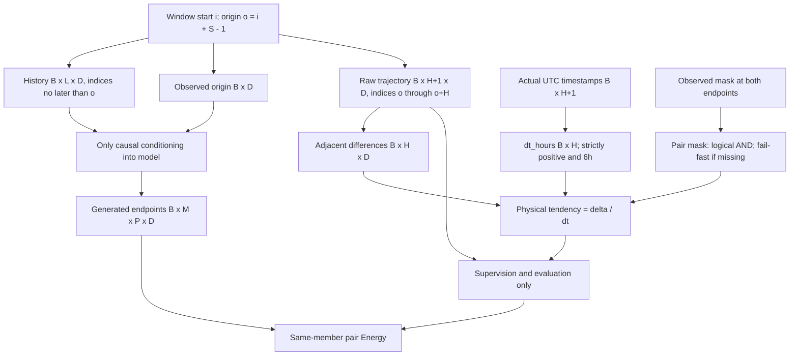
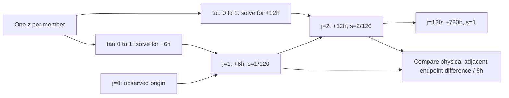
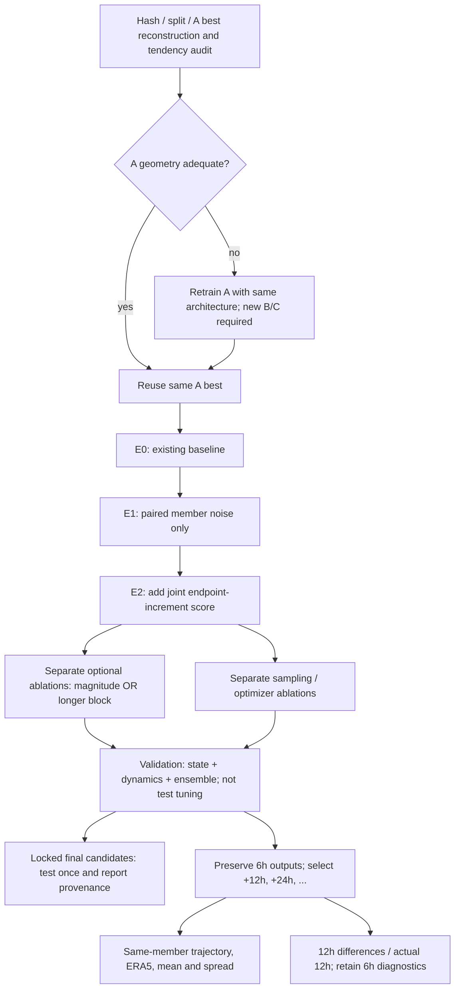

# DataLoader·두 시간축·실험 순서

2026-09-09 설계, 아직 제안된 dynamics loader/loss 및 12h 출력 CLI는 구현하지 않았습니다.
[전체 설계](../docs/training-mechanism/README.md).

## 데이터 shape와 정답 누수 방지

`D=C*Y*X`, `S=(L-1)*history_stride+1`, `P=2` endpoints이며 j=0의 왼쪽은 관측값입니다.
역정규화 후 차분하며 future trajectory는 inference의 입력으로 넘기지 않습니다.
통계는 train raw span 내부의 고유 인접쌍에서 fit합니다. C calibration에서 다시 fit하지 않습니다.

## Physical time과 generation time

위 가로 화살표는 **물리 시각의 순서**이지 예측 state를 다음 lead의 입력으로 다시 넣는
autoregressive 경로가 아닙니다. 각 생성 ODE의 lead 조건은 고정됩니다.

## 실험과 후속 12h 출력

12h output는 `[M,120,D][:,1::2,:]`이며 origin을 별도 anchor로 포함할 수 있습니다.
Checkpoint H=120/step=6은 유지합니다. 같은 투영에서 그린 state-space trajectory는 공기
입자의 geographic 이동 경로가 아닙니다. 날짜를 shift하거나 fps/풍속을 키워 성능을 보정하지 않습니다.
