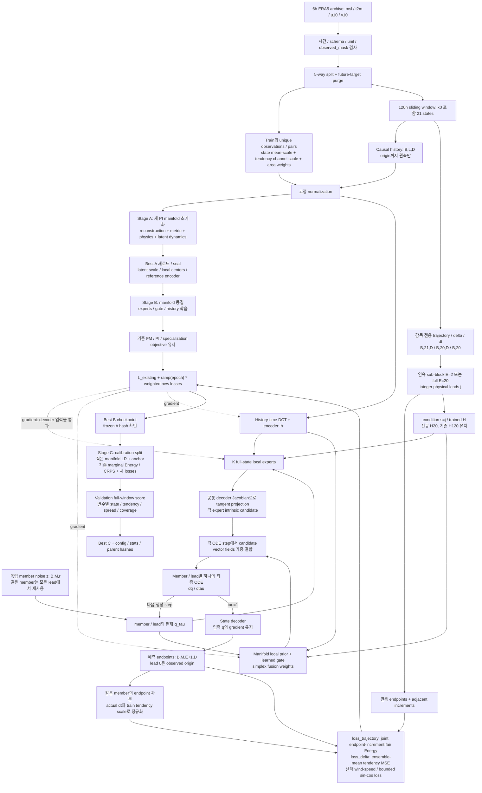
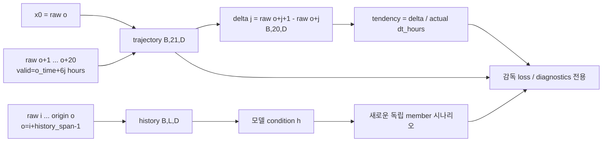

# 구현된 State + Dynamics 학습 (2026-09-10)

[실행 README](../flow-matching_moe/RETRAIN_120H.md). 기존 network와 latent/manifold 차원은 유지합니다.
아래 그래프는 `train_manifold_moe._epoch`와 `ManifoldMoE.sample_trajectory`의 실제 계산 경로입니다.

Gradient: B에서 A parameter의 `requires_grad=False`와 `decoder(q)`에 대한 gradient는 별개입니다.
decoder를 `no_grad`로 둘러 새 loss를 끊지 않습니다. C는 manifold도 작은 LR로 업데이트하지만
reference encoder와 좌표 anchor를 보존합니다. 비선형 decoder에 velocity를 state처럼 넣지 않습니다.
새 objective에서 정의한 physical tendency는 **ds/dphysical-hour**이며 FM의 dq/dtau 또는 wind m/s가 아닙니다.

Data shape와 leak 방지:

미래 supervision에서 condition으로 향하는 edge가 없습니다. 전체 window 옵션이 아닌 sub-block
학습에서는 선택된 인접 구간만 joint score를 받습니다. M member 각각을 같은 정답에 MSE로
강제하지 않으며, mean MSE의 유한-M 분산 penalty도 작은 weight/ramp/ablation으로 검사합니다.
