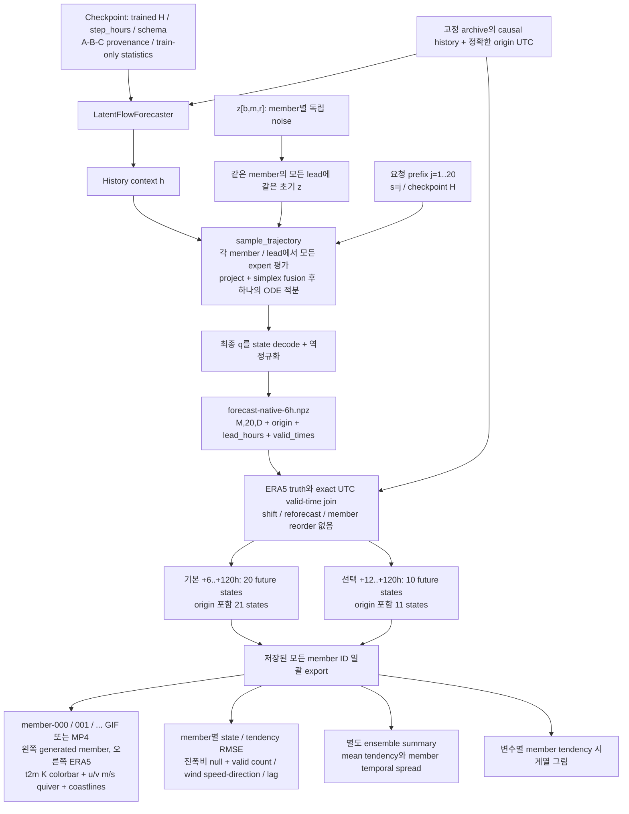

# 같은 member를 유지하는 120h 출력

`120h`와 `120 steps`는 다릅니다. 신규 H20 모델은 s=j/20, 기존 H120 모델의 120h prefix는
s=j/120입니다. 출력 길이로 checkpoint의 물리 lead 조건을 다시 정규화하지 않습니다.
6h 원본을 유지하고12h는 정확한 index 선택만 합니다. origin은 별도 state로 저장합니다.

Quiver는 Eulerian wind: 격자 위치는 고정되고 u/v 방향과 길이만 업데이트됩니다.
이는 입자 궤적이나 FM 생성 velocity가 아닙니다. 각 member 영상끼리 동일한 온도/화살표 scale을
사용하며 FPS 또는 화살표 scale 조정이 모델 동역학 개선이라는 뜻은 아닙니다.
mean 영상은 기존 renderer로 요청할 때만 선택적으로 생성합니다.

실행은 [RETRAIN_120H.md의 8번](../flow-matching_moe/RETRAIN_120H.md#8-같은-forecast에서-모든-member-출력),
합성 예시는 [member 0](../docs/results/temporal-120h-smoke/members-12h/member-000.gif),
[member 1](../docs/results/temporal-120h-smoke/members-12h/member-001.gif),
[member 2](../docs/results/temporal-120h-smoke/members-12h/member-002.gif)입니다. ERA5 결과가 아닙니다.
