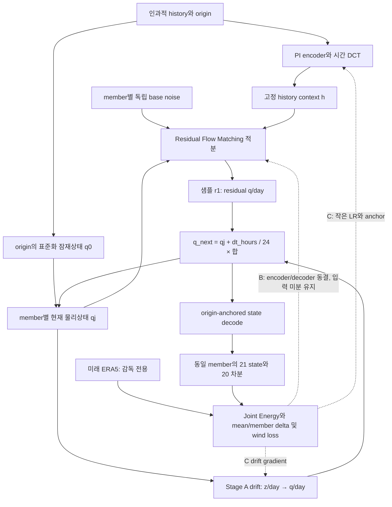

# 실제 구현: 두 시간축과 A/B/C 학습

`forecast_dynamics=recurrent_residual`만 이 그림을 사용합니다. 기존 checkpoint는 기존 경로입니다.

| 단계 | 데이터/target | gradient 범위 |
|---|---|---|
| A | train의 인접 관측, reconstruction/PI/metric/latent dynamics | manifold encoder/decoder/drift |
| B | teacher-forced residual FM + **생성 20-step trajectory** | experts/gate/history; manifold parameters 동결 |
| C | calibration의 동일 objective + probabilistic score/PI/anchor | experts/gate/history, 작은 LR의 manifold/drift |

FM target은 `(encode(next)-encode(current))/dt_days - drift_q_per_day`이며 target 경로는 detach합니다.
Teacher forcing의 current/next는 FM 학습쌍에만 쓰입니다. 실제 trajectory는 origin에서 시작하여 **미래 관측을 입력하지 않습니다**.
Full-window loss에는 중간 q의 detach가 없습니다. `trajectory_edges>0`도 origin부터 선택 block까지 prefix를 적분하므로 저렴한 독립 pair 생성과는 다릅니다.

## Gradient와 좌표 shape

| 기호 | shape | 단위/의미 |
|---|---|---|
| history | B,L,D | state-normalized origin 이전 관측 |
| qj | B,M,r | 현재 physical state의 표준화 잠재좌표 |
| epsilon | B,M,r | member별 base Gaussian, 모든 physical step에 고정 |
| r_tau | BM,r | residual q/day 샘플 공간의 생성 경로 |
| raw experts | BM,K,D | normalized-state/day per tau transport 후보 |
| J(qj) | BM,D,r | state decoder Jacobian; residual state에서 계산하지 않음 |
| fused tau field | BM,r | d(r_tau)/d(tau), 물리 tendency 아님 |
| r1 + drift | BM,r | q/day; dt_hours/24를 곱해 물리 step 진행 |
| trajectory | B,M,21,D | 6h archive에서 origin 포함120h |

`D=C×Y×X`, 새 output channel/대형 network를 추가하지 않습니다. 64/160은 기존 expert bottleneck/gate 폭, r은 별도 manifold 차원입니다.
