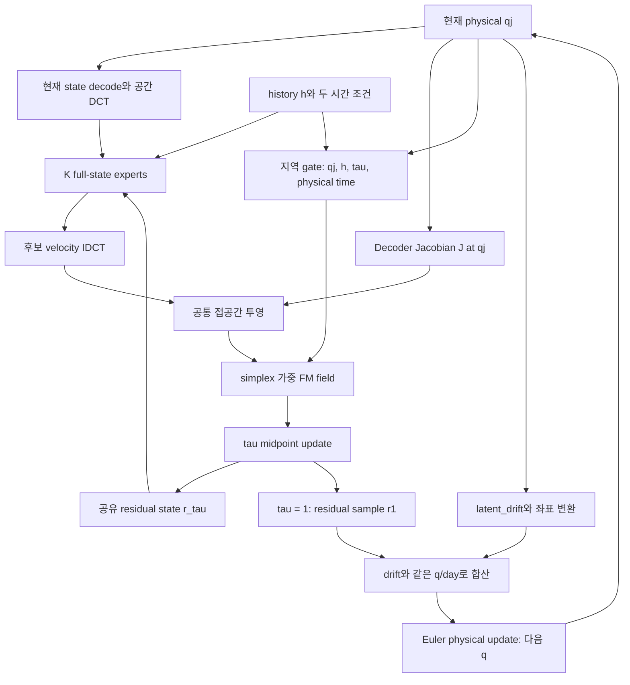

# 하나의 member: 안쪽 생성 ODE와 바깥쪽 물리시간

안쪽 적분 동안 qj와 h는 고정이고 r_tau만 변합니다. **모든 expert를 평가한 뒤 field를 합쳐 한 r_tau를 적분**합니다. Expert별 최종 state를 생성하여 평균하는 구조가 아닙니다.

바깥 물리 step은6시간이며 다음 q는 직전 q_output 그대로입니다. member 간 noise/state를 섞지 않습니다. 다음 physical step에서 같은 epsilon을 residual 생성의 출발점으로 재사용하지만 qj가 달라져 같은 residual을 강제하지는 않습니다.

주의: r1에는 noise source와 학습된 transport가 모두 포함됩니다. expert weights를 0으로 하면 residual=0이 아니라 source가 남습니다. 진짜 zero-residual 비교는 `--moe-mode drift_only`입니다.

출력은 `origin + decode(qj) - decode(q0)`입니다. 고정된 chart offset으로 AE reconstruction의 일회성 origin jump를 제거하되, latent velocity를 state decoder에 입력하지 않습니다. 이 translated chart가 primitive PDE나 물리 불변량을 정확히 만족한다는 보장은 없습니다.
