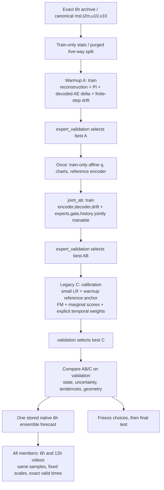
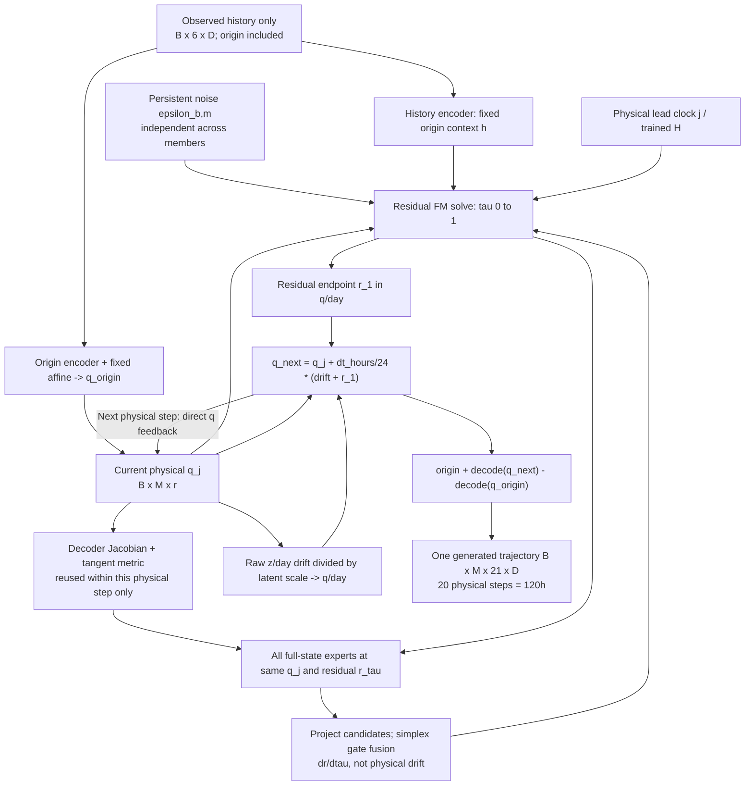
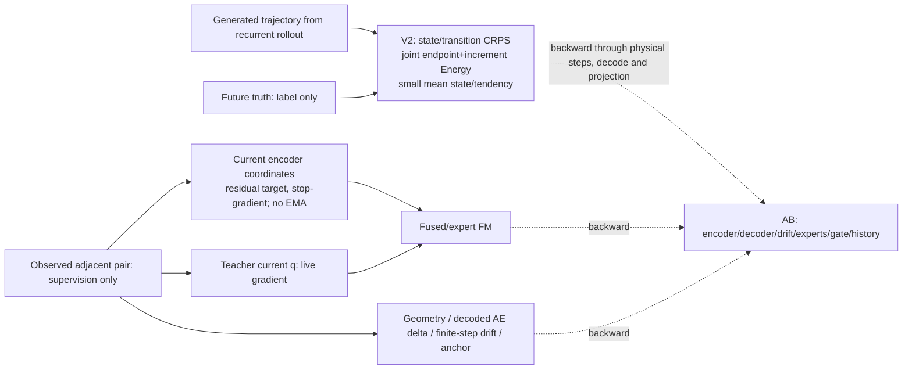

# A+B 공동 학습 + Loss V2: 실제 단계·시간·gradient 계약

기준 코드 `3fc5328`, 2026-09-15 점검. [전체 실행 순서](../flow-matching_moe/JOINT_AB_TRAINING_MANUAL.md).
이 그림은 연결된 코드의 구조이지 ERA5 성능 검증 결과가 아닙니다.
V2 tendency 단위 환산/gradient logger는 [미해결 항목](../docs/results/joint-ab-loss-v2/manual-audit-2026-09-15.md)을 확인하세요.

## 학습 단계와 best checkpoint

ABでは1本のrecurrent graphを全V2 scoreで共有します。Cは別実装で、marginalとtemporalの
生成が別です。ABのprofileがそのままCに適用されるわけではありません。
affine/chart/referenceはAB後・C後に再sealしません。Cのreferenceもwarmup由来です。

## 同一 member の physical recurrence

decoder 출력은 기상장/score 경로입니다. 다음 recurrent 입력으로 decode→encode하지 않습니다.
비선형 decoder에 velocity를 state처럼 넣지 않습니다. `dr/dtau`, `dq/day`, `ds/hour`,
u/v(m/s)는 다른 양입니다. 12h 출력은 원래 6h trajectory의 부분 선택입니다.

## 감독과 gradient 경계

full-windowは`trajectory_edges=0`。陽なscore blockは小さくてもoriginからprefixを積分します。
同じnoiseをlead間で使うだけでjoint trajectory lawの学習成功を主張しません。
member-MSEは新AB/Cで0。finite-M mean MSEも分散への圧力があるため、coverage/spreadと併せて評価します。
**意図する physical tendency は `diff(x_normalized) * state_scale / dt_hours / tendency_scale`**。
現在V2呼び出しではこの`state_scale`復元が欠けているため、図中のtransition scoreが
物理単位まで検証済みという意味ではありません。モデル修正は今回の文書作業に含めていません。
