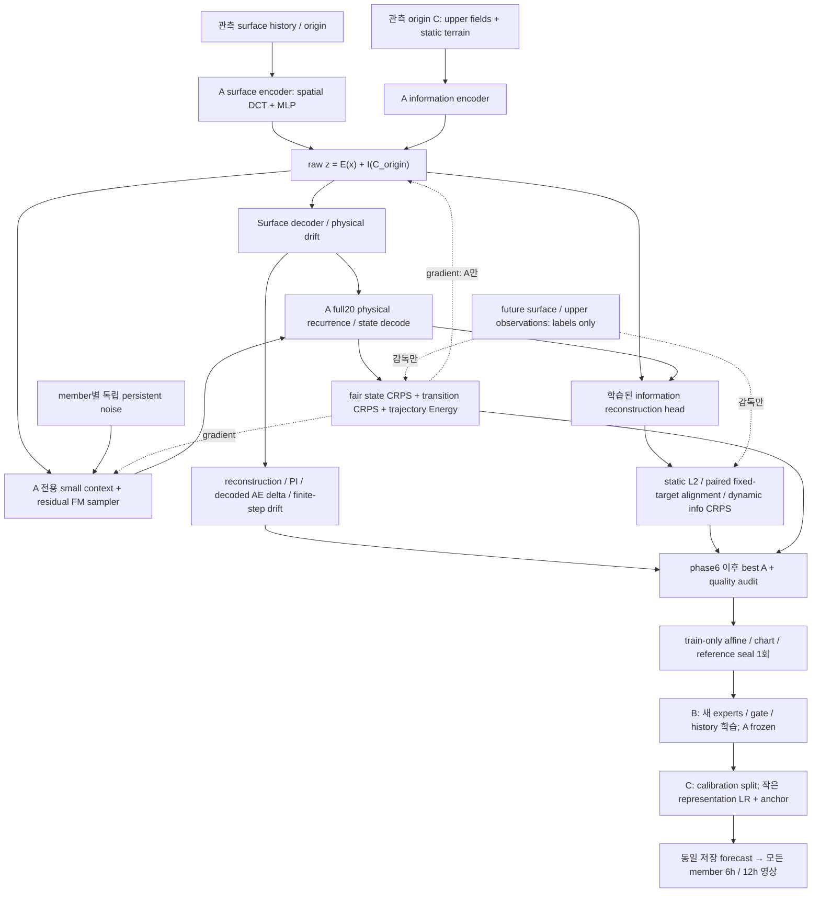
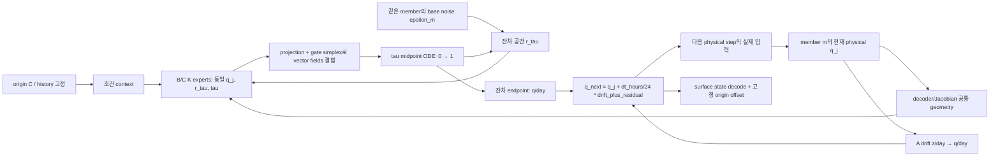
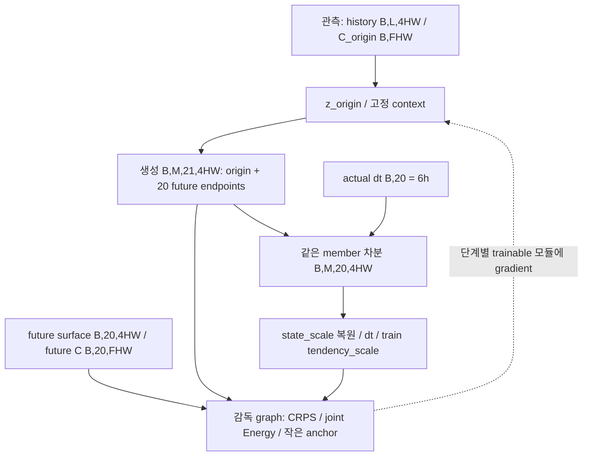

# 분리형 A information/process 학습과 B/C 연결

구현은 `information_process.py`, 실행은 [전체 매뉴얼](../flow-matching_moe/A_INFORMATION_TRAINING_MANUAL.md).
**A+B 공동학습 그림이 아니다.** 기존4dd9bf4에서 별도로 확장했으며 output은 surface4변수다.

A sampler/context/info head는 auxiliary다. B/C forecast는 이 sampler 대신 기존 full-state MoE를 사용한다.
그래서 A의 확률적 목적이 B 최종 불확실성에 자동으로 전달되었다고 말할 수 없다. B 재학습 및 비교가 필요하다.

## 두 시간축 / 하나의 member 경로

`tau` 적분은 분포 생성 시간이고 `j*6h`는 실제 예보시간이다. `dr/dtau`를 물리 drift로 더하지 않는다.
잔차 endpoint만 같은 단위로 더한다. A auxiliary는 raw z/day로 계산해 seal에 불변이고 B/C는 standardized q/day다.
비선형 decoder는 state를 복원한다. Jacobian 방향 oracle과 유한6h decoded secant는 같은 것이 아니다.

## 입력 shape / 미래 정보의 경계

미래 labels→encoder conditioning 화살표는 없다. teacher-forced FM은 별도 one-step 감독으로만 현재/다음 정답 pair를 쓴다.
미래 upper label을 history/router에 넣지 않는다. 알려진 static geometry와 동적 upper fields를 구분하고
inference 중 dynamic C도 origin snapshot으로 고정한다. B에서는 A가 frozen이어도 decoder 입력 gradient는 유지한다.
