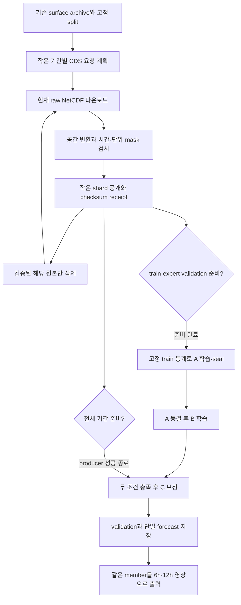

# 추가 ERA5 전처리와 분리형 A/B 학습 병행

작은 shard는 모든 epoch에서 재사용한다. 다운로드 중 train 통계를 다시 fit하지 않는다.
A/B가 사용하는 prefix를 전부 준비한 뒤 나머지 held-out 기간 전처리와 학습을 병행한다.
6시간×20 physical step, origin-fixed conditioning, A/B/C gradient/freeze와 loss는 그대로다.
실제 시간 부족/누락 셀을 보간해 채우지 않으며 시점별 shard 경계가 trajectory를 끊지 않는다.
