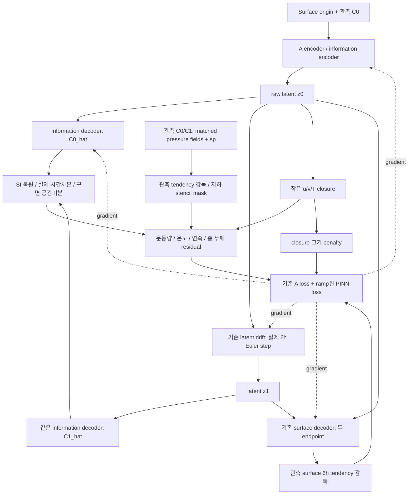

# A Hybrid PINN: 관측 정보를 실제 6h dynamics 제약으로 연결

기반 `feature/a-manifold-information-process` → `feature/a-hybrid-pinn-physics`.
실행/단위/방정식/범위는 [A_HYBRID_PINN_MANUAL.md](../flow-matching_moe/A_HYBRID_PINN_MANUAL.md)를 참조한다.

## A 내부의 물리 gradient

PDE는 10m/2m 변수가 아니라 **같은 기압면의 u/v/T/Z/omega**로 계산한다.
sidecar Z는 m, 내부 Phi는 `gZ`; omega는 Pa/s, 시간차분은 seconds다.
관측 미래 C1은 정답/mask이며 생성 예측의 conditioning으로 주입하지 않는다.
기존 정적 지형 입력/복원과 확률 trajectory 학습은 유지한다.

## 분리 학습에서의 경계

| 순서 | 학습/검증 경계 |
|---|---|
| 준비 | 기존 surface archive + 새 PINN 정보 sidecar |
| A warmup | 관측 residual로 closure만 학습, 나머지 동결 |
| A 본 학습 | 기존 curriculum + PINN ramp |
| Best A | expert_validation 선택 후 train-only seal |
| 새 B | A 및 PINN 동결, 새로운 experts 학습 |
| C | 기존 작은 LR representation 보정, PINN은 동결 |
| 평가 | validation과 최종 test에서 dynamics·확률성능 확인 |

A는 현재 trainer와 같이 새로 초기화한다. 같은 단계 A checkpoint의 warm start는 지원하지 않는다.
B/C는 parent의 설정·통계·PINN weights를 상속한다. A를 바꾼 뒤 과거 B weights를 재사용하지 않는다.

PINN은 A의 첫 6h deterministic drift에 적용되는 학습 제약이며,
B/C에 알려진 PDE를 직접 적분하는 새 예측기가 추가된 것은 아니다.
FM 생성 시간 `tau`의 미분이나 모든 120h member 경로의 미분을 PDE 시간미분으로 쓰지 않는다.
전층 질량 수지, 지형 상승류 경계식, 수증기/에너지 예후식은 이번 구현 범위에 없다.
