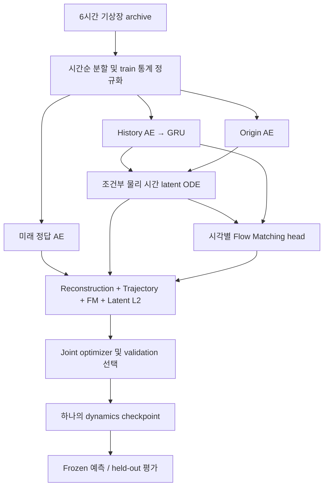

# Latent dynamics + Flow Matching 구조

대상: `feature/latent-dynamics-flow`. 실제 코드 `dynamics.py`, `train_dynamics.py`,
`inference.py`, `evaluation.py`를 기준으로 작성했습니다. 과거 GPT Router + 태풍 dual-loss
그림은 별도 downstream 시스템입니다. 이 저장소의 dynamics trainer는 기상장을 학습하며
GPT API, Transformer router, 태풍 track MSE 또는 IBTrACS distribution CE를 호출하지 않습니다.

- [01-training.md](01-training.md): 입력, 두 시간축, joint training, loss와 gradient
- [02-checkpoint-inference.md](02-checkpoint-inference.md): 저장되는 모델, ensemble 출력, 평가
- [03-review-and-run.md](03-review-and-run.md): 수정 사항, 실행 명령, 검증과 남은 제약

기본 시간 계약은 history 6개, stride 120, archive step 6h입니다. 입력 시점은
`t0-150d, -120d, -90d, -60d, -30d, t0`이며 필요한 연속 archive 길이는 601개입니다.
예측 horizon 120은 **120 × 6h = 30일**입니다. `h24`는 24시간이 아니라 24 step = 144시간입니다.
