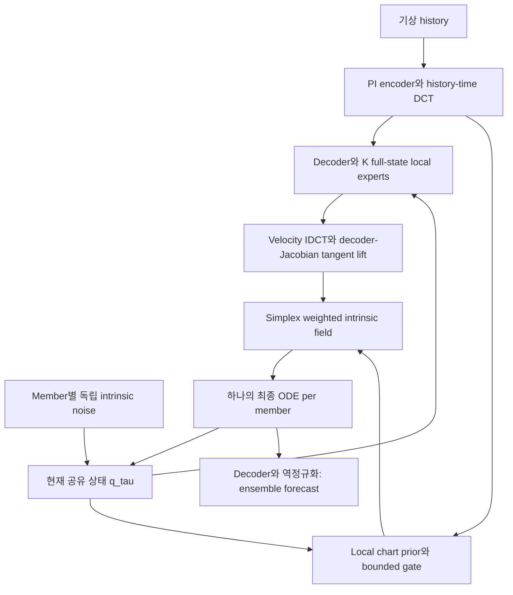
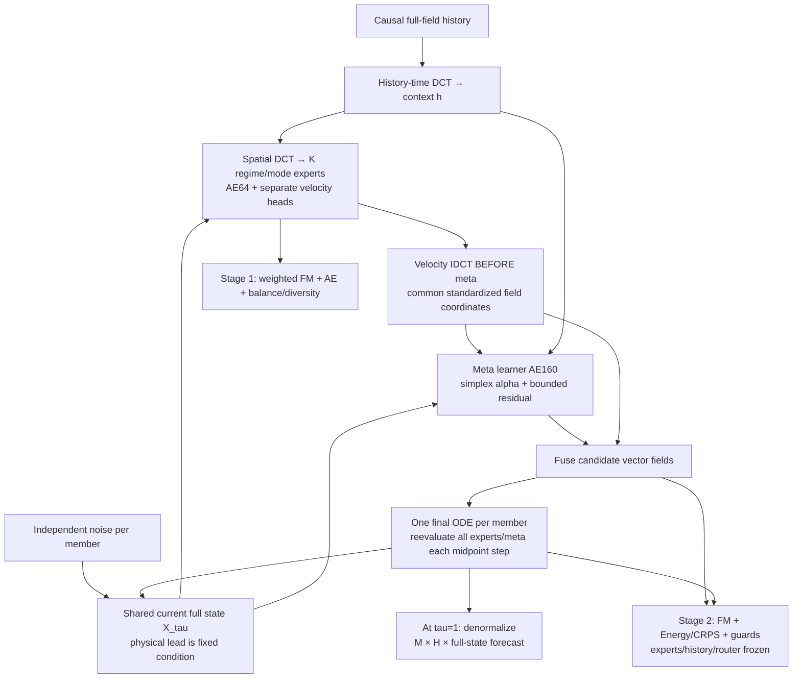
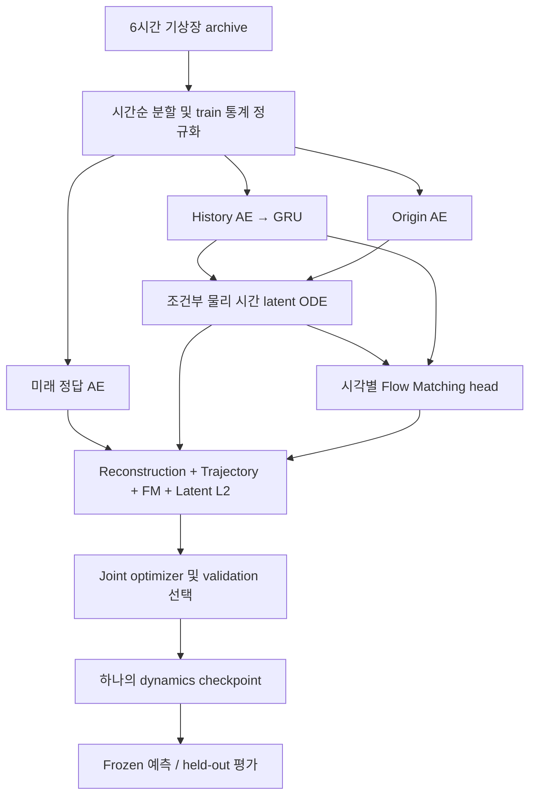

# Climate Flow: Manifold MoE, Full-state MoE 및 Dynamics 구조

## 구현된 dynamics loss / 120h trajectory (2026-09-10)

- [11-temporal-training-implemented.md](11-temporal-training-implemented.md): 새 delta / joint trajectory / wind loss, A/B/C gradient
- [12-member-trajectory-output.md](12-member-trajectory-output.md): 동일 noise, 정확한 6h/12h prefix, 모든 member 영상
- [전면 재학습 실행 순서](../flow-matching_moe/RETRAIN_120H.md)
- [실제 합성 학습·영상 결과와 미검증 범위](../docs/results/temporal-120h-smoke/README.md)

## 학습 메커니즘 개선의 원래 설계 (2026-09-09)

- [09-dynamics-supervision-design.md](09-dynamics-supervision-design.md): 동일 member paired endpoints, 확률적 dynamics loss와 gradient
- [10-dynamics-data-and-stages.md](10-dynamics-data-and-stages.md): DataLoader shape, 두 시간축, 실험 순서와 후속 12h 출력
- [설계·코드 위치·검증 계획](../docs/training-mechanism/README.md)

아래 구현된 manifold architecture는 유지합니다. 새 문서를 읽는 것만으로 기존 checkpoint가
재학습되거나 새 dynamics loss가 활성화되지는 않습니다.

## 최종 추가 경로: Physics-informed Manifold MoE

- [06-manifold-training.md](06-manifold-training.md): A/B/C, 지역 responsibility, physics와 gradient
- [07-manifold-inference.md](07-manifold-inference.md): Jacobian projection, 동일 member coupling, intrinsic ODE
- [설계 → 시각화 → 실행 README](../flow-matching_moe/MANIFOLD_README.md)
- [실제 학습 그림·영역별 expert 오차·한계](../docs/results/manifold-smoke/README.md)

영역은 위도·경도 구획이 아니라 기상 state의 잠재공간입니다. A의 PI embedding, B의
국소 expert 학습, C의 작은 LR 공동 보정이 최종 경로입니다. 아래 이전 Meta160 경로와
checkpoint format을 구분하며 이전 실험을 보존합니다.

## 보존된 경로: Full-state Flow Matching MoE

- [04-moe-training.md](04-moe-training.md): DCT/IDCT 좌표, AE64/160, 두 단계 loss·freeze·split
- [05-moe-inference.md](05-moe-inference.md): 저장 모델과 member별 **fusion 후 적분**
- [실행 README](../flow-matching_moe/README.md): 설치/RunPod/평가/메모리 및 수정 위치
- [실제 학습 결과](../docs/results/moe-smoke/README.md): CPU synthetic 40+25 epoch, 실제 그래프와 제한

`train-climate-moe`와 아래 `train-climate-dynamics`는 별도 학습 진입점입니다. MoE v1은
생성 flow-time ODE이고 아래 모델은 물리 시간 latent dynamics를 포함합니다. Expert의
full state는 archive에 선택된 모든 field를 뜻합니다. Regime별 의미는 loss만으로 보장되지
않으며 [실측 routing 진단](../docs/results/moe-smoke/summary.json)과 held-out skill로 평가합니다.

## 보존된 기존 경로: Latent dynamics + Flow Matching

대상: `feature/latent-dynamics-flow`. 실제 코드 `dynamics.py`, `train_dynamics.py`,
`inference.py`, `evaluation.py`를 기준으로 작성했습니다. 과거 GPT Router + 태풍 dual-loss
그림은 별도 downstream 시스템입니다. 이 저장소의 dynamics trainer는 기상장을 학습하며
GPT API, Transformer router, 태풍 track MSE 또는 IBTrACS distribution CE를 호출하지 않습니다.

- [01-training.md](01-training.md): 입력, 두 시간축, joint training, loss와 gradient
- [02-checkpoint-inference.md](02-checkpoint-inference.md): 저장되는 모델, ensemble 출력, 평가
- [03-review-and-run.md](03-review-and-run.md): 수정 사항, 실행 명령, 검증과 남은 제약

기본 시간 계약은 history 6개, stride 120, archive step 6h입니다. 입력 시점은
`t0-150d, -120d, -90d, -60d, -30d, t0`이며 필요한 연속 archive 길이는 601개입니다.
예측 horizon 120은 **120 × 6h = 30일**입니다. `h24`는 24시간이 아니라 24 step = 144시간입니다.
